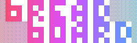
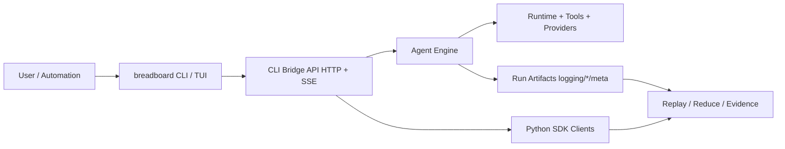

# BreadBoard

<p align="center">
  
</p>

<p align="center"><strong>The agent harness kernel.</strong></p>

<p align="center">
  
  <a href="https://github.com/kmccleary3301/breadboard/actions/workflows/ci.yml">
    
  </a>
  <a href="https://github.com/kmccleary3301/breadboard/actions/workflows/tmux-e2e-soft-gate.yml">
    
  </a>
  
  
  
  <a href="https://github.com/kmccleary3301/breadboard">
    
  </a>
</p>

BreadBoard is a contract-backed engine and event stream for building tool-using agents with replayable artifacts and UI-agnostic clients.

<p align="center">
  
</p>

## Table Of Contents

- [Why BreadBoard](#why-breadboard)
- [What You Can Do Today](#what-you-can-do-today)
- [5-Minute Quickstart](#5-minute-quickstart)
- [SDK Quickstart (Python)](#sdk-quickstart-python)
- [Replay-Proof Workflow](#replay-proof-workflow)
- [Architecture](#architecture)
- [Contract Surfaces](#contract-surfaces)
- [Safety And Claim Discipline](#safety-and-claim-discipline)
- [Documentation Map](#documentation-map)
- [Launch Status](#launch-status)
- [License](#license)

## Why BreadBoard

Most agent stacks blur runtime behavior into implementation details. BreadBoard treats runtime behavior as a contract:

- canonical event and streaming surfaces,
- reproducible run artifacts for replay and regression analysis,
- projection-driven clients (TUI and SDK) built over stable boundaries.

This lets you evolve engine internals, UX, and provider integrations without breaking operator workflows.

## What You Can Do Today

| Capability | What You Get | Evidence |
|---|---|---|
| Contract-backed stream/event surfaces | Stable protocol layer for clients and tools | `docs/CLI_BRIDGE_PROTOCOL_VERSIONING.md`, `docs/contracts/cli_bridge/openapi.json` |
| Replayable run artifacts | Debug and inspect runs from deterministic artifacts | `docs/log_reduce_tool.md`, `docs/quickstarts/REPLAY_PROOF_BUNDLE_QUICKSTART.md` |
| Projection-driven TUI workflows | Operator UI that consumes normalized contracts | `docs/TUI_TODO_EVENT_CONTRACT.md`, `docs/TUI_THINKING_STREAMING_CONFIG.md` |
| Proof media + bundle workflow | Reproducible screenshot/clip/bundle pipeline | `docs/media/proof/README.md` |
| SDK + CLI bridge client model | Programmatic session control over HTTP + SSE | `breadboard_sdk/client.py`, `docs/CONTRACT_SURFACES.md` |

### What BreadBoard Is Not

- Not a "drop-in replacement" claim for external harnesses.
- Not "perfect parity" marketing.
- Not a single-provider wrapper.

Claim language is tracked in `docs/CLAIMS_EVIDENCE_LEDGER.md`.

## 5-Minute Quickstart

Prereqs:

- Node.js 20+ (22+ recommended)
- Python 3.11+ (3.12 works)

Build CLI/TUI:

```bash
npm -C tui_skeleton ci
npm -C tui_skeleton run build
```

Run health + quick task:

```bash
breadboard doctor --config agent_configs/opencode_mock_c_fs.yaml
breadboard run --config agent_configs/opencode_mock_c_fs.yaml "Say hi and exit."
```

Start UI:

```bash
breadboard ui --config agent_configs/opencode_mock_c_fs.yaml
```

Safety preflight (recommended before runtime commands):

```bash
python scripts/preflight_workspace_safety.py --config agent_configs/opencode_mock_c_fs.yaml
```

## SDK Quickstart (Python)

```python
from breadboard_sdk import BreadboardClient

client = BreadboardClient(base_url="http://127.0.0.1:9099")

session = client.create_session(
    config_path="agent_configs/opencode_mock_c_fs.yaml",
    task="List files in the workspace and summarize them.",
    stream=True,
)
print("session_id:", session["session_id"])

for event in client.stream_events(session["session_id"], query={"schema": 2, "include_legacy": False, "replay": True}):
    etype = event.get("type")
    if etype == "assistant_message":
        payload = event.get("payload", {})
        print(payload.get("text", ""))
    if etype == "completion":
        print("done:", event.get("payload"))
        break
```

Useful SDK operations:

- create/list/delete sessions,
- post inputs and session commands,
- stream events over SSE,
- read session files and download artifacts,
- inspect model catalog and c-tree snapshots.

Source:

- `breadboard_sdk/client.py`

## Replay-Proof Workflow

Use this path when you want evidence, not just a live run:

```bash
python scripts/export_cli_bridge_contracts.py
bash scripts/phase12_live_smoke.sh
RUN_DIR="$(ls -1dt logging/* | head -n 1)"
python scripts/log_reduce.py "${RUN_DIR}" --turn-limit 2 --tool-only > docs/media/proof/launch_v1/log_reduce_sample_v1.txt
```

Proof bundle and deterministic media:

- `docs/media/proof/bundles/launch_proof_bundle_v1.zip`
- `docs/media/proof/launch_v1/launch_tui_screenshot_v1.png`
- `docs/media/proof/launch_v1/launch_tui_clip_v1.mp4`
- `docs/media/proof/launch_v1/launch_tui_clip_v1.gif`

## Architecture



Key repo areas:

- `agentic_coder_prototype/`: engine loop, routing, API bridge internals.
- `tui_skeleton/`: CLI + Ink/OpenTUI operator surfaces.
- `breadboard_sdk/`: Python SDK for bridge APIs.
- `docs/contracts/`: OpenAPI and schema surfaces.
- `scripts/`: smoke, replay, capture, export, and validation tooling.

## Contract Surfaces

Primary contract lanes:

- run artifact contract (replay surface),
- live CLI bridge contract (HTTP + SSE + schemas),
- projection contract for operator UIs,
- portability/parity lanes via fixtures and replay scripts.

Start here:

- `docs/CONTRACT_SURFACES.md`
- `docs/CLI_BRIDGE_PROTOCOL_VERSIONING.md`
- `docs/contracts/cli_bridge/openapi.json`

## Safety And Claim Discipline

Operational safety:

- `docs/SAFE_MODE_EXECUTION_POLICY.md`
- `scripts/preflight_workspace_safety.py`

Public claim discipline:

- `docs/CLAIMS_EVIDENCE_LEDGER.md`

Hard red lines:

- do not claim "drop-in replacement",
- do not claim "perfect parity",
- do not claim universal provider/plan support without coverage evidence.

## Documentation Map

| If You Want To... | Read This |
|---|---|
| Get started quickly | `docs/INSTALL_AND_DEV_QUICKSTART.md` |
| Understand release entrypoint | `docs/RELEASE_LANDING_V1.md` |
| Validate replay/proof flow | `docs/quickstarts/REPLAY_PROOF_BUNDLE_QUICKSTART.md` |
| Understand event/protocol contracts | `docs/CONTRACT_SURFACES.md` |
| Work on TUI event projections | `docs/TUI_TODO_EVENT_CONTRACT.md` |
| Work on thinking/streaming behavior | `docs/TUI_THINKING_STREAMING_CONFIG.md` |
| Audit launch claims and confidence | `docs/CLAIMS_EVIDENCE_LEDGER.md` |
| Work on branding assets | `docs/media/branding/README.md` |
| Review deterministic launch media | `docs/media/proof/README.md` |

## Launch Status

Repo-first launch hardening is complete. Current gating and staging state:

- `docs/LAUNCH_STAGING_PLAN_V1.md`
- `docs/ci/QUICKSTART_SAFE_VALIDATION_20260217.md`
- `docs/ci/RELEASE_LOW_RISK_GATES_20260217.md`
- `docs/ci/LAUNCH_STAGING_REVIEW_20260217.md`

Only external blocker in this tranche:

- early-channel feedback incorporation before broader posting.

## License

Experimental research software; use responsibly.

