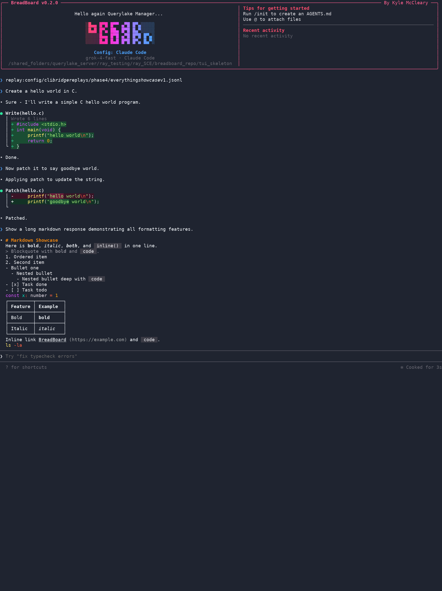
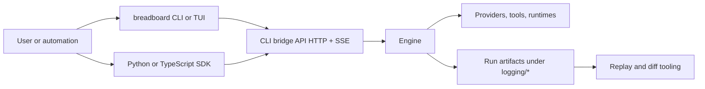

# BreadBoard

<p align="center">
  
</p>

<p align="center"><strong>Agent SDK + harness workbench + client/server coding UI stack.</strong></p>

<p align="center">
  
  <a href="https://github.com/kmccleary3301/breadboard/actions/workflows/ci.yml">
    
  </a>
  <a href="https://github.com/kmccleary3301/breadboard/actions/workflows/tmux-e2e-soft-gate.yml">
    
  </a>
  
  
  
</p>

BreadBoard is a Python-first runtime for tool-using agents, with SDKs, replay tooling, and terminal clients built on the same engine API.

<p align="center">
  
</p>

## Quick start

### 1) install prerequisites

- Python 3.11+ (3.12 works)
- Node.js 20+ (22+ recommended)

### 2) build the local `breadboard` CLI/TUI

```bash
npm -C tui_skeleton ci
npm -C tui_skeleton run build
```

### 3) run a smoke command

```bash
breadboard doctor --config agent_configs/opencode_mock_c_fs.yaml
breadboard run --config agent_configs/opencode_mock_c_fs.yaml "Say hi and exit."
```

### 4) start the interactive UI

```bash
breadboard ui --config agent_configs/opencode_mock_c_fs.yaml
```

### 5) optional safety preflight

```bash
python scripts/preflight_workspace_safety.py --config agent_configs/opencode_mock_c_fs.yaml
```

For full setup details, see `docs/INSTALL_AND_DEV_QUICKSTART.md`.

## What BreadBoard covers

### 1) Agent/LLM SDK work (Python and TypeScript)

BreadBoard includes:

- Python SDK: `breadboard_sdk/`
- TypeScript SDK: `sdk/ts/`
- Stable HTTP + SSE engine surface: `docs/contracts/cli_bridge/openapi.json`

This is the layer you use when you want app-side control like:

- create/resume/inspect sessions from code,
- stream events into your own UX,
- pull artifacts for evals and debugging.

Python example:

```python
from breadboard_sdk import BreadboardClient

client = BreadboardClient(base_url="http://127.0.0.1:9099")
session = client.create_session(
    config_path="agent_configs/opencode_mock_c_fs.yaml",
    task="Summarize this repository layout.",
    stream=True,
)

for event in client.stream_events(session["session_id"], query={"schema": 2, "replay": True}):
    if event.get("type") == "assistant_message":
        print(event.get("payload", {}).get("text", ""))
    if event.get("type") == "completion":
        break
```

TypeScript example:

```ts
import { createBreadboardClient, streamSessionEvents } from "@breadboard/sdk"

const client = createBreadboardClient({ baseUrl: "http://127.0.0.1:9099" })
const session = await client.createSession({
  config_path: "agent_configs/opencode_mock_c_fs.yaml",
  task: "List the top-level modules and explain each in one line."
})

for await (const event of streamSessionEvents(session.session_id, { config: { baseUrl: "http://127.0.0.1:9099" } })) {
  console.log(event.type)
  if (event.type === "completion") break
}
```

### 2) TUI alternatives (fixed-height and scrollback)

`tui_skeleton/` ships the terminal client and profile/preset system.

Current UX work includes:

- scrollback-style interaction,
- OpenTUI/fixed-height profile surfaces,
- thinking/status/todo projection lanes,
- capture and replay tooling for deterministic TUI checks.

Start with `tui_skeleton/README.md` and `docs/TUI_THINKING_STREAMING_CONFIG.md`.

### 3) Harness calculus (emulation profiles + replay parity lanes)

BreadBoard has a profile-based approach for harness emulation and parity testing:

- emulation profile schema: `docs/contracts/emulation_profile/emulation_profile_manifest_v1.schema.json`
- parity runner: `scripts/run_parity_replays.py`
- parity kernel boundaries: `docs/PARITY_KERNEL_BOUNDARIES.md`

The practical use case is not marketing parity claims; it is faster harness R&D:

- encode a harness behavior as a profile,
- replay goldens against that profile,
- iterate on one surface at a time without rewriting your full runtime.

### 4) Provider auth and plan-aware controls

BreadBoard supports in-memory provider auth attach/detach/status for the engine:

- concept doc: `docs/concepts/provider-plan-auth.md`
- API schema: `docs/contracts/cli_bridge/openapi.json`
- policy manifests: `docs/provider_plans/policy_manifests/`

Current policy manifests in-repo:

- OpenAI Codex/ChatGPT subscription plan: present, default-off, local-only, explicit-enable required.
- Anthropic consumer subscription: explicitly unsupported by default.
- OpenCode-oriented configs are available through standard provider/API-key routing today (see `agent_configs/opencode_*`); subscription-plan bridging remains policy-gated.

This keeps sensitive plan tokens behind explicit gating and local-only checks.

### 5) External session import and resume

BreadBoard supports deterministic transcript import into canonical event JSONL:

- concept doc: `docs/concepts/session-import.md`
- import IR schema: `docs/contracts/import/import_ir_v1.schema.json`
- manifest schema: `docs/contracts/import/import_run_manifest_v1.schema.json`
- converter script: `scripts/import_ir_to_events_jsonl.py`

This is the base path for importing sessions from other harness formats, then resuming them inside BreadBoard workflows.

Current import/resume scope explicitly targets Codex CLI, OpenCode, and Claude-style harness transcripts, with deterministic conversion as the first step and harness-specific adapters layered on top.

### 6) Engine-client split (local or remote control)

BreadBoard uses a server-client split similar to OpenCode:

- engine API runs as a service (FastAPI + SSE),
- CLI/TUI and SDKs are clients over that API,
- the same engine can be driven by local terminal UX, scripts, or remote clients.

Engine entrypoint from source:

```bash
python -m agentic_coder_prototype.api.cli_bridge.server
```

Main engine code:

- `agentic_coder_prototype/`
- `agentic_coder_prototype/api/cli_bridge/`

## How this differs from SDK-only or CLI-only stacks

SDK-first frameworks usually stop at app embedding. CLI-first harnesses usually stop at terminal workflows.

BreadBoard intentionally combines both with one runtime surface:

- SDKs for embedded usage,
- terminal clients for operator workflows,
- replay artifacts for regression and evidence,
- profile-driven harness experimentation.

If you are evaluating DSPy, Vercel AI SDK, LangChain, Pi, Claude Code, or OpenCode, this repo is built for cross-cutting work where those concerns overlap.

## Replay and evidence workflow

When you need reproducible outputs instead of one-off runs:

```bash
python scripts/export_cli_bridge_contracts.py
bash scripts/phase12_live_smoke.sh
RUN_DIR="$(ls -1dt logging/* | head -n 1)"
python scripts/log_reduce.py "${RUN_DIR}" --turn-limit 2 --tool-only > docs/media/proof/launch_v1/log_reduce_sample_v1.txt
```

Output references:

- `docs/media/proof/launch_v1/launch_tui_screenshot_showcase_v1.png`
- `docs/media/proof/launch_v1/launch_tui_clip_v1.mp4`
- `docs/media/proof/launch_v1/launch_tui_clip_v1.gif`
- `docs/media/proof/README.md`

## Architecture



## Repository map

- `agentic_coder_prototype/`: engine loop, providers, bridge service, parity core.
- `breadboard_sdk/`: Python SDK.
- `sdk/ts/`: TypeScript SDK.
- `tui_skeleton/`: terminal client and UX projection layer.
- `docs/contracts/`: OpenAPI and JSON schemas.
- `scripts/`: smoke tests, replays, exports, capture tools.
- `docs/media/`: branding and proof media.

## Documentation map

- Install/dev quickstart: `docs/INSTALL_AND_DEV_QUICKSTART.md`
- Release entrypoint: `docs/RELEASE_LANDING_V1.md`
- Runtime boundaries: `docs/CONTRACT_SURFACES.md`
- TUI thinking/streaming config: `docs/TUI_THINKING_STREAMING_CONFIG.md`
- TUI todo event surface: `docs/TUI_TODO_EVENT_CONTRACT.md`
- Replay-proof quickstart: `docs/quickstarts/REPLAY_PROOF_BUNDLE_QUICKSTART.md`
- Claims and wording guardrails: `docs/CLAIMS_EVIDENCE_LEDGER.md`

## Claim boundaries

This README is intentionally conservative on two points:

- no blanket "drop-in replacement" claim for other harnesses,
- no blanket "perfect parity" claim.

Coverage should be read from evidence docs and replay outputs:

- `docs/CLAIMS_EVIDENCE_LEDGER.md`
- `docs/PARITY_KERNEL_BOUNDARIES.md`

## License

Experimental research software; use responsibly.
