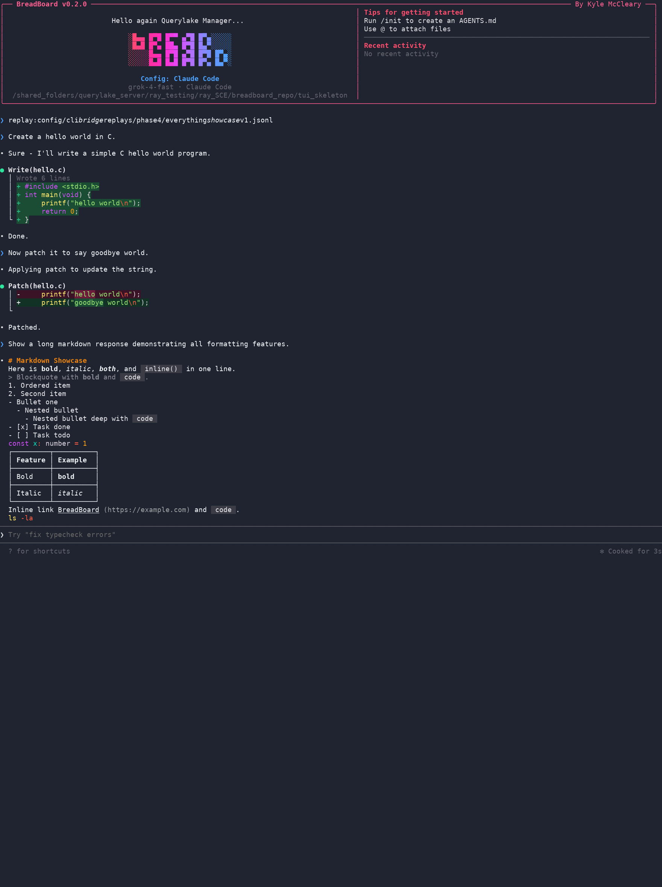
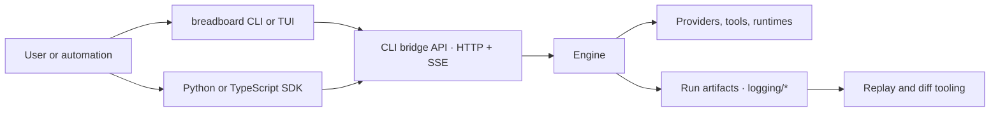

# BreadBoard

<p align="center">
  
</p>

<p align="center"><strong>Agent engine · harness workbench · multi-client coding stack.</strong></p>

<p align="center">
  
  <a href="https://github.com/kmccleary3301/breadboard/actions/workflows/ci.yml">
    
  </a>
  <a href="https://github.com/kmccleary3301/breadboard/actions/workflows/tmux-e2e-soft-gate.yml">
    
  </a>
  
  
  
</p>

## What BreadBoard is

BreadBoard started as a code agent in the same class as OpenCode and Claude Code: client-server split, terminal UX, tool-using LLM loop. It has grown past that framing.

**In current form it is:**

- a code agent
- an SDK and engine
- a harness emulator
- a large-scale sandbox engine
- and, on the near-term roadmap, an RL environment builder for training and evaluating coding agents at scale

Each of those is a real working thing, not a roadmap placeholder.

**The thread connecting all of them:** the engine-client split is not an implementation detail, it is the whole bet. Every client (TUI, SDK, VSCode sidebar, any script) talks to the same engine over the same canonical SSE event stream. The engine emits the same events regardless of which client is driving. That constraint is what makes everything else composable.

**The most direct way to see what that constraint buys you:** BreadBoard can fully emulate Codex CLI, Claude Code, or OpenCode—not approximately, but down to hash-level equivalence on request bodies. That is validated in the conformance suite against actual golden artifacts. Encoding a target harness's behavior as a profile and running the replay suite against it turned out to be one of the more interesting things to build here, and the fact that it works at that level of fidelity is a direct consequence of the modularity being real rather than aspirational.

**The short version:** it is roughly what Pi would look like if modularity and cross-harness compatibility were the design constraints from day one.

<p align="center">
  
</p>

---

## Quick start

**Prerequisites:** Python 3.11+ and Node.js 20+ (22+ recommended)

### Bootstrap

```bash
bash scripts/dev/bootstrap_first_time.sh
```

Engine-only, no TUI:

```bash
bash scripts/dev/bootstrap_first_time.sh --profile engine
```

Via Make (Linux/macOS):

```bash
make setup              # full bootstrap
make setup-fast         # full bootstrap, skip doctor checks
make setup-engine       # engine only
make setup-fast-engine  # engine only, skip doctor checks
```

The bootstrap creates or reuses `.venv` (prefers `uv` when available), installs Python dependencies from `requirements.txt`, builds `sdk/ts` and `tui_skeleton` when sources are present, and skips redundant installs when lockfiles and outputs are current.

### Smoke check

```bash
breadboard doctor --config agent_configs/opencode_mock_c_fs.yaml
breadboard run --config agent_configs/opencode_mock_c_fs.yaml "Say hi and exit."
```

### Interactive TUI

```bash
breadboard ui --config agent_configs/opencode_mock_c_fs.yaml
```

### Readiness and verification

```bash
# check environment before or after setup
python scripts/dev/quickstart_first_time.py --include-advanced
make cli-capabilities

# verify SDK paths are live
make sdk-hello-live

# run onboarding contract check
make onboarding-contract

# devx smoke (fast)
make devx-smoke
make devx-smoke-engine

# full sequential confidence pass with timing report
make devx-full-pass
make devx-full-pass-engine
make devx-timing

# inspect ~/.breadboard footprint (dry-run)
make disk-report

# first-time doctor (strict)
python scripts/dev/first_time_doctor.py --profile engine --strict
```

For the full setup reference, see [docs/INSTALL_AND_DEV_QUICKSTART.md](docs/INSTALL_AND_DEV_QUICKSTART.md). For a copy-paste 5-minute path, see [docs/quickstarts/FIRST_RUN_5_MIN.md](docs/quickstarts/FIRST_RUN_5_MIN.md).

---

## What's included

### Engine and SDKs

The engine lives at `agentic_coder_prototype/api/cli_bridge/` and its HTTP + SSE surface is documented in [docs/contracts/cli_bridge/openapi.json](docs/contracts/cli_bridge/openapi.json). Python and TypeScript SDKs wrap that surface.

```python
from breadboard_sdk import BreadboardClient

client = BreadboardClient(base_url="http://127.0.0.1:9099")
session = client.create_session(
    config_path="agent_configs/opencode_mock_c_fs.yaml",
    task="Summarize this repository layout.",
    stream=True,
)

for event in client.stream_events(session["session_id"], query={"schema": 2, "replay": True}):
    if event.get("type") == "assistant_message":
        print(event.get("payload", {}).get("text", ""))
    if event.get("type") == "completion":
        break
```

```ts
import { createBreadboardClient, streamSessionEvents } from "@breadboard/sdk"

const client = createBreadboardClient({ baseUrl: "http://127.0.0.1:9099" })
const session = await client.createSession({
  config_path: "agent_configs/opencode_mock_c_fs.yaml",
  task: "List the top-level modules and explain each in one line."
})

for await (const event of streamSessionEvents(session.session_id, { config: { baseUrl: "http://127.0.0.1:9099" } })) {
  console.log(event.type)
  if (event.type === "completion") break
}
```

SDK paths: `breadboard_sdk/` (Python), `sdk/ts/` (TypeScript).

You can also drive the engine directly from source:

```bash
python -m agentic_coder_prototype.api.cli_bridge.server
```

---

### Terminal clients

`tui_skeleton/` is the main terminal client. It supports scrollback and fixed-height profile surfaces, thinking/status/todo projection lanes, and capture-replay tooling for deterministic TUI regression. Start at [tui_skeleton/README.md](tui_skeleton/README.md) and [docs/TUI_THINKING_STREAMING_CONFIG.md](docs/TUI_THINKING_STREAMING_CONFIG.md).

There is also an OpenTUI-style fixed-height path (`opentui_slab/`) and a VSCode sidebar extension scaffold (`vscode_sidebar/`).

---

### Harness emulation and parity testing

BreadBoard has a profile-based system for encoding and replaying harness behaviors. The intended workflow:

1. Encode a target harness's behavior as an emulation profile.
2. Replay your goldens against that profile.
3. Iterate on one surface at a time without touching the rest of the runtime.

References:
- emulation profile schema: [docs/contracts/emulation_profile/emulation_profile_manifest_v1.schema.json](docs/contracts/emulation_profile/emulation_profile_manifest_v1.schema.json)
- parity runner: `scripts/run_parity_replays.py`
- kernel surfaces that must stay byte-stable: [docs/PARITY_KERNEL_BOUNDARIES.md](docs/PARITY_KERNEL_BOUNDARIES.md)

---

### Provider auth and plan controls

The engine supports in-memory provider auth attach/detach for session-scoped credential management. OpenAI API-key routing is the default path. Subscription-plan bridging is policy-gated and local-only—policy manifests live in `docs/provider_plans/policy_manifests/`.

References: [docs/concepts/provider-plan-auth.md](docs/concepts/provider-plan-auth.md), [docs/contracts/cli_bridge/openapi.json](docs/contracts/cli_bridge/openapi.json).

---

### Session import and resume

BreadBoard converts external transcripts into its canonical JSONL format and can resume them inside the engine. Current import scope targets Codex CLI, OpenCode, and Claude-style transcripts.

References:
- [docs/concepts/session-import.md](docs/concepts/session-import.md)
- import IR schema: [docs/contracts/import/import_ir_v1.schema.json](docs/contracts/import/import_ir_v1.schema.json)
- converter: `scripts/import_ir_to_events_jsonl.py`

---

## Why the engine-client split matters

Most SDK-first frameworks stop at app embedding. Most CLI harnesses stop at terminal workflows. BreadBoard runs the same engine for both, which means:

- a Python script and a TUI session share the same event log,
- you can replay a terminal session in CI,
- you can drive a live session from a remote client without forking the runtime.

The cost is more ceremony upfront—there are schemas, contract docs, and conformance tests to stay aware of. If you are doing cross-cutting work where DSPy, OpenCode, Claude Code, and Vercel AI SDK concerns overlap, that ceremony pays off. If you want a thin wrapper around the OpenAI SDK, it probably does not.

---

## Replay and evidence

Every run writes `logging/<run-id>/meta/events.jsonl`—append-only, deterministically ordered, and portable to any replay or eval tool in `scripts/`.

```bash
python scripts/export_cli_bridge_contracts.py
bash scripts/phase12_live_smoke.sh
RUN_DIR="$(ls -1dt logging/* | head -n 1)"
python scripts/log_reduce.py "${RUN_DIR}" --turn-limit 2 --tool-only \
  > docs/media/proof/launch_v1/log_reduce_sample_v1.txt
```

Proof media: [docs/media/proof/launch_v1/](docs/media/proof/launch_v1/) and [docs/media/proof/README.md](docs/media/proof/README.md).

---

## Architecture


```mermaid
flowchart LR
  U[User or automation] --> CLI[breadboard CLI or TUI]
  U --> SDK[Python or TypeScript SDK]
  CLI --> API[CLI bridge API · HTTP + SSE]
  SDK --> API
  API --> ENG[Engine]
  ENG --> RT[Providers, tools, runtimes]
  ENG --> ART[Run artifacts · logging/*]
  ART --> REP[Replay and diff tooling]
```

---

## Repository map

| Path | Contents |
|------|----------|
| `agentic_coder_prototype/` | Engine loop, providers, bridge service, parity core |
| `breadboard_sdk/` | Python SDK |
| `sdk/ts/` | TypeScript SDK |
| `tui_skeleton/` | Terminal client and UX projection layer |
| `opentui_slab/` | Fixed-height OpenTUI-style client |
| `vscode_sidebar/` | VSCode extension scaffold |
| `docs/contracts/` | OpenAPI and JSON schemas |
| `scripts/` | Smoke, replay, export, and capture tools |
| `docs/media/` | Branding and proof media |

---

## Docs map

| Doc | Contents |
|-----|----------|
| [docs/INSTALL_AND_DEV_QUICKSTART.md](docs/INSTALL_AND_DEV_QUICKSTART.md) | Full setup reference |
| [docs/quickstarts/FIRST_RUN_5_MIN.md](docs/quickstarts/FIRST_RUN_5_MIN.md) | 5-minute onboarding path |
| [docs/RELEASE_LANDING_V1.md](docs/RELEASE_LANDING_V1.md) | Release entrypoint |
| [docs/CONTRACT_SURFACES.md](docs/CONTRACT_SURFACES.md) | Runtime contract boundaries |
| [docs/TUI_THINKING_STREAMING_CONFIG.md](docs/TUI_THINKING_STREAMING_CONFIG.md) | TUI thinking/streaming config |
| [docs/TUI_TODO_EVENT_CONTRACT.md](docs/TUI_TODO_EVENT_CONTRACT.md) | TUI todo event surface |
| [docs/quickstarts/REPLAY_PROOF_BUNDLE_QUICKSTART.md](docs/quickstarts/REPLAY_PROOF_BUNDLE_QUICKSTART.md) | Replay-proof bundle path |
| [docs/CLAIMS_EVIDENCE_LEDGER.md](docs/CLAIMS_EVIDENCE_LEDGER.md) | Claims and wording guardrails |

---

## Claim boundaries

Two explicit limits this README does not cross:

- no blanket "drop-in replacement" for other harnesses,
- no blanket "perfect parity."

Coverage is in the evidence docs:
- [docs/CLAIMS_EVIDENCE_LEDGER.md](docs/CLAIMS_EVIDENCE_LEDGER.md)
- [docs/PARITY_KERNEL_BOUNDARIES.md](docs/PARITY_KERNEL_BOUNDARIES.md)

---

## License

Experimental research software; use responsibly.
