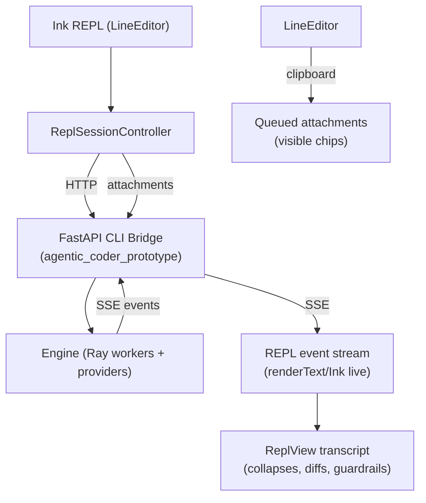

# TUI Full Spec (V1) — KyleCode CLI

## Table of Contents
- [1. Overview](#1-overview)
- [2. Goals & Motivations](#2-goals--motivations)
- [3. Current Capabilities (V1)](#3-current-capabilities-v1)
- [4. Architecture & Data Flow](#4-architecture--data-flow)
- [5. Source Layout](#5-source-layout)
- [6. Configs & Defaults](#6-configs--defaults)
- [7. Interaction Model (REPL UX)](#7-interaction-model-repl-ux)
- [8. Clipboard, Attachments, and Markdown](#8-clipboard-attachments-and-markdown)
- [9. Guardrails, Tools, and Plans](#9-guardrails-tools-and-plans)
- [10. Testing, Stress Harness, and CI](#10-testing-stress-harness-and-ci)
- [11. Mock SSE & Offline Modes](#11-mock-sse--offline-modes)
- [12. Scripts & Commands (Cheat Sheet)](#12-scripts--commands-cheat-sheet)
- [13. Outstanding Work / Next Steps](#13-outstanding-work--next-steps)

---

## 1. Overview
KyleCode TUI is an Ink-based REPL for the KyleCode engine. It targets Claude Code/Codex-class UX with streaming transcript, collapsible blocks, responsive model picker, guardrail banner, paste chips, attachments, and deterministic stress tooling.

---

## 2. Goals & Motivations
- Deliver a “just run `kyle repl`” experience with sensible defaults (Grok 4 Fast, localhost bridge).
- Parity with mature coding TUIs (Claude Code / Codex): streaming, collapses, diffs, guardrails, model picker, paste/attachments.
- Deterministic regression tooling (mock SSE, PTY harness, VT grid, timeline budgets) to catch layout/input regressions without a GUI.

---

## 3. Current Capabilities (V1)
- **Streaming transcript**: auto-collapse long assistant/tool blocks; diff coloring; collapse previews with `Δ +/−` and filenames.
- **Model picker**: responsive table (`Provider · Model | Context | $/M In | $/M Out`) with priority-based column drop on narrow widths.
- **Permission approval modal**: Claude Code–style tool approval prompt with Summary/Diff/Rules tabs; `Enter` allow once; `a` allow always (defaults to **project** scope); `Esc` hard deny + stop.
- **Checkpoint rewind modal**: Claude Code–style rewind picker (`Esc Esc` or `/rewind`), restore modes 1 convo / 2 code / 3 both; code-only restore does not prune.
- **File mentions**: typing `@` opens a file picker modal; `↑/↓` navigate; `Enter` opens directories/selects files; `Esc` cancels (leaves the typed `@` in the composer); selecting inserts `@path`.
- **Input**: Backspace/Ctrl+Backspace/word jumps, bracketed paste, paste chips for large text, undo/redo.
- **Attachments**: Clipboard images become chips; uploaded to `/attachments`; `/retry [n]` reuses attachment IDs.
- **Guardrails**: Single sticky banner (expand `e`, dismiss `x`); structured tool logs with status glyphs.
- **Markdown/diff**: Rich renderer via worker; fenced `diff` blocks colorized; plain fallback available.
- **Defaults**: Grok 4 Fast config baked in; base URL localhost; mock and snapshot modes available.
- **Testing**: Stress/CI bundle with mock SSE, VT grid, timeline metrics, key fuzz, clipboard diffs.

---

## 4. Architecture & Data Flow


---

## 5. Source Layout
```
kylecode_cli_skeleton/
├─ src/
│  ├─ commands/repl/
│  │  ├─ command.tsx        # CLI entry for REPL, script mode
│  │  ├─ controller.ts      # Session orchestration, SSE handling
│  │  └─ renderText.ts      # Non-interactive render
│  ├─ repl/components/
│  │  ├─ ReplView.tsx       # Main UI layout, transcript, model menu, guardrails
│  │  ├─ LineEditor.tsx     # Input, history, paste chips, undo
│  │  ├─ LiveSlot.tsx       # Spinner/status slots
│  │  └─ GuardrailBanner.tsx
│  ├─ repl/inputChunkProcessor.ts # Paste/burst handling
│  ├─ providers/modelCatalog.ts   # Pricing/context normalization
│  ├─ config/appConfig.ts        # Defaults (base URL, config, model)
│  └─ util/clipboard.ts          # Clipboard readers (text/image)
├─ scripts/
│  ├─ run_stress_bundles.ts      # Stress runner (repl+pty, mock SSE)
│  ├─ run_stress_ci.sh           # CI gate wrapper
│  ├─ repl_pty_harness.ts        # PTY harness, snapshots, VT grid
│  ├─ mock_sse_*.json            # Deterministic SSE scripts
│  └─ modal_overlay_stress.json, layout_ordering_pty.json, ...
├─ tools/
│  ├─ mock/mockSseServer.ts      # Deterministic SSE server
│  ├─ tty/vtgrid.ts, gridDiff.ts # VT reconstruction + diffs
│  ├─ timeline/                  # timeline/flamegraph builders
│  └─ reports/                   # ttydoc, clipboard diff, key fuzz
└─ docs/cli_phase_2/             # Plans, realignment, this spec
```

---

## 6. Configs & Defaults
- **Baked-in default**: `agent_configs/opencode_openrouter_grok4fast_cli_default.yaml`
  - Default model: `openrouter/x-ai/grok-4-fast`
  - Guardrails permissive for Q&A, plan off, todos on (strict), long turn limit.
- **Snapshot (tool-free markdown/diff)**: `agent_configs/opencode_openai_codexmini_c_fs_cli_shared.yaml` or `..._responses_snapshot.yaml`.
- **Mock (deterministic)**: `agent_configs/opencode_cli_mock_guardrails.yaml` (pairs with mock SSE or mock provider).
- **App defaults** (`src/config/appConfig.ts`):
  - Base URL `http://127.0.0.1:9099` (override `KYLECODE_API_URL`)
  - Default config override: `KYLECODE_DEFAULT_CONFIG`
  - Default model override: `KYLECODE_DEFAULT_MODEL`

---

## 7. Interaction Model (REPL UX)
- **Header/meta**: Status glyphs for working/model/local/events/tools/turn; sticky guardrail banner below header.
- **Transcript**: Streaming assistant block; auto-collapse long assistant/user blocks; `[ ]` to cycle target, `e` to expand/collapse; diff previews show `Δ +/−` and filenames.
- **Model picker**: `/models` opens responsive table; arrow keys + Enter/Esc; columns drop by priority (Context → $/M In → $/M Out).
- **Composer**: Slash autocomplete, shortcuts hint, optional virtualization in compact mode (≤32 rows).
- **Commands**: `/view collapse <auto|all|none>`, `/view scroll <auto|compact>`, `/view markdown <on|off>`, `/retry [n]`, `/plan`, `/mode`, `/files`, `/test`, `/model`.
- **Error states**: Clear single error if bridge unreachable; no hanging.

---

## 8. Clipboard, Attachments, and Markdown
- **Paste pipeline** (`inputChunkProcessor.ts`, `LineEditor.tsx`):
  - Short text (<512 chars) inline; long text → chip `[Pasted Content N chars]` (raw preserved); undo removes chip in one step.
  - Bracketed paste enabled while focused; disabled on exit/crash; no stray `~`.
  - Clipboard images → chips `[XKB Image Attachment]`; metadata shown under prompt.
- **Attachments**:
  - Uploaded to `/attachments` before `/input`; IDs reused on `/retry [n]`.
  - Helper lines echoed into transcript; chips cleared after submit.
- **File mentions (`@`)**:
  - Picking a file queues it for submit-time attachment as context (full inline for small files, snippet + truncation addendum for oversized files).
  - Config (env): `KYLECODE_TUI_FILE_MENTION_MODE=auto|inline|reference`, `KYLECODE_TUI_FILE_MENTION_INSERT_PATH=1|0`, size budgets + snippet settings via `KYLECODE_TUI_FILE_MENTION_*`.
- **Markdown/diff**:
  - Worker: `workers/markdown-worker.js` loaded from `dist/workers`; toggle via `/view markdown off` or `KYLECODE_RICH_MARKDOWN=0`.
  - Diff coloring: `+` green, `-` red, `@@` cyan/amber, headers teal; plain fallback if worker fails.

---

## 9. Guardrails, Tools, and Plans
- **Guardrail rendering**: Single sticky banner under header; `e` expands, `x` dismisses; no duplicates.
- **Tool logs**: Structured rows with status glyph (● working/success/error), collapse previews with `Δ +/−`.
- **Plan/Todos**: Disabled by default for snapshot/mock; enabled in coding configs as needed.
- **Configs**: Mock guard config inherits from codexmini guardrails but with plan off and permissive watchdogs.

---

## 10. Testing, Stress Harness, and CI
- **Stress runner**: `npm run stress:ci` → launches mock bridge, runs bundle:
  - Cases: `modal_overlay`, `layout_ordering` (PTY), `ctrl_v_paste`, `ctrl_v_paste_large`, `mock_hello`.
  - Optional PTY parity case: `permission_rewind` (permission approval + rewind flow).
  - Optional PTY parity case: `file_picker` (type `@` → file picker → navigate/select → mention insertion).
  - Optional PTY parity case: `file_mentions` (type `@` → pick file → submit → attached context + truncation gating).
  - Artifacts per case: `transcript.txt`/`cli.log`/`sse_events.txt` (repl), `pty_snapshots.txt`/`pty_raw.ansi` (PTY), `input_log.ndjson`, `repl_state.ndjson`, `grid_snapshots/*`, `anomalies.json`, `timeline.ndjson`, `timeline_summary.json`, `timeline_flamegraph.txt`, `ttydoc.txt`, `case_info.json`, clipboard manifests/diffs.
  - Budgets: `TTFT_BUDGET_MS=2500`, `SPINNER_BUDGET_HZ=12`, `MAX_ANOMALIES=0`, `MAX_TIMELINE_WARNINGS=1`.
- **PTY harness**: `scripts/repl_pty_harness.ts` (records frames, snapshots, diffs; supports clipboard injection and winch scripts).
- **Mock SSE**: Per-case scripts auto-spawned unless `--no-case-mock-sse`; chaos knobs available via env for bridge (`KYLECODE_CLI_LATENCY_MS`, etc.).
- **Key fuzz**: Built into stress:ci (iterations configurable via env).
- **Artifacts**: Latest passing bundle `artifacts/stress/20251126-193228/` (zip at `stress_ci_latest.zip` if copied).
- **Agent observability**: See `docs/cli_phase_2/TUI_TESTING_TOOLING_FOR_AGENTS.md` for the “give the agent eyes” artifact contract and workflow.

---

## 11. Mock SSE & Offline Modes
- **Server**: `tools/mock/mockSseServer.ts`
  - Example: `npx tsx tools/mock/mockSseServer.ts --script scripts/mock_sse_sample.json --host 127.0.0.1 --port 9191`
  - Scripts: `mock_sse_sample.json`, `mock_sse_diff.json`, `mock_sse_markdown_basic.json`, `mock_sse_markdown_diff.json`, `mock_sse_modal_overlay.json`, `mock_sse_layout_ordering.json`, `mock_sse_guardrail.json`, `mock_sse_file_picker.json`.
- **Bridge launcher**: `scripts/run_cli_bridge_mock.sh` (starts FastAPI bridge; can also launch mock SSE if `KYLECODE_CLI_MOCK_SSE_SCRIPT` set).

---

## 12. Scripts & Commands (Cheat Sheet)
- **Run default REPL (Grok)**:
  ```bash
  cd kylecode_cli_skeleton
  npm run build
  KYLECODE_API_URL=http://127.0.0.1:9099 kyle repl
  ```
- **Snapshot replay (markdown diff, mock SSE)**:
  ```bash
  KYLECODE_API_URL=http://127.0.0.1:9191 \
    node dist/main.js repl \
    --config agent_configs/opencode_cli_mock_guardrails.yaml \
    --script scripts/markdown_diff_snapshot.json \
    --script-output scripts/markdown_diff_output.txt \
    --script-final-only
  ```
- **Stress CI (mock)**:
  ```bash
  cd kylecode_cli_skeleton
  ./scripts/run_stress_ci.sh
  ```
- **Manual PTY probe**:
  ```bash
  npx tsx scripts/repl_pty_harness.ts \
    --script scripts/layout_ordering_pty.json \
    --config ../agent_configs/opencode_cli_mock_guardrails.yaml \
    --base-url http://127.0.0.1:9099 \
    --snapshots /tmp/layout_debug.txt
  ```
- **Mock SSE only**:
  ```bash
  npx tsx tools/mock/mockSseServer.ts --script scripts/mock_sse_sample.json --once
  ```

---

## 13. Outstanding Work / Next Steps
- **Guardrail banner invariant**: Re-verify with live backend that only one banner renders and persists correctly across multiple guard events.
- **Pinned layout invariant**: Keep header/composer stable under long transcripts, tool logs, and modals; no terminal scroll artifacts.
- **Live-provider sanity**: Run a real Grok session end-to-end (non-mock) to confirm streaming and transcripts match mock behavior; capture transcript/metrics.
- **Docs**: Keep Quick Start and stress docs in sync when configs change; ensure plan checkboxes stay current.
- **External session resume (future)**: Import and continue from logged Claude Code/Codex CLI/OpenCode sessions via a canonical “session capsule” (`docs/cli_phase_2/EXTERNAL_SESSION_IMPORT_RESUME.md`).
- **Optional polish**: Friendlier message on mock stop 400; richer ttydoc “one-file story” for CI artifacts.
