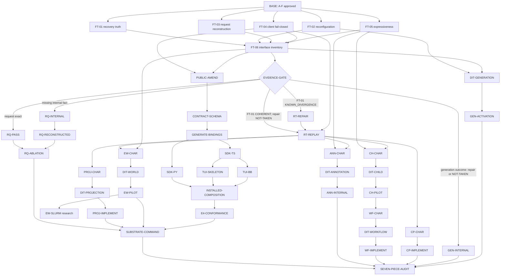

# Promoted workstream DAG

Ticket: `bb-inj5.7`
Status: APPROVED — guarded owner policy selected; post-contract route escalation passed
Session: 2 of 2

## Control panel

- North star: turn the approved evidence-only tranche into the smallest executable dependency graph that can converge on the seven-part research substrate without silently promoting donor ideas.
- Current claim: 623/623 ledger rows have one typed route; the graph is acyclic; FT-01 through FT-06 are the only unconditional work packets; no new seam, public surface, compatibility deletion, or implementation is promoted.
- Current red class: none. The corrected FT-01 terminal predicates passed exact raw-machine validation and independent P0/P1 escalation review. The product-level north-star command is intentionally `FOG`: four of seven substrate pieces lack admitted runtime owners.
- Next cheapest discriminator: execute FT-01 and FT-04 against pinned products, then the isolated FT-02/03/05 probes, then regenerate FT-06 and cross the evidence gate.
- Active external blocker: none. Kyle selected the guarded-conditional policy; the publication-blocking route contradiction is corrected and revalidated.
- Stop or escalation: stale input uses PROC-STALE; product mismatch uses PROC-DEFECT; new seam, public surface, compatibility deletion, or freeze change uses PROC-AMEND and Kyle approval.

DECISION THIS STAGE CAN MOVE: packet ordering, conditional admission, ownership, and the approval boundary after evidence turns green or red.
EVIDENCE THAT WOULD MOVE IT: the six approved packet reports, their exact raw identities, and fresh interface counts from FT-06.
EVIDENCE PRODUCED SO FAR: one 50-node typed DAG prototype, deterministic validator PASS, explicit routing for 623/623 donor rows, Kyle's guarded-conditional policy selection, one permitted consistency renewal, and one later bounded post-contract route escalation with P0/P1 = 0/0.
PROVENANCE-ONLY ARTIFACTS PRODUCED SO FAR: `raw/bb-inj5.7/` contains session provenance, row routing, DAG prototype, validator/result, owner decision, and consistency verdict.

## Gate card

- **Claim:** six evidence-only packets are runnable now; every later node is conditional on a named observation, design/approval gate, or bounded research metric.
- **Denominator:** 623 ledger rows, DSH phases 0–12, six first-tranche packets, seven target substrate pieces, 50 prototype nodes, and every public generation/consumer step.
- **Oracle:** approved A–F artifacts; pinned source owners; packet-specific independent oracles in F; deterministic graph invariants in `raw/bb-inj5.7/validate_dag_prototype.py`.
- **Cost:** first tranche ≤19 packet-minutes before retries: FT-01 ≤6, FT-02 ≤4, FT-03 ≤2, FT-04 ≤2, FT-05 ≤2, FT-06 ≤3. Maximum three typed attempts per packet except FT-06: one regeneration plus one stale rerun.
- **Retry:** only after new bytes, a corrected independent oracle, a changed environment, or a written mechanism diagnosis.
- **Stop:** no packet may invent product policy, a public fact, a dispatch layer, or a second source of truth. Missing facts are evidence, not an invitation to synthesize them.
- **Fallback:** retain the strongest bounded characterization, mark its branch terminal, and leave the downstream node closed.
- **Nonclaims:** no packet has run; no product defect is repaired; no runtime substrate exists; no public CLI/API/schema is approved; no compatibility path is removable.

## Deterministic prototype result

One command:

```console
/opt/homebrew/bin/python3.11 docs/plans/dsh_donor_campaign/evidence/raw/bb-inj5.7/validate_dag_prototype.py
```

Result: `PASS`; 50/50 nodes topologically ordered; 623/623 unique ledger rows routed; DSH phases 0–12 represented; six first-tranche packets present; zero unconditionally promoted new seams. Machine inputs and captured result live in `raw/bb-inj5.7/`.

## Ledger routing and denominator

A route is not an implementation promotion. It is a terminal current decision plus, where applicable, one named gate. Exact per-row records are in `raw/bb-inj5.7/row-routing.json`.

| Decision | Rows | Meaning |
| --- | ---: | --- |
| Satisfied | 177 | Keep the existing owner, behavior, or contract; no packet. |
| Superseded | 4 | Keep the named replacement; delete the old path only after exact consumers are zero. |
| Rejected | 10 | No work; reopen only through PROC-AMEND. |
| Research-only with metric and kill | 29 | A bounded experiment may run only with a pre-registered metric and terminal threshold. |
| Deferred behind named evidence | 398 | No implementation packet; the row belongs to one phase family and a named evidence gate. |
| Promoted with first-tranche packet | 5 | S1→FT-01/L1, S2→FT-01, S4→FT-06, S7→FT-04, S8→FT-05. |
| **Total** | **623** | **Every row appears exactly once.** |

FT-02 and FT-03 are additionally promoted by normative laws E4.8/E4.9 and E5.1/E5.2. They do not reclassify donor rows. This distinction prevents the ledger's 261 `observed_gap` bases from becoming 261 implementation tickets.

## DSH phase decisions

Count cells use `S` satisfied, `X` superseded, `J` rejected, `R` research-only, `D` deferred, `P` promoted. Source sections refer to `DONOR_ITEMS.yaml`; exact rows remain in the routing JSON.

| Phase / workstream | Source sections | Routed counts | Required decision and gate |
| --- | --- | --- | --- |
| 0 / WS-00 governance and inventory | 7, 8.1–8.4, 10–14, 41–50; S4/S5; closure core/support groups | S27 X4 J8 R16 D96 P1 | **Narrow.** B/E/F already own laws, provenance, locks, review, and inventory. Run FT-06; do not build a registry, ledger, scoreboard, or supervisor abstraction. |
| 1 / WS-01 Session runtime truth | 15; S2/S3; identity closure | S8 D19 P1 | **Promote evidence only.** FT-01 characterizes recovery/admission. Runtime repair is conditional on reproduced divergence at the existing Session event sink. |
| 2 / WS-02 request provenance | 16–17; S6; LLM closure | S27 D23 | **Promote normative evidence.** FT-03 proves exact reconstruction or names the first missing internal fact. No RequestEnvelope. |
| 3 / WS-03 domain operations | 18; guard/host closures | S25 D3 | **Reject universal Operation.** Keep domain-specific owners; reconsider only for a named common caller, two adapters, deletion payoff, and design-it-twice. |
| 4 / WS-04 events and projections | 19–20; S1; context/session/query/todo closures | S12 D26 P1 | **Promote truth evidence; defer registry.** FT-01/04 gate replay and projection characterization. A projection seam requires a real as-of/lineage consumer and design-it-twice. |
| 5 / WS-05 generations and capabilities | 21; boot/MCP/skill closures | S6 J1 D13 | **Narrow.** FT-02 characterizes current generation adapters. Generic Capability Runtime remains rejected; activation coordination is conditional on three surviving adapters and design-it-twice. |
| 6 / WS-06 reconfiguration | 22; settings closure | S3 D18 | **Characterize only.** FT-02 owns the four cases. Provider implementation reload remains rejected; settings HMR needs a separate failing consumer and quiescent-boundary proof. |
| 7 / WS-07 lossless compaction | 31; compaction/spill closures | S6 D9 | **Defer.** Admit CP-CHAR only with a long-horizon exact-recovery fixture; implementation must preserve all raw facts at an existing Session seam. |
| 8 / WS-08 execution worlds and security | 23, 34; execution/security closures | S16 R1 D30 | **Defer.** First prove local/container event equivalence under a declared world-field mask, then design-it-twice. Ray/Slurm follows an internal pilot, never precedes it. |
| 9 / WS-09 durable children and jobs | 24–26; experimental/jobs/subagent closures | S9 J1 R1 D45 | **Defer.** Characterize current child/job process-death behavior; require provider-neutral caller evidence and design-it-twice before an internal pilot. |
| 10 / WS-10 workflows and control | 27–29; goal/plan/schedule/workflow closures | S9 R2 D47 | **Defer.** Durable local children plus WorkItem invariants precede workflow characterization; controller ownership then requires design-it-twice. |
| 11 / WS-11 clients and annotations | 32–33, 35–38; S7; client/SDK/TUI/annotation closures | S23 R1 D51 P1 | **Narrow.** FT-04 gates client compatibility; annotation starts as an immutable preference-label scenario. Any public event, SDK, or TUI change follows the amendment/generation chain. |
| 12 / WS-12 bounded research | 30, 39–40; S8; ACP/code/web/extensions closures | S6 R8 D18 P1 | **Research only.** FT-05 bounds current expressiveness. Code Mode, dynamic packages, advanced clients, and distributed teams require their own metric and kill threshold. |

## Owners and workstream seams

| Workstream | Existing authority to preserve | Consumers / adapters | Boundary rule |
| --- | --- | --- | --- |
| WS-00 | approved A–F artifacts; contract-tier, schema-lifecycle, generated operation/event registries | implementation supervisor; H/I reviewers | FT-06 is a disposable report, never another authority. |
| WS-01 | `SessionService.send_input`; `Session.restore`; public Session events | live/durable readers, replay, SDK/TUI | Repair only at the existing event/admission owner. |
| WS-02 | `ProviderRequest`, `ProviderExchangeV2`, `ProviderInvoker`, `SystemPromptCompiler`, `EffectiveHarnessLock` | provider adapters, replay, analysis | Reconstruct from logical facts; `ProviderExchangeV2.request` and captured bytes are forbidden inputs. |
| WS-03 | current domain command owners | domain-specific callers | No universal Operation wrapper. |
| WS-04 | Session logical event sink and existing projectors | SDK/TUI, replay, future lineage/as-of consumers | No universal projection registry without a proven common caller. |
| WS-05 | current config/provider/plugin generation adapters and Lock | Session control, compiler, client display | Characterization does not grant an activation owner. |
| WS-06 | `SessionService.durable_reconfigure`, `SessionRunner.transition_product_session`, `Session.reconfigure` | Session control and clients | Applied change must occur at a quiescent, Lock-compatible boundary. |
| WS-07 | Session event/artifact/context owners | replay and analysis | Compact representation may change; reconstructible raw facts may not. |
| WS-08 | current `DevSandboxV2` and `DockerSandboxV2` foundations | tools, artifacts, event sink | World-specific fields must be declared; hidden ambient authority is a failure. |
| WS-09 | current agent/job/process owners | orchestrator and parent Session | Durable identity, parent/root lineage, recovery reference, and one terminal settlement are mandatory. |
| WS-10 | goal/plan/schedule/workflow domain owners | WorkItem and child execution | No workflow service until durable children and replay invariants hold. |
| WS-11 | generated contracts, Python/TS SDKs, `tui_skeleton`, separate BreadBoard TUI | users and E4 | Clients consume product facts; they never become authority. |
| WS-12 | experiment packet and its raw evidence | research decision-maker | Metric, confidence rule where stochastic, cost cap, and kill threshold precede execution. |

## Executable dependency graph

Solid nodes are runnable or typed downstream packets. `DIT-*` is a design-it-twice gate. `PUBLIC-*` is the mandatory public/freeze chain. Conditions on nodes remain closed until their predecessor report states the condition verbatim.



The machine graph contains the same dependencies plus bounded research leaves. `RQ-ABLATION` is an `ANY` join: either an exact FT-03 pass or a later repaired reconstruction may feed it. No other join is disjunctive. `RT-REPAIR` opens only for FT-01 `KNOWN_DIVERGENCE`; coherent FT-01 evidence records repair as `NOT-TAKEN` and may join FT-04 at `RT-REPLAY`; only an explicitly successful repair proving the divergence absent may take the repair route to replay. `PRODUCT_RED`, `UNKNOWN`, `KILLED`, exhausted repair attempts, or another typed red closes replay and every dependent node. `GEN-INTERNAL` is a required terminal outcome after FT-02 evidence: repair a current-owner gap or record evidence-backed `NOT-TAKEN`. Public work remains a separate chain.

## First tranche execution windows

The approved packet contracts in `05_FIRST_TRANCHE_PACKET_SET.md` are incorporated without expansion.

| Window | Packet | Exact owners/symbols | Risk / budget | Parallelism | Output and next branch |
| --- | --- | --- | --- | --- | --- |
| W1a | FT-01 | `SessionService.send_input`; `Session.restore`; `/v1 session.events` | high; ≤6 min; 3 typed attempts | exclusive installed-product slot | Journal divergence→RT-REPAIR; permission divergence→PROC-DEFECT; exact behavior→retain only L1/L2 records that pass six holds. |
| W1b | FT-04 | `breadboard_sdk.client._validate_event_payload`; TS `validateEventPayload`; `decodeLoggedSessionEvent`; separate-TUI engine port | low; ≤2 min; 3 attempts | may run isolated while FT-01 owns installed slot | Any silent accept→PROC-DEFECT; 4/4 typed stops→compatibility clear for required-event evolution. |
| W2a | FT-02 | `SessionService.durable_reconfigure`; `SessionRunner.transition_product_session`; `Session.reconfigure`; `EffectiveHarnessLock` | medium; ≤4 min; 3/case | isolated ENGINE lane; parallel with W2b/c | Current-owner gap→GEN-INTERNAL repair; no gap→GEN-INTERNAL `NOT-TAKEN`. Cross-owner coordination need→DIT-GENERATION designs; no activation need→DIT-GENERATION and GEN-ACTIVATION `NOT-TAKEN`. Public fact need→PROC-AMEND. |
| W2b | FT-03 | `ProviderRequest`; `ProviderExchangeV2`; `ProviderInvoker`; `SystemPromptCompiler`; `EffectiveHarnessLock` | medium; ≤2 min; 3 attempts | isolated ENGINE lane | Exact→RQ-PASS/L3 six-holds audit; missing internal fact→RQ-INTERNAL; public fact/nondeterminism/secret→stop. |
| W2c | FT-05 | `compile_harness_definition`; harness model/validate; v1/compatible-v2 schemas | low; ≤2 min; 3 attempts | isolated ENGINE lane | Per-capability EXPRESSIBLE/PARTIAL/INEXPRESSIBLE routes ANN/CH/research; schema change is never implicit. |
| W3 | FT-06 | generated registries; schema lifecycle; SDK export roots; TUI consumer roots | medium; ≤3 min; one stale rerun | after all focused reports | Exact owner/adapter/deletion report sizes every downstream packet; count drift invokes PROC-STALE. |
| W4 | EVIDENCE-GATE | six report digests and cited raw identities | high decision leverage | serial | Admit only branches whose predicate is observed; otherwise close them as bounded negatives. |

Review budget: one exact-artifact review per admitted packet; one renewal only after a material correction. Stale invalidation: cited head, law, packet, fixture, contract, generated registry, adapter count, or independent oracle change. Every packet records repository/head, clean state, interpreter/tool identities, command or fixture digest, raw outputs, and exact report digest before claiming an outcome.

## Conditional packet-family contracts

| Family | Admission / output | Size, risk, parallel rule | Failure, kill, rollback, approval |
| --- | --- | --- | --- |
| Runtime truth (`RT-*`, `PROJ-*`) | FT-01 reproduced divergence→existing-owner repair→replay conformance; named as-of/lineage consumer→projection characterization. | Each small; repair/projection high; installed checks exclusive. | Product red→PROC-DEFECT. Kill on retained-state authority or production instrumentation. Roll back packet commit. Projection seam requires DIT-PROJECTION and Kyle. |
| Request (`RQ-*`) | FT-03 exact or first missing internal fact→existing-owner repair→exact reconstruction; ablation is a separate pre-registered experiment. | Each small; medium circular-oracle risk; fake adapter isolated. | Kill on captured-request input, secret, nondeterminism, or public-field need. Delete fixture/report; public need→PROC-AMEND. |
| Generation (`GEN-*`) | FT-02 terminal current-owner result: internal fix or `NOT-TAKEN`; FT-02 + FT-06 terminal activation result: DIT and implementation if needed, otherwise evidence-backed `NOT-TAKEN`. | Small characterization/repair; medium seam risk; local isolated lanes. | Kill generic capability runtime or implementation reload. Roll back packet commit. Activation seam requires Kyle; public indicator requires PROC-AMEND. |
| Compaction (`CP-*`) | Long-horizon event/artifact/context fixture→exact replay before/after→existing-seam implementation. | Medium, high data-loss risk; exclusive fixture root. | Any raw-fact loss kills branch. Roll back representation change and retain characterization only. New owner returns to DIT/approval. |
| Execution worlds (`EW-*`) | Same Definition/Lock runs local/container; event diff equals declared mask→DIT-WORLD→internal pilot; Slurm only after pilot. | Medium then high; worlds isolated; scheduler work exclusive within standing Slurm envelope. | Hidden authority or undeclared semantic diff kills. Authenticated cleanup required. New seam requires Kyle; public world facts require PROC-AMEND. |
| Annotations (`ANN-*`) | Preference-label scenario names message/trajectory identity, author, generation, immutable payload; W6 now owns immutable internal Product Session annotation events→DIT-ANNOTATION→internal sidecar. Canonical identity/trajectory acceptance and public exposure remain W11 fog. | Small/medium; integrity risk; may parallel after RT-REPLAY. | Message mutation or missing canonical identity kills. Delete sidecar/pilot. New seam requires Kyle; SDK/TUI exposure uses public chain. |
| Children (`CH-*`) | Current process-death proof with durable child identity, lineage, recovery, one settlement→DIT-CHILD→internal pilot. | Medium/high; process roots isolated. | Duplicate settlement, orphan process, or ambient authority kills. Authenticated cleanup. New seam requires Kyle. |
| Workflows (`WF-*`) | CH-PILOT plus WorkItem invariants→replay characterization→DIT-WORKFLOW→controller. | Medium/high; serial after children. | Non-replayable controller or hidden scheduler state kills. Roll back controller. New seam requires Kyle. |
| Public rollout (`PUBLIC-*`) | Named failing consumer/correctness case + internal proof + Kyle amendment→contract/schema→generator→SDKs→two TUIs→installed composition→E4. | Large/high; generator serial, SDKs/TUIs parallel, installed slot exclusive. | Any consumer mismatch stops rollout. Roll back the entire feature change; no compatibility deletion until exact consumer count is zero. |
| Research | Pre-registered metric, baseline, cost, and kill threshold; output is a bounded verdict. | One experiment each; high-risk runtime experiments isolated. | No metric or named consumer means no run. Negative result closes the branch; no product fallback. |

All prototype nodes carry repository set, size, risk, parallel rule, attempt cap, review budget, stale rule, freeze/approval state, rollback, kill, and failure branch in `raw/bb-inj5.7/dag-prototype.json`.

## Branch, migration, deletion, and freeze rules

1. **Evidence green at an existing owner:** open one internal packet with exact before/after characterization and no public surface.
2. **Evidence green but a new owner appears necessary:** stop; run the named design-it-twice gate; require common caller, at least two real adapters, deletion payoff, and three interface alternatives; Kyle approves the selected seam.
3. **Public fact or client contract needed:** stop; PROC-AMEND with named failing consumer/correctness case and Kyle sign-off. Then execute strictly: contract/schema → generator → Python/TypeScript SDKs → `tui_skeleton` and separate TUI → installed product → E4 consumer conformance.
4. **Compatibility migration:** dual-read/write is not assumed. Specify exact old/new producers and consumers, a bounded window, telemetry/evidence, rollback, and a zero-consumer deletion check. No deletion packet exists until FT-06 (or its stale renewal) proves the denominator.
5. **Product mismatch:** record raw reproduction and open PROC-DEFECT. This campaign does not patch it.
6. **Contract mismatch:** stop against E laws. Change the contract only through amendment; do not normalize the observation.
7. **Evidence/harness red:** repair only the harness or oracle, rerun within its attempt budget, and bind a new digest.
8. **Infrastructure red:** use the cheapest local discriminator; remote/scheduler escalation keeps exact cleanup and bounded resource envelopes.
9. **Stale:** any cited input change invalidates the affected node and all descendants until PROC-STALE rebinds artifacts. Reviews are digest-bound, never transferable.
10. **Rollback:** evidence packets delete temporary fixtures; implementation packets revert their packet commit; installed/scheduler runs perform authenticated teardown. A rollback never silently restores an obsolete compatibility path.

## Design-it-twice register

No new seam or primitive is currently promoted, so G8's unconditional denominator is 0/0. The graph still places a design-it-twice node before every conditional new seam:

| Gate | Three alternatives to compare | Current conservative preference |
| --- | --- | --- |
| DIT-PROJECTION | methods on existing Session; pure feature-local projector functions; shared projection registry | Feature-local projector until a common caller and deletion payoff are measured. |
| DIT-GENERATION | keep direct domain-owner transitions; one Session activation method; standalone generation coordinator | Existing domain owners unless FT-02 proves cross-owner atomicity cannot be expressed there; record the no-activation outcome as terminal `NOT-TAKEN`. |
| DIT-WORLD | explicit capability bundle argument; small protocol adapter; execution-world service | Explicit bundle/protocol; no service without durable lifecycle ownership. |
| DIT-ANNOTATION | immutable Session event; artifact sidecar owned by Session; annotation store/service | Existing artifact sidecar if identity/replay laws fit; never mutate messages. |
| DIT-CHILD | compose current agent/job owners; Session child factory; durable child supervisor | Composition first; supervisor only if process-death evidence proves shared lifecycle. |
| DIT-WORKFLOW | projection-driven controller at current owners; explicit WorkItem aggregate; workflow service | Existing owner plus explicit WorkItem facts; no service until replay needs it. |

For every gate, the later design packet must rank the alternatives against information hiding, interface size, stable domain ownership, testability, adapter count, deletion payoff, failure recovery, and six-month maintenance. Identical before/after characterization bytes are mandatory for a behavior-preserving seam extraction.

## Fog register and research kills

| Fog | Why it stays out | Cheapest evidence / metric | Kill threshold |
| --- | --- | --- | --- |
| Generic Capability Runtime | Current capabilities have domain owners; no common caller or deletion payoff. | FT-02/06 adapter and caller report. | Fewer than two real adapters or any added dispatch layer. |
| Universal Operation | Specific operation owners already exist. | Name one caller forced to branch across two owners and code deletions enabled. | No named caller/deletion or widened error algebra. |
| Projection registry/query | Projectors exist, but no proven common interface consumer. | PROJ-CHAR for one as-of/lineage query. | Query can remain feature-local or registry adds authority. |
| Execution-world abstraction | Two foundations exist; semantic equivalence and authority mask unproved. | EW-CHAR local/container event diff. | Undeclared event/authority difference or only one real adapter. |
| Lossless compaction | Exact long-horizon recovery not demonstrated. | CP-CHAR byte/digest and replay equivalence. | Any raw fact cannot be reconstructed exactly. |
| Durable child runtime | Adjacent agent/job owners are not provider-neutral adapters. | CH-CHAR process-death fixture. | Duplicate settlement, missing lineage/recovery, or one foundation. |
| Annotation owner | W6 supplies an internal immutable Product Session event owner; canonical identity/trajectory acceptance and public shape remain frozen. | ANN-CHAR preference-label scenario and W11 contract work. | Message mutation, missing immutable identity, or public change without amendment. |
| Code Mode | Expressiveness/runtime gain unmeasured. | Existing-vs-Code-Mode task benchmark with pre-registered correctness and cost. | Any correctness regression or no predeclared gain. |
| Dynamic packages | Supply-chain/authority risk and no named consumer. | One disposable generation in an isolated world after EW-PILOT. | Ambient authority, non-reproducible package set, or no consumer. |
| Distributed teams | Durable local children and WorkItem coordination not proved. | Only after CH-PILOT/WF-CHAR. | Local recovery/settlement red or coordination state outside event truth. |
| Advanced clients / interactive side sessions | Snapshot, merge, authority, compaction, and compatibility semantics are not fixed. | One named consumer and a bounded workflow after prerequisite pilots. | Missing merge/rollback law or public work without amendment. |

## Seven-part substrate and one-command acceptance

The target research substrate is: (1) experiment definition, (2) execution world, (3) immutable generation, (4) event/log projection, (5) exact reconstruction/ablation, (6) annotation, and (7) durable children/workflows with lossless compaction. The current admission state is deliberately not a vertical-slice claim.

| Piece | Current owner or packet | State |
| --- | --- | --- |
| Experiment definition / Lock | existing compiler + `EffectiveHarnessLock`; FT-05 | owned for bounded definition inputs; runtime capability verdict pending |
| Execution world | `DevSandboxV2`/`DockerSandboxV2`; EW-CHAR→DIT-WORLD→EW-PILOT | `FOG`, not admitted |
| Immutable generation | current config/provider/plugin adapters; terminal FT-02→GEN-INTERNAL result plus terminal DIT-GENERATION→GEN-ACTIVATION result | characterization promoted; common activation owner `FOG` |
| Event/log projection | Session logical event sink; FT-01/04→RT-REPLAY→PROJ-CHAR | truth characterization promoted; general query seam `FOG` |
| Exact reconstruction / ablation | existing provider/prompt/Lock owners; FT-03→RQ-ABLATION | reconstruction evidence promoted; ablation separate |
| Annotation | ANN-CHAR→DIT-ANNOTATION→ANN-INTERNAL | Internal immutable Product Session owner implemented in W6; canonical identity/trajectory and public sidecar acceptance remain `FOG`, not admitted |
| Durable children/workflows/compaction | CH/CP characterization and gated pilots | `FOG`, not admitted |

Target acceptance shape, not an approved public interface:

```console
bb research compare --definition EXPERIMENT.json --world WORLD.json --generation GENERATION.json --projection PROJECTION.json --compare E,E_PRIME
```

It must create or resume one durable run, preserve exact Definition/Lock/generation/world identities, emit replayable logical events, reconstruct held provider requests without captured-request input, materialize the named projection, compare E to E′, attach immutable annotations, settle child work exactly once, compact without fact loss, and return an artifact/report identity. Its independent oracle is the conjunction of: Definition/Lock digest equality; world-mask event equivalence; generation adoption at quiescent boundaries; event replay versus durable owned state; held-out request-byte equality; immutable annotation identity; exactly-one child settlement; and pre/post-compaction reconstruction equality.

**Current verdict: NOT RUNNABLE and not authorized for implementation.** Definition and reconstruction have evidence packets; W6 supplies only the internal immutable Product Session annotation owner. Execution-world ownership, general projection, canonical annotation identity/trajectory and public sidecar acceptance, durable-child/workflow, compaction, generation outcome, and the command owner remain gated fog. `SEVEN-PIECE-AUDIT` may pass only after all four conditional pilot branches, both terminal generation outcomes, and the substrate command have exact observed evidence. This is the required honest negative; declaring the command runnable or promoting the public annotation surface is forbidden.

## Decision options

1. **Guarded conditional — recommended.** Normative-law contradiction plus packet evidence may admit an internal, no-surface packet at an existing owner. Every new seam, public surface, compatibility deletion, or freeze change returns to Kyle through its named gate.
2. **Approval at every packet.** Kyle approves even evidence-positive internal existing-owner packets. Lowest autonomy; serial decision latency.
3. **Automatic evidence branches.** Every evidence-positive predicate launches its downstream packet without owner approval. Fastest; permits a local observation to accrete architecture and is not recommended.

## Fresh-context consistency read and closure

Kyle selected **Guarded conditional**. Normative-law contradiction plus packet evidence may admit an internal, no-surface packet at an existing owner. Every new seam, public surface, compatibility deletion, or freeze change returns to Kyle through its named gate. The answer was auto-selected after timeout and counts as Kyle's answer under the campaign instruction. Raw record: `raw/bb-inj5.7/owner-decision.txt`.

The initial fresh-context read found one P1: the distributed-teams research node omitted the WorkItem-coordination predecessor its own condition required. During the one permitted renewal, the read also surfaced incomplete machine predicates on five design-it-twice gates and medium/low drift for FT-04/05 risk metadata. The raw DAG and validator now require `CH-PILOT + WF-CHAR`, the four global seam-admission facts on all six DIT nodes, Kyle approval on every conditional new-seam implementation, and the exact six first-tranche risk classes. The validator reran `PASS`.

Final permitted renewal: `PASS`, P0/P1 = 0/0. A later post-contract escalation, authorized by Kyle's implementation mandate rather than counted as another renewal, revalidated the corrected FT-01 terminal predicates at P0/P1 = 0/0. Exact bindings and evidence: `raw/bb-inj5.7/consistency-read.txt`.

Gate G-G passes on the post-contract escalation binding. G1–G10 are satisfied; 623/623 donor rows have typed routes; all DSH phases have explicit decisions; the six first-tranche packets remain unchanged in scope; every downstream implementation is conditional; no new seam or public/freeze change is promoted; and the seven-piece substrate remains honestly not runnable until its named fog gates pass. No packet execution belongs to this workstream.
