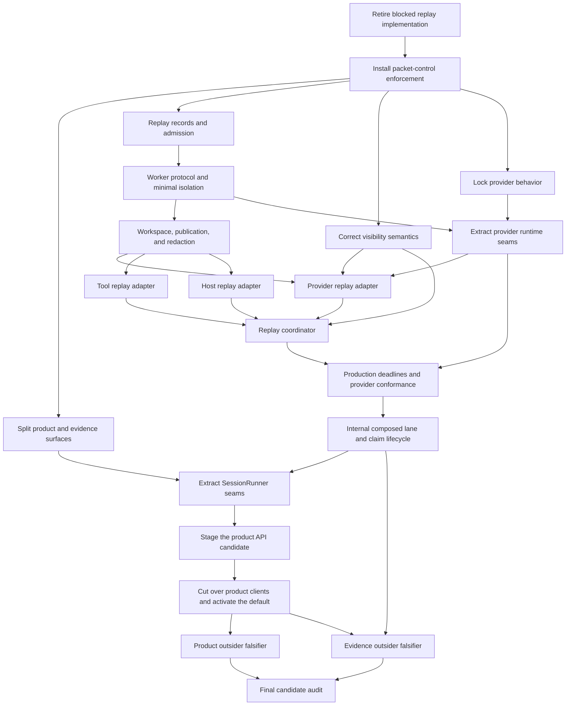

# North-Star recovery execution plan

Status: approved planning direction; no implementation packet may bypass its machine preflight or human gate, except the bounded G0 and G2 pre-checker processes defined below.

Date: 2026-07-24

## 1. Outcome

Finish the existing BreadBoard direction with one default product path and a separate internal evidence backend. The program ends when:

- the 26-operation product catalog drives the default CLI/API/SDK/TUI path;
- E4 is off by default and absent from ordinary clients;
- replay R0-R4 yields one real completed deterministic execution with a complete artifact graph;
- one named real provider route passes production replay conformance;
- one exact target behavior is captured, compared, claimed, and reverified;
- separate product and evidence clean-room falsifiers pass;
- current status reports product readiness, active exact-scope claims, and packet state without a cumulative completion score.

`ARCHITECTURE_SPEC.md` defines the target boundaries. This file owns packet scope, dependency order, budgets, acceptance, and approval sequencing.

## 2. Operating rules

1. Refresh `STATE.json` from Beads, GitHub, current source, and immutable evidence before selecting work.
2. Use one isolated worktree and one implementation owner per writing packet.
3. Run at most two writing packets concurrently, with no shared files or generated outputs.
4. The supervisor may use two remaining subagent slots for research, review, or CI diagnosis.
5. Each packet has one promotion owner who alone updates packet state, PR status, and Beads.
6. Exact-head review is mandatory. A head change invalidates local/exact-head results, review, CI, promotion, evidence dossiers, and provider/target results before `refresh_state`.
7. A base or merge-base change invalidates the diff budget, allowed paths, test derivation, local/exact-head results, review, CI, promotion, evidence dossiers, provider/target results, and integration assessment before `refresh_state`.
Generated-input changes are source-identity changes for routing: they invalidate generated fixed points, dependent claims, cached generated checks, scope-bound approvals, and all source-bound results before `refresh_state`.
Target, fixture, provider route/model, comparator, or runtime identity changes are typed invalidation events in every bound active, blocked, verified, and closed state. They route through `refresh_state` and invalidate results, reviews, dossiers, claims, caches, spend approvals, packet closure, and promotion before any successor action.
8. Stop at 100% of any file, line, attempt, or review budget. Split or abandon through a human decision.
9. Generated files count toward the file cap but not the non-generated line cap. Their authored inputs and generator command must be named.
10. Tests come from the ownership manifest, import/schema consumers, generated dependencies, and packet acceptance. A worker may not invent a smaller test plan.
11. Broad E4 fixed-point work runs only at a stable head. Target evidence is never reused across a target, fixture, provider, comparator, or environment change.
12. Merge, issue closure or supersession, public contract/default changes, and security-boundary changes remain human gates.
13. Historical evidence is immutable. Use successor records and a current selector to supersede status.
14. Stop after two implementation attempts or two review rounds unless the packet says less.
15. Product defects, specification gaps, environmental failures, flakes, and gate defects are classified separately. A failed check is never hidden by skipping it.
16. Run `uv run python scripts/check_phase20_freeze.py` at preflight and local gates. A missing guard, missing digest-bound result report, missing required exception record, or nonzero result blocks the packet.
17. G2 is the first writing packet after G0. G1 may be researched concurrently, but its branch and edits wait until G2 closes.

## 3. Recovery graph



Allowed parallel work:

- after replay retirement: packet-control enforcement; G1 read-only research may run concurrently but no G1 branch or edit starts;
- after packet-control enforcement: G1, R0, visibility semantics, and provider behavior lock when their file scopes are disjoint;
- after R2: provider, tool, and host replay adapters when their file scopes are disjoint;
- product and evidence outsider falsifiers after their prerequisites are stable.

Serialize catalog regeneration, public client generation, shared evidence inventories, fixed-point regeneration, and campaign state rendering.

## 4. Packet register

Budgets apply to non-generated additions plus deletions. Mechanical moves still count unless the packet checker can prove byte-identical relocation and reports moved bytes separately. A packet crossing a cap enters `blocked_budget` before further edits.

| Key | Packet | Depends on | Max files | Max non-generated lines | Attempts | Review rounds | Required proof | Human gate |
| --- | --- | --- | ---: | ---: | ---: | ---: | --- | --- |
| G0 | Retire blocked replay implementation | none | 4 | 200 | 1 | 1 | T0, tracker/PR audit | tracker_supersession + packet_closure + campaign_graph_rewrite |
| G1 | Split product and evidence surfaces | G0, G2 | 12 | 750 | 2 | 2 | T0-T2, generated diff | public_boundary + architecture_change |
| G2 | Install packet-control enforcement | G0 | 11 | 700 | 2 | 2 | bootstrap review, T0-T2, negative gates | governance_schema |
| R0 | Replay records and admission | G2 | 8 | 650 | 2 | 2 | T0-T2 | governance_schema |
| R1 | Worker protocol and minimal isolation | R0 | 12 | 800 | 2 | 2 | T0-T2, security lens | security_boundary |
| R2 | Workspace, publication, and redaction | R1 | 12 | 900 | 2 | 2 | T0-T2, fault matrix | security_boundary + artifact_publication |
| V1 | Correct visibility semantics | G2 | 6 | 450 | 2 | 2 | T0-T2 | public_boundary |
| P0 | Lock provider behavior | G2 | 4 | 250 | 1 | 1 | T0-T1 behavior fixtures | none |
| P1 | Extract provider runtime seams | P0, R1 | 12 | 1000 | 2 | 2 | T0-T3, behavior parity | architecture_change |
| R3A | Provider replay adapter | R2, P1, V1 | 8 | 550 | 2 | 2 | T0-T2, tape fixture | none |
| R3B | Tool replay adapter | R2 | 7 | 450 | 2 | 2 | T0-T2, capability negatives | security_boundary |
| R3C | Host replay adapter | R2 | 7 | 450 | 2 | 2 | T0-T2, approval negatives | security_boundary |
| R4 | Replay coordinator | R3A, R3B, R3C, V1 | 10 | 800 | 2 | 2 | T0-T3, deterministic journey | architecture_change |
| N9B | Production deadlines and provider conformance | R4, P1 | 10 | 800 | 2 | 2 | T0-T4, named live routes | external_spend |
| N10 | Internal composed lane and claim lifecycle | N9B | 10 | 800 | 2 | 2 | T0-T4, exact-scope claim | artifact_publication |
| S1 | Extract SessionRunner seams | G1, N10 | 12 | 900 | 2 | 2 | T0-T3, behavior parity | architecture_change |
| A1 | Stage the product API candidate | S1 | 10 | 650 | 2 | 2 | T0-T3, opt-in installed journey | public_boundary + security_boundary |
| C1 | Cut over product clients and activate the default | A1 | 16 | 900 | 2 | 2 | T0-T3, generated fixed point and five-client journey | public_boundary |
| O1 | Product outsider falsifier | C1 | 0 | 0 | 1 | 1 | clean-room raw dossier | external_spend |
| O2 | Evidence outsider falsifier | N10, C1 | 0 | 0 | 1 | 1 | clean-room raw dossier | external_spend |
| F1 | Final candidate audit | O1, O2 | 4 | 200 | 1 | 2 | full CI, claim reverify, two reviews | none; postverification release |

The packet checker may tighten a budget before implementation. Increasing scope or budget routes the blocked packet through `scope_budget_approval`; only a current granted `scope_budget_amendment` record bound to the packet, old/new scope and budget, base, merge base, reason, and expiry may refresh preflight, and the amendment resets review.
N9B, O1, and O2 require an `external_spend` approval with a typed provider, target, or participant-only identity mode; exact applicable identity/route/model values; a nonnegative limit; unit/currency; request cap; token-or-runtime cap; and consumed/remaining balance. Participant-only attempts bind a participant/context digest and encode provider/target identity, route, and model as `null`. Every request or target launch, including failures and zero-cost calls, emits a typed consumption receipt. No launch may exceed the remaining balance, request cap, or token/runtime cap; exhaustion of any cap routes to `blocked_budget` without a success, claim, or promotion.
O1 and O2 are `evidence_only` packets. G0 is `external_governance`; all other packets are `code_or_contract`. `LOOP_SPEC.yaml#packet_kinds` owns their distinct state-machine paths.

Every materialized packet has one Beads issue. O1 and O2 invent no code branch or PR; after exact-hash dossier review, their typed `packet_closure` approval names and closes only the existing packet issue. The evidence worker never performs that closure. The supervisor executes it only after the human approval record matches the dossier, packet, scope, source tree/head/base/merge base, target, fixture, runtime, and environment identities.

## 5. Packet specifications

### G0: Retire blocked replay implementation
Exact controlled objects:

```text
GitHub PR: https://github.com/kmccleary3301/breadboard/pull/44
Beads packet: bb-06u.11
Salvage artifact: docs/plans/north_star_recovery/g0_replay_salvage_record.v1.json
Allowed repository path: docs/plans/north_star_recovery/g0_replay_salvage_record.v1.json
Generated terminal-handoff path: docs/plans/north_star_recovery/STATE.json
Forbidden repository paths: breadboard/**, agentic_coder_prototype/**, sdk/**, tui_skeleton/**, contracts/**, docs/conformance/**
```

The salvage record schema requires `schema_version`, old PR/base/head/tree identities, immutable retained contract refs, retained test-vector refs, and `discarded_implementation_paths` entries encoded as `{path, sha256}` records from the exact old head; successor packet keys; Beads and GitHub actions; the direct tracker/closure human approval IDs; actor; timestamps; and action-result refs. Canonical digests of the three old-head partitions must equal the preflight's `salvage_contract_sha256`, `salvage_tests_sha256`, and `discarded_code_sha256`. The action-result refs must include the digest-bound campaign-graph approval binding receipt. External PR/Beads mutations do not count as repository files; the salvage artifact counts as one file. `STATE.json` is regenerated by the state renderer after the approved actions and is not a G0 implementation file.

G0 runs only from a clean isolated worktree at the approved planning-package commit; any pre-existing tracked or untracked change blocks preflight. The generated predecessor `STATE.json` may be the sole dirty file only while the planning-review frontier is active. After two exact-hash reviews approve, the renderer writes the refreshed STATE and exact handoff manifest, commits only STATE on the reviewed authored anchor, records the resulting clean head/tree, and requires an empty status before G0 selection. G0 is the only pre-G2 external-governance bootstrap. `LOOP_SPEC.yaml#bootstrap_policy.G0` owns every closed schema and executable command. Before the first protected mutation, all preflight and initial-action commands pass. Immediately before every GitHub or Beads mutation—including every individual issue-create and dependency-edge command—the fail-closed wrapper reruns approval freshness, requires at least 900 seconds remaining, revalidates source/worktree/action sequence, and verifies the live partial graph is a duplicate-free approved subset with unchanged unrelated canonical digests. A nonzero result, expiry, identity drift, dirty path, or sequence mismatch blocks that mutation and records partial state.
The packet-specific preflight records exactly two direct approvals for `tracker_supersession` and `packet_closure` plus a separate `campaign_graph_rewrite` approval bound to the 21 packet titles, dependency map, planning head/tree, and pre-action tracker snapshot context. The preflight `packet_closure` action names only closing PR #44 without merge. Bootstrap approval records use the closed pre-G2 schema and cannot satisfy post-G2 generic guards. After the G0 postcheck and independent exact-head salvage review pass, a separate closure-preflight record binds the explicit approval-record path and SHA-256, materialized G0 issue ID, issue-map digest, pre/post records, salvage and review digests, clean planning head/tree, base, merge base, and scope. Its executable validator dereferences every record, checks exact keys and live identities, and requires a nonfuture grant plus at least 900 seconds remaining immediately before closing that issue. The live closure receipt is then digest-bound to that approval and revalidated against Beads.
The G0 postcheck runs before the salvage review and state renderer. It validates the salvage artifact, direct action receipts, graph-approval binding receipt, current source identity, unexpired approvals, and a live post-action tracker snapshot while the salvage artifact is the only worktree change. It queries GitHub and Beads directly; proves PR #44 is closed and unmerged and `bb-06u.11` is superseded; proves every new packet issue title, exact label set, unique ID, status, and canonical unique dependency list equals the approved map; binds both current exact-hash planning reviews; and proves every unrelated pre-existing tracker node and edge has the same canonical JSON byte digest. Self-authored receipt JSON is never authoritative. After the postcheck and one independent exact-head salvage review pass, request the separate exact G0-issue `packet_closure` approval. Only that granted record may close the materialized G0 issue. The renderer may then replace only `STATE.json`; the external handoff manifest binds its digest.
G0 has one action attempt. Every protected command has an attempt-specific immutable pre-mutation receipt, full authority snapshot, and post-command outcome receipt with command, exit, stdout/stderr digests, and `mutation_applied`. Any failure or partial mutation increments the attempt to its limit, records completed and remaining actions from live authorities, and enters `blocked_external` without dirtying tracked STATE. One exact human-approved recovery may continue the same attempt after a fixed-path closed validator recomputes the failed outcome and post-command snapshot, current all-issues graph, completed receipt/outcome prefix, duplicate scan, unrelated-record equality, source identity, clean worktree, and approval with a 900-second margin. Applied-but-nonzero actions remain in the completed prefix; non-applied actions are retried. The immutable attempt-2 suffix starts at the first remaining action and continues through every remaining command under the same validation result. If the last command applied despite a nonzero result, the distinct completed-sequence recovery enters local gates without rerunning any mutation. Any further retry requires a `scope_budget_amendment`, abandonment, or supersession.

The executable action-boundary wrapper owns the complete ordered sequence: close PR, supersede the legacy Bead, create each packet issue in register order, then create each approved dependency edge in register order. Before every individual command it revalidates three distinct approval identities with at least 900 seconds remaining, the exact remote-main/base/merge-base/head/tree, an empty worktree, the live expected PR and legacy-Bead state, the exact already-completed sequence prefix, the exact partial packet graph, and canonical equality of every unrelated tracker record. The initial prefix uses attempt 1; after one fixed recovery result, the remaining suffix uses attempt 2. The postcheck preserves and validates the failed attempt-1 evidence, allows an applied-but-nonzero outcome only when its all-issues post snapshot proves the mutation, and rejects missing, aliased, out-of-order, stale, source-mismatched, outcome-free, or unproved receipts.

The independent salvage review uses a closed record schema bound to the salvage artifact digest, G0 postcheck digest, current source identity, empty findings digest, reviewer identity, and review round. Immediately after that review, a closure-status command proves the salvage artifact is the sole dirty path and writes a digest-bound status record. The closure preflight and separate approval bind that status record, review, postcheck, salvage artifact, issue map, source identities, and materialized G0 issue. Immediately before closure, executable validators recheck the exact record schemas and referenced content, current status, all source identities, the full live tracker snapshot and dependency graph, PR and legacy-Bead state, and the 900-second approval margin. The closure receipt repeats the approval, status, postcheck, and review digests and is validated against live Beads. G2 cannot start until its preflight dereferences that receipt and proves the exact G0 issue is live-closed with its approved title, labels, and dependencies.

Recovery is state-specific. A failure during the initial PR/legacy-Bead/graph sequence writes an external failure record without modifying tracked STATE and enters `blocked_external`; one approved recovery returns to `implementing` only after the fixed recovery record and result validators pass against the clean worktree, original attempt, failed outcome, completed prefix, full live graph, and unrelated authority snapshot. It then completes remaining mutations and repeats local gates, postcheck, and independent review. A close-command or closure-receipt failure records the live issue state externally and invalidates the consumed closure approval before entering `blocked_external`; both the still-open and already-closed routes require the executable reconciliation validator.
If the live G0 issue remains open, reconciliation preserves the committed reviewed STATE and salvage-only dirty scope, returns to `verified`, and requires a fresh closure preflight and approval before retrying the close. If Beads already closed the issue—whether the close command reported success, failure, or an ambiguous result—the distinct reconciliation route proves the exact live closed issue and full all-issues graph, reconstructs the canonical receipt without repeating the close command, preserves clean tracked STATE, and continues through receipt validation.

Every tracker snapshot command uses `bd list --all --json --limit 0`; pre-action, per-command, post-action, closure, reconciliation, and G2 predecessor checks therefore share one all-issues scope, including the superseded legacy Bead. Each per-command wrapper uses the canonical G0 preflight path, derives attempt-specific receipt, pre-snapshot, outcome, and post-snapshot paths from a hard-coded register/action order, refuses symlinks or aliases, and binds every digest. The salvage review, graph-binding receipt, closure approval/status/receipt/result, and terminal manifest/push/result also use fixed canonical paths. Fixed no-argument closed-policy validators own the G0/G2 schema and literal sets; caller-supplied key or literal arguments cannot weaken them.

Closing the materialized G0 issue enters `closure_pending_receipt`, not `closed`. A canonical receipt validator writes a digest-bound validation result after checking exact actor/time/approval/reason and the live issue. Only that result enters `g0_terminal_handoff`. The commit request renders destination-closed STATE with all 21 exact Beads IDs, commits exactly the salvage artifact plus generated STATE, and enters `g0_terminal_handoff_committed`. It then records or reconstructs the external manifest, validates predecessor and committed head/tree plus the exact two-file commit, pushes Beads with a typed receipt, and writes a canonical terminal validation result. Only the executable result validator can enter `closed`. G2 binds both manifest and result; separate required commands independently revalidate the exact postcheck schema, every ordered mutation receipt/outcome and all-issues snapshot including recovery classification, every retained/test/discarded old-head digest and action-result binding, the closure approval/status/review/receipt/result, destination STATE, clean commit, canonical paths, full graph, and live closed G0 issue.

Closure and terminal-handoff failures use separate closed-schema records and executable validators. Recovery requires a fresh `partial_governance_recovery` approval with the exact retry, already-closed reconciliation, or terminal-handoff action and at least 900 seconds remaining. An already-applied close is never repeated. If the terminal commit exists but its manifest, validation, or push/result record failed, the recovery validator proves the existing exact two-file commit and reconstructs only external records; it never resets and recreates the commit.


Actions:

- immediately before the command, run the fail-closed per-mutation wrapper, then close draft PR #44 without merge under the exact approval;
- immediately before the command, rerun the wrapper, then change `bb-06u.11` from blocked to superseded and record R0-R4 plus N9B as successors under the exact `tracker_supersession` approval;
- for every issue-create and dependency-edge command, rerun the wrapper and partial-graph guard; under the separate exact `campaign_graph_rewrite` approval, create one uniquely labeled Beads issue for each of the 21 packet keys with the exact register title and dependency edges, and record the resulting key-to-ID map;
- write the fixed salvage artifact naming hashed retained contracts, retained test vectors, and discarded implementation paths from the exact old head, plus exact old base/head/tree, successor packets, approvals, and external action results;
- query GitHub and Beads live to verify PR #44 is closed and unmerged, `bb-06u.11` is superseded, and every new issue and dependency edge matches the approved map.
- capture the full pre/post all-issues Beads authority snapshots with `bd list --all --json --limit 0` and reject any change outside `bb-06u.11` plus the exact 21 newly approved packet issues;
- after the postcheck and independent salvage review pass, obtain the separate exact closure-preflight record and approval, rerun all postcheck and closure validators with at least 900 seconds remaining, close only the bound materialized G0 packet issue into `closure_pending_receipt`, and require the canonical live receipt-validation result;
- render destination-closed STATE with every canonical packet key bound to its exact Beads ID, commit exactly the salvage artifact and generated STATE, enter `g0_terminal_handoff_committed`, record and validate the manifest, push Beads with a typed receipt, require the canonical terminal validation result, and only then enter `closed`.

Do not edit any product path or any repository path outside the one allowed salvage artifact; generated STATE is the only additional terminal-handoff path. Do not merge PR #44, run its implementation, alter its branch, or rewrite accepted evidence.
A closed, unmerged PR has no promotion transition in this state machine. Reopening, merging, or attaching a new promotion path is a new protected action requiring a new current human gate; absent that action, the old branch is archival input only.

Acceptance:

- PR #44 is closed and unmerged;
- `bb-06u.11` is `superseded` with exact successors R0, R1, R2, R3A, R3B, R3C, R4, and N9B;
- the schema-valid salvage artifact separates retained immutable contracts/tests from discarded code and binds the human approval plus external action evidence;
- the materialized G0 packet issue is closed only after the postcheck and independent salvage review pass under a separate exact `packet_closure` approval bound to its materialized issue ID and evidence digests;
- the refreshed destination-closed `STATE.json` records the exact unique Beads ID and approved key dependency list for every packet key and is committed with the salvage artifact under the validated clean terminal handoff before `select_frontier` can select any G0 successor;
- G2 binds the terminal-handoff head/tree and terminal validation result and independently validates the canonical closure approval, status, salvage review, postcheck, receipt/result, exact two-file commit, destination STATE IDs, all-issues graph, and live closed G0 issue.
- the old branch is archival input only and has no active promotion path.

### G1: Split product and evidence surfaces

Actions:

- preserve `contracts/public/operations.v1.json` and its frozen hash as historical evidence;
- author the 26-operation product authority at `contracts/public/operations.v2.json`;
- author the 19-operation internal authority at `contracts/internal/evidence/operations.v1.json`;
- update catalog loaders, validators, `system.describe`, and the surface inventory generator to consume the correct catalog;
- move lane and claim CLI commands under an explicit maintainer namespace;
- make E4 HTTP routes opt-in and absent from default OpenAPI;
- prevent ordinary Python, TypeScript, and TUI generation from consuming the evidence catalog;
- keep compatibility callers unchanged until A1/C1.
- update package-data configuration and installed-wheel loaders so both current catalogs are present and loadable from a clean install;
- remove the product application's module-load dependency on the E4 router; import and mount E4 only after an exact true-valued internal opt-in;
- reject unknown E4 flag values rather than treating them as enablement;

Acceptance:

- the product router and catalog both contain the exact 26 operations in `ARCHITECTURE_SPEC.md`;
- the internal evidence catalog contains the exact 19 evidence operations;
- the default app has no `/v1/e4/*` routes;
- explicit E4 enablement retains the internal routes and maintainer tools;
- ordinary generated client manifests contain no lane, claim, lane-execution, or lane-lock methods;
- clean-install and installed-wheel checks load both catalogs through their intended namespaces;
- default import tracing covers the installed `bbh`/product CLI, API app creation, Python SDK, TypeScript client, and TUI; none imports `agentic_coder_prototype.api.e4`, `breadboard.product.evidence`, or any E4/evidence/campaign transitive module before exact true-valued internal opt-in;
- the same negative checks inspect Python `sys.modules`/import traces plus default route, OpenAPI, generated-export, and client manifests;
- only `1`, `true`, or `yes` enable E4; unset, false values, typos, and unknown values keep it absent or fail closed;
- the default product path is not flipped in this packet;
- a supersession record points from the historical 45-operation candidate catalog to the two current catalogs.

### G2: Install packet-control enforcement

Target surfaces:

```text
contracts/governance/schemas/bb.work_packet.v2.schema.json
contracts/governance/schemas/bb.north_star_recovery.state.v1.schema.json
scripts/packet/check_packet.py
scripts/packet/derive_test_plan.py
scripts/packet/render_state.py
scripts/packet/test_ownership.v1.json
focused tests
```

Reuse `bb.work_item.v2`, `bb.signal.v1`, `bb.review_verdict.v1`, and existing coordination validators where their semantics match. Do not create parallel task, signal, or review nouns.
G0 and G2 are the only bounded pre-checker exceptions. `LOOP_SPEC.yaml#bootstrap_policy.G2` owns G2's exact preflight/postcheck schemas and commands. Before any G2 edit, the supervisor runs closed-record validation, nonfuture-grant/future-expiry validation, a digest-bound Phase 20 freeze report rerun under `uv`, a dereferenced one-review exact-base verdict bound to base/merge/scope and the canonical preflight payload, and a digest/content/live-authority validation of the completed G0 post-record and closed G0 STATE row.
The one-time `governance_schema` approval is bound to the exact G2 action, base, merge base, scope, and future UTC expiry. The installed checker must then self-host: G2's own negative and positive acceptance records, report digests, current base/merge/head/scope/environment identities, and Phase 20 result all pass through the installed checker before review.

Acceptance tests must fail on:

- forbidden path changes;
- file or line budget overflow;
- implementation, review, or CI retry exhaustion;
- review or CI evidence from another head;
- changed base or merge-base without renewed preflight;
- missing dependency closure;
- missing test ownership;
- worker self-finalization;
- promotion by anyone except the promotion owner.
- missing or stale planning-package review;
- missing or invalid one-time G2 bootstrap approval;
- missing or failing Phase 20 freeze enforcement;
- `STATE.json` keys that do not validate against `bb.north_star_recovery.state.v1`;
- a state render that omits packet DAG state, exact source identities, per-claim references, approval scope, or completion evidence;
- a missing, unhashed, tampered, identity-mismatched, over-cap, nonmonotonic, or aggregate-inconsistent external-spend receipt;

`render_state.py` queries Beads, GitHub, source identity, and evidence refs. It does not use `STATE.json` as input authority.

### R0: Replay records and admission

Scope:

```text
breadboard/product/evidence/replay/{__init__,plan,execution,manifest,admission,errors}.py
one focused test module
```

Acceptance:

- canonical plan IDs are stable and exclude `plan_id` from the preimage;
- any bound-input mutation changes plan ID;
- imported capture or normalized records enter `not_evaluated`, never executed;
- noncompleted execution cannot compare or claim;
- serialization round-trips without object or callable reconstruction;
- manifest paths reject absolute paths, traversal, and duplicate destinations;
- content-addressed refs are checked for existence and digest before admission;
- execution and provider-exchange parent identities must link;
- no provider runtime, FastAPI, SDK, TUI, tracker, or campaign imports.

The permissive `bb.replay_session.v1` scenario contract remains historical input and is not execution authority.

### R1: Worker protocol and minimal isolation

Implement one deterministic dummy worker through a protocol and an adapter to an approved existing sandbox driver. Resolve the current `HostPort.execute` versus sandbox `run`/`run_shell` mismatch explicitly.

Acceptance:

- canonical JSON-only IPC;
- no pickle, callable, or arbitrary object deserialization;
- explicit environment with no inherited secret variables;
- closed inherited file descriptors;
- startup, shutdown, and cancellation bounded;
- cancellation leaves no child or container;
- import outside a frozen allowlist fails;
- network and host filesystem denied by default;
- provider worker has no writable workspace;
- Docker timeout explicitly stops the container;
- legacy gVisor import has no role in the active path.

### R2: Workspace, publication, and redaction

Reuse the current content-addressed artifact and crash-safe session publication behavior.

Acceptance:

- a baseline snapshot exists before execution;
- symlink and root escape fail closed;
- content digests detect modification;
- publication uses staging, `fsync`, no-replace, and rollback;
- replay records reference the product artifact store;
- redaction produces a report;
- raw secrets never appear in published files, logs, errors, or refs;
- fault injection at each publication step leaves no partially authoritative result.

### V1: Correct visibility semantics

Acceptance fixtures cover:

- system prompt: model/provider visible;
- provider route configuration: host-only;
- secret reference: redacted and host-only;
- tool result: model and host visible;
- approval event: host-only;
- public projection: host-only projection, not kernel truth.

No unconditional all-true visibility remains in product compilation or event projection.

### P0 and P1: Provider behavior lock and seam extraction

P0 records current request conversion, streaming events, auth handling, error mapping, cancellation, and descriptor behavior in focused fixtures.

P1 separates product-owned ports and conversions from transport/orchestration without changing public behavior. It must eliminate replay imports from production provider code and break the observed import cycle before N9B.

No production provider rewrite is allowed. A broad design change stops for a new packet.

### R3A, R3B, and R3C: Replay adapters

R3A uses one deterministic tape-backed provider adapter before real transport work. It proves request/response normalization, exact binding identity, and no workspace access.

R3B proves typed input/output, capability enforcement, workspace scope, and an outcome record separate from model rendering.

R3C proves brokered side effects, an approval reference, and no ambient host capability.

Each adapter depends inward on product-owned ports. Production runtime does not depend on replay.

### R4: Replay coordinator

The coordinator owns deterministic turn sequencing, provider/tool/host transitions, cancellation observation, execution-state transitions, referenced outcomes, and handoff to publication.

Acceptance:

- deterministic multi-turn provider-to-tool-to-provider fixture;
- deterministic host fixture with approval;
- cancellation and terminal status;
- complete content-addressed artifact graph;
- failed/canceled/timed-out/integrity-failed results remain nonclaimable;
- no production provider deadlines, fallback, retry, or transport policy;
- no OS sandbox implementation details.

### N9B: Production deadlines and provider conformance

Run only after target preflight proves credentials, models, provider endpoints, runtime, and spend approval.

Acceptance:

- explicit operation, idle, and total deadlines;
- cancellation races and cleanup fault matrix;
- no fallback/model drift hidden inside a result;
- streaming and non-streaming/tool routes run twice on named real providers;
- one live cancellation stops within grace and cannot claim;
- raw request IDs, route/model identities, environment hash, logs, and redaction evidence retained;
- no mock result occupies a production evidence role.

Environmental holds remain blocked and do not become code defects.

### N10: Internal composed lane and claim lifecycle

This packet replaces the existing public lane/claim intent. It stays internal unless a second real HTTP-service consumer is proven.

Acceptance:

- Lane Lock composes with Replay Plan;
- one deterministic lane executes, compares, and produces one exact-scope candidate claim;
- stored reuse cannot be labeled executed;
- claim scope-overreach fails closed;
- reverification is non-mutating and bound to current inputs;
- the recovery claim record binds claim ID and scope to current execution, comparison, support-claim, input, environment, and reverification digests;
- `STATE.json#completion.recovery_claim` points to that record and cannot be satisfied by pre-existing inventory counts;
- current claim counts come from `docs/conformance/e4_lane_inventory.json`, not historical score expectations;
- ordinary product clients gain no lane or claim methods.

### S1: Extract SessionRunner seams

Extract only the seams required for the product Session to own lifecycle and records. Preserve behavior with current CLI/API/session fixtures. Keep provider, tool, and host ports behind explicit boundaries. Do not replace the runtime wholesale.

Acceptance:

- product Session owns lifecycle and product records;
- compatibility adapter calls the same product service;
- no new dual-write state;
- cancellation, input, events, approvals, resume, and artifact behavior remain stable;
- product service does not read campaign or E4 state.

### A1: Stage the product API candidate

Acceptance:

- the lock-first local CLI journey uses `session.start` rather than `config_path` compatibility creation;
- the product API candidate works only under explicit opt-in; the default does not flip in A1;
- compatibility routes remain isolated behind explicit compatibility mode;
- E4 remains off by default;
- installed-wheel CLI and direct API candidate journeys pass;
- `system.describe`, candidate OpenAPI, and the v2 product catalog agree;
- `integration.probe` has an explicit capability, secret, filesystem, network, and side-effect policy review bound to the candidate head;
- rollback of the candidate path is one documented flag change;
- the human approver receives the exact public-candidate diff and head.

### C1: Cut over product clients and activate the default

Generate or update ordinary OpenAPI, Python SDK, TypeScript SDK, TUI, and docs from the v2 product catalog while the candidate remains opt-in. Keep compatibility in explicit non-ordinary modules with removal metadata. Remove lane/claim methods from ordinary clients. Flip the product default only in the final reviewed C1 diff.

Acceptance:

- ordinary OpenAPI, Python SDK, TypeScript SDK, TUI, CLI, and docs expose exactly the 26 product operation IDs and no internal evidence operation;
- compatibility exports exist only in separate non-ordinary modules with owner and removal packet;
- Python and TypeScript clients pass against the same server;
- one lock-first session journey passes through CLI, API, Python SDK, TypeScript SDK, and TUI at the exact C1 head;
- TUI uses the same event and result semantics;
- client regeneration reaches a fixed point;
- no hand-maintained duplicate operation list remains;
- the human approval is bound to the exact generated-client and default-flip diff and head;
- only after all preceding C1 checks pass, the product API is enabled by default and compatibility remains explicit;
- rollback is the documented product-default flag without changing E4's off-by-default state.

### O1 and O2: Outsider falsifiers

These are evidence-only packets with zero repository files and lines. Use separate approved participants or clean contexts. O1 receives no E4 requirement. O2 begins only after a product journey exists. Write content-addressed dossiers to the external evidence root with raw commands, inputs, typed target/fixture/environment/runtime identities, exact source tree/head/base/merge base, elapsed time, line counts, failures, outputs, participant approval ID, redaction result, evidence-attempt counter/max, and review-round counter/max. A failed run remains valid negative evidence but cannot close the packet. Each dossier receives exact-hash independent review. A failed, over-budget, contaminated, unredacted, or missing-hash dossier routes to a blocked state and cannot emit `evidence_complete`. Remediation requires both counters to remain available; exhausted evidence attempts enter `blocked_budget` and exhausted evidence review rounds enter `blocked_review`.

### F1: Final candidate audit

The final audit answers:

- Can an outsider build and run a harness?
- Is one engine path used across all ordinary clients?
- Can one exact target behavior be captured and claimed?
- Are product and evidence surfaces separate?
- Are there unresolved P0/P1 correctness or security defects?
- Do compatibility paths have removal owners?

Run full product CI once at the stable candidate head, touched-lane claim reverification, and two independent review lenses. Do not produce a cumulative readiness score.

## 6. Proof tiers

G2 authors the ownership manifest and packet checker. G0 and G2 alone use their distinct bounded bootstrap processes above. Every later writing packet, including G1, must pass the installed checker before editing; no worker may reconstruct a smaller test plan from memory.

- T0: changed-file lint/type/import checks, directly owned units, schema validation, touched generator check, and `scripts/check_phase20_freeze.py`. Target under 60 seconds.
- T1: owning package tests, contract boundaries, import-boundary negatives. Target under three minutes.
- T2: product integration, clean-install or installed-wheel journey, generated-surface checks. Target under ten minutes.
- T3: required GitHub CI matrix and exact-head integration gates.
- T4: named provider/target preflight, capture, replay, comparison, claim, or fixed-point evidence.

A cache hit is valid only when packet key, scope version, head/tree identity, base, merge base, test-manifest hash, exact command, dependency lock, environment fingerprint, and generated input hashes match. T4 also requires the same target version, fixture, provider route/model, comparator, and runtime.

## 7. Review and CI

Every packet receives one exact-head read-only reviewer. G1, G2, R0-R4, V1, P1, N9B, N10, S1, A1, and C1 receive two lenses:

- specification, correctness, behavior, and completeness;
- security, public boundary, standards, and generated/dispatch drift.

Findings use P0-P3 and Q severity. P0-P2 block promotion. The implementer returns a finding-resolution table; the reviewer reruns on the new head. Exhausted review rounds enter `blocked_review`; exhausted implementation attempts or CI reruns enter `blocked_budget`.

One CI watcher classifies failures as product defect, specification gap, flaky check, environmental hold, or gate defect. Only product defects return directly to implementation. The CI watcher never changes code.
An environment change from any environment-bound work, review, CI, promotion, merge, evidence, verified, blocked, or closed state invalidates environment-bound results, reviews, CI, and promotion eligibility and routes through `refresh_state`.

## 8. Human approval gates

The supervisor must stop with one evidence-backed question before:

- closing or superseding the blocked replay PR or tracker packet;
- merging any packet;
- expanding scope or budget; the human decision must be captured in a typed `scope_budget_amendment` record binding the packet, old/new scope and budget, base, merge base, reason, protected action, decision, and expiry;
- changing public operation catalogs, route defaults, schemas, or generated clients;
- changing isolation, secret, filesystem, network, capability, or approval boundaries;
- activating or changing authoritative artifact publication semantics;
- spending external provider/target resources;
- accepting a known P0-P2 defect or test waiver;
- activating the product API by default;
- rewriting the existing North-Star tracker graph;
- publishing claims or releasing a candidate.

The user's approval to create this package authorizes planning and managed PR preparation. It does not remove the previously selected merge, issue-closure, public-boundary, or security gates.

## 9. Tracker amendment

After this package passes independent review:

1. preserve the current campaign and packet history;
2. link the recovery program as an amendment;
3. supersede the blocked replay packet with R0-R4 and N9B;
4. reframe the existing lane/claim API packet as internal evidence service work, or cancel it if no second consumer exists;
5. retain the merged core API packet as accepted exact-head work, not product certification;
6. replace the current downstream dependency edges with the graph in section 3;
7. update Beads only after the human graph-rewrite gate;
8. regenerate `STATE.json` after each approved transition.

## 10. Stop conditions

Stop the loop and escalate when:

- a packet reaches any hard budget;
- an exact behavior cannot be reproduced on the base;
- the required target, credential, provider, platform, or participant is unavailable;
- source authority, tracker state, or evidence identity conflicts cannot be reconciled;
- implementation requires a forbidden path or an unapproved public/security change;
- two implementation attempts or two review rounds fail;
- CI reports an unclassified failure;
- a generated surface has no authored owner;
- the product and evidence paths start to share public operations again.
