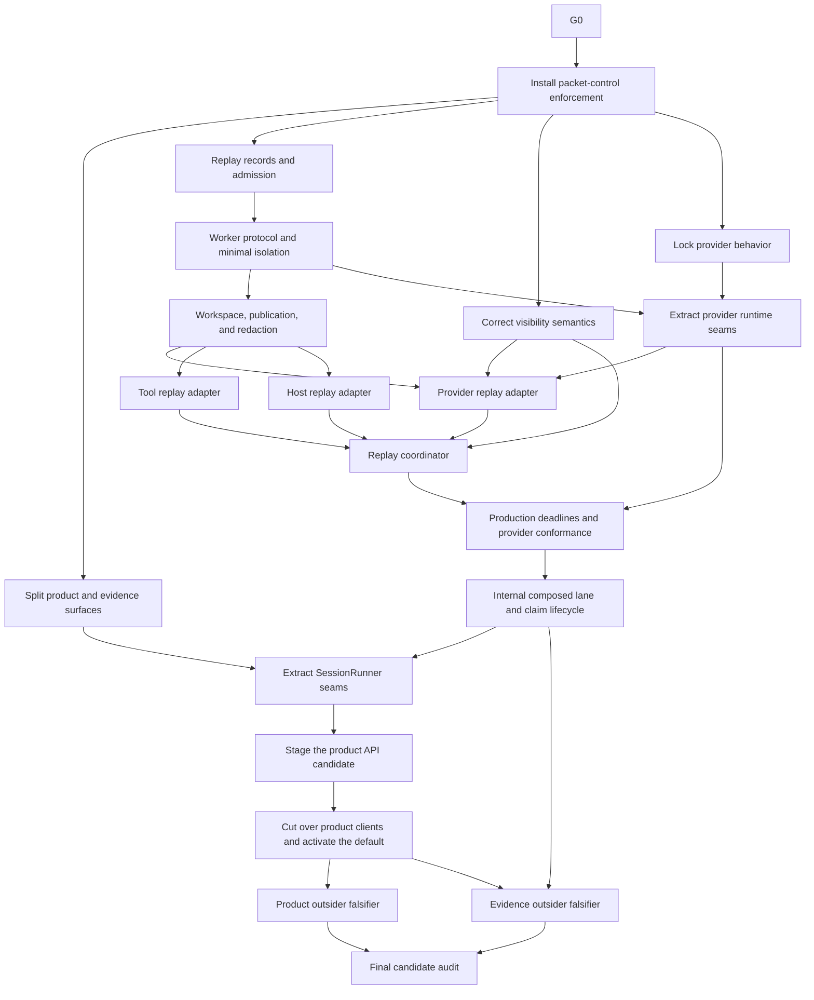

# North-Star recovery execution plan

Status: approved planning direction; no implementation packet may bypass its machine preflight or human gate, except the bounded G0 and G2 pre-checker processes defined below.

Date: 2026-07-24

## 1. Outcome

Finish the existing BreadBoard direction with one default product path and a separate internal evidence backend. The program ends when:

- the 26-operation product catalog drives the default CLI/API/SDK/TUI path;
- E4 is off by default and absent from ordinary clients;
- replay R0-R4 yields one real completed deterministic execution with a complete artifact graph;
- one named real provider route passes production replay conformance;
- one exact target behavior is captured, compared, claimed, and reverified;
- separate product and evidence clean-room falsifiers pass;
- current status reports product readiness, active exact-scope claims, and packet state without a cumulative completion score.

`ARCHITECTURE_SPEC.md` defines the target boundaries. This file owns packet scope, dependency order, budgets, acceptance, and approval sequencing.

## 2. Operating rules

1. Refresh `STATE.json` from Beads, GitHub, current source, and immutable evidence before selecting work.
2. Use one isolated worktree and one implementation owner per writing packet.
3. Run at most two writing packets concurrently, with no shared files or generated outputs.
4. The supervisor may use two remaining subagent slots for research, review, or CI diagnosis.
5. Each packet has one promotion owner who alone updates packet state, PR status, and Beads.
6. Exact-head review is mandatory. A head change invalidates local/exact-head results, review, CI, promotion, evidence dossiers, and provider/target results before `refresh_state`.
7. A base or merge-base change invalidates the diff budget, allowed paths, test derivation, local/exact-head results, review, CI, promotion, evidence dossiers, provider/target results, and integration assessment before `refresh_state`.
Generated-input changes are source-identity changes for routing: they invalidate generated fixed points, dependent claims, cached generated checks, scope-bound approvals, and all source-bound results before `refresh_state`.
Target, fixture, provider route/model, comparator, or runtime identity changes are typed invalidation events in every bound active, blocked, verified, and closed state. They route through `refresh_state` and invalidate results, reviews, dossiers, claims, caches, spend approvals, packet closure, and promotion before any successor action.
8. Stop at 100% of any file, line, attempt, or review budget. Split or abandon through a human decision.
9. Generated files count toward the file cap but not the non-generated line cap. Their authored inputs and generator command must be named.
10. Tests come from the ownership manifest, import/schema consumers, generated dependencies, and packet acceptance. A worker may not invent a smaller test plan.
11. Broad E4 fixed-point work runs only at a stable head. Target evidence is never reused across a target, fixture, provider, comparator, or environment change.
12. Merge, issue closure or supersession, public contract/default changes, and security-boundary changes remain human gates.
13. Historical evidence is immutable. Use successor records and a current selector to supersede status.
14. Stop after two implementation attempts or two review rounds unless the packet says less.
15. Product defects, specification gaps, environmental failures, flakes, and gate defects are classified separately. A failed check is never hidden by skipping it.
16. Run `uv run --no-project --with PyYAML --with jsonschema python scripts/check_phase20_freeze.py` at preflight and local gates. `--no-project` prevents gate execution from creating or mutating a repository lockfile; `PyYAML` and `jsonschema` are explicit transient tool dependencies because the project environment does not declare them. A missing guard, missing digest-bound result report, missing required exception record, or nonzero result blocks the packet.
17. G2 is the first writing packet after G0. G1 may be researched concurrently, but its branch and edits wait until G2 closes.
18. Beads is local-only: `.beads/` and `.beads_local/` stay ignored and untracked, no BreadBoard source repository may be a Dolt remote, and `bd dolt push` is forbidden unless a later human-approved policy names a dedicated non-source remote. Packet transitions seal the local Dolt identity and authority snapshot instead of synchronizing it to Git.

## 3. Recovery graph



Allowed parallel work:

- after replay retirement: packet-control enforcement; G1 read-only research may run concurrently but no G1 branch or edit starts;
- after packet-control enforcement: G1, R0, visibility semantics, and provider behavior lock when their file scopes are disjoint;
- after R2: provider, tool, and host replay adapters when their file scopes are disjoint;
- product and evidence outsider falsifiers after their prerequisites are stable.

Serialize catalog regeneration, public client generation, shared evidence inventories, fixed-point regeneration, and campaign state rendering.

## 4. Packet register

Budgets apply to non-generated additions plus deletions. Mechanical moves still count unless the packet checker can prove byte-identical relocation and reports moved bytes separately. A packet crossing a cap enters `blocked_budget` before further edits.

| Key | Packet | Depends on | Max files | Max non-generated lines | Attempts | Review rounds | Required proof | Human gate |
| --- | --- | --- | ---: | ---: | ---: | ---: | --- | --- |
| G0 | Retire blocked replay implementation | none | 4 | 200 | 1 | 1 | T0, tracker/PR audit | tracker_supersession + packet_closure + campaign_graph_rewrite |
| G1 | Split product and evidence surfaces | G0, G2 | 12 | 750 | 2 | 2 | T0-T2, generated diff | public_boundary + architecture_change |
| G2 | Install packet-control enforcement | G0 | 19 | 6000 | 5 | 5 | reset-3 seed, object-mode self-host, generated projection/differential parity, T0-T2, positive preseed/seed/candidate/closure fixtures, nine negative families, fresh actions and exact reviews | governance_schema + security_boundary + scope_budget_amendment + merge + closure_anchor_selection + packet_closure |
| R0 | Replay records and admission | G2 | 8 | 650 | 2 | 2 | T0-T2 | governance_schema |
| R1 | Worker protocol and minimal isolation | R0 | 12 | 800 | 2 | 2 | T0-T2, security lens | security_boundary |
| R2 | Workspace, publication, and redaction | R1 | 12 | 900 | 2 | 2 | T0-T2, fault matrix | security_boundary + artifact_publication |
| V1 | Correct visibility semantics | G2 | 6 | 450 | 2 | 2 | T0-T2 | public_boundary |
| P0 | Lock provider behavior | G2 | 4 | 250 | 1 | 1 | T0-T1 behavior fixtures | none |
| P1 | Extract provider runtime seams | P0, R1 | 12 | 1000 | 2 | 2 | T0-T3, behavior parity | architecture_change |
| R3A | Provider replay adapter | R2, P1, V1 | 8 | 550 | 2 | 2 | T0-T2, tape fixture | none |
| R3B | Tool replay adapter | R2 | 7 | 450 | 2 | 2 | T0-T2, capability negatives | security_boundary |
| R3C | Host replay adapter | R2 | 7 | 450 | 2 | 2 | T0-T2, approval negatives | security_boundary |
| R4 | Replay coordinator | R3A, R3B, R3C, V1 | 10 | 800 | 2 | 2 | T0-T3, deterministic journey | architecture_change |
| N9B | Production deadlines and provider conformance | R4, P1 | 10 | 800 | 2 | 2 | T0-T4, named live routes | external_spend |
| N10 | Internal composed lane and claim lifecycle | N9B | 10 | 800 | 2 | 2 | T0-T4, exact-scope claim | artifact_publication |
| S1 | Extract SessionRunner seams | G1, N10 | 12 | 900 | 2 | 2 | T0-T3, behavior parity | architecture_change |
| A1 | Stage the product API candidate | S1 | 10 | 650 | 2 | 2 | T0-T3, opt-in installed journey | public_boundary + security_boundary |
| C1 | Cut over product clients and activate the default | A1 | 16 | 900 | 2 | 2 | T0-T3, generated fixed point and five-client journey | public_boundary |
| O1 | Product outsider falsifier | C1 | 0 | 0 | 1 | 1 | clean-room raw dossier | external_spend |
| O2 | Evidence outsider falsifier | N10, C1 | 0 | 0 | 1 | 1 | clean-room raw dossier | external_spend |
| F1 | Final candidate audit | O1, O2 | 4 | 200 | 1 | 2 | full CI, claim reverify, two reviews | none; postverification release |

The packet checker may tighten a budget before implementation. Increasing scope or budget routes the blocked packet through `scope_budget_approval`; only a current granted `scope_budget_amendment` record bound to the packet, old/new scope and budget, base, merge base, reason, and expiry may refresh preflight, and the amendment resets review.
N9B, O1, and O2 require an `external_spend` approval with a typed provider, target, or participant-only identity mode; exact applicable identity/route/model values; a nonnegative limit; unit/currency; request cap; token-or-runtime cap; and consumed/remaining balance. Participant-only attempts bind a participant/context digest and encode provider/target identity, route, and model as `null`. Every request or target launch, including failures and zero-cost calls, emits a typed consumption receipt. No launch may exceed the remaining balance, request cap, or token/runtime cap; exhaustion of any cap routes to `blocked_budget` without a success, claim, or promotion.
O1 and O2 are `evidence_only` packets. G0 is `external_governance`; all other packets are `code_or_contract`. `LOOP_SPEC.yaml#packet_kinds` owns their distinct state-machine paths.

Every materialized packet has one Beads issue. O1 and O2 invent no code branch or PR; after exact-hash dossier review, their typed `packet_closure` approval names and closes only the existing packet issue. The evidence worker never performs that closure. The supervisor executes it only after the human approval record matches the dossier, packet, scope, source tree/head/base/merge base, target, fixture, runtime, and environment identities.

## 5. Packet specifications

### G0: Retire blocked replay implementation
Exact controlled objects:

```text
GitHub PR: https://github.com/kmccleary3301/breadboard/pull/44
Beads packet: bb-06u.11
Salvage artifact: docs/plans/north_star_recovery/g0_replay_salvage_record.v1.json
Allowed repository path: docs/plans/north_star_recovery/g0_replay_salvage_record.v1.json
Generated terminal-handoff path: docs/plans/north_star_recovery/STATE.json
Forbidden repository paths: breadboard/**, agentic_coder_prototype/**, sdk/**, tui_skeleton/**, contracts/**, docs/conformance/**
```

The salvage record schema requires `schema_version`, old PR/base/head/tree identities, immutable retained contract refs, retained test-vector refs, and `discarded_implementation_paths` entries encoded as `{path, sha256}` records from the exact old head; successor packet keys; Beads and GitHub actions; the direct tracker/closure human approval IDs; actor; timestamps; and action-result refs. Canonical digests of the three old-head partitions must equal the preflight's `salvage_contract_sha256`, `salvage_tests_sha256`, and `discarded_code_sha256`. The action-result refs must include the digest-bound campaign-graph approval binding receipt. External PR/Beads mutations do not count as repository files; the salvage artifact counts as one file. `STATE.json` is regenerated by the state renderer after the approved actions and is not a G0 implementation file.

G0 runs only from a clean isolated worktree at the approved planning-package commit; any pre-existing tracked or untracked change blocks preflight. The generated predecessor `STATE.json` may be the sole dirty file only while the planning-review frontier is active. After two exact-hash reviews approve, the renderer writes the refreshed STATE and exact handoff manifest, commits only STATE on the reviewed authored anchor, records the resulting clean head/tree, and requires an empty status before G0 selection. G0 is the only pre-G2 external-governance bootstrap. `LOOP_SPEC.yaml#bootstrap_policy.G0` owns every closed schema and executable command. Before the first protected mutation, all preflight and initial-action commands pass. Immediately before every GitHub or Beads mutation—including every individual issue-create and dependency-edge command—the fail-closed wrapper reruns approval freshness, requires at least 900 seconds remaining, revalidates source/worktree/action sequence, and verifies that the full normalized protected tracker projection equals the previous accepted action outcome (or the approved recovery-current projection for attempt 2), with exact dependency IDs and types. The exact full PR projection is independently chained between action outcomes and retry evidence. Unrelated tracker work may advance between protected command intervals; each runner nevertheless compares its own immediate before/after unrelated semantic hashes and seals any interval drift as a typed failure. A nonzero result, expiry, identity drift, dirty path, protected-state mismatch, or command-interval unrelated drift blocks that mutation and records partial state.
The packet-specific preflight records exactly two direct approvals for `tracker_supersession` and `packet_closure`, each bound to the current planning head/tree, plus a separate `campaign_graph_rewrite` approval bound to the 21 packet titles, 31-edge dependency map, planning head/tree, and pre-action tracker snapshot context. The preflight `packet_closure` action names only closing PR #44 without merge. Bootstrap approval records use the closed pre-G2 schema and cannot satisfy post-G2 generic guards. After the G0 postcheck and independent exact-head salvage review pass, a separate closure-preflight record binds the explicit approval-record path and SHA-256, materialized G0 issue ID, issue-map digest, pre/post records, salvage and review digests, clean planning head/tree, base, merge base, and scope. Its executable validator dereferences every record, checks exact keys and live identities, and requires a nonfuture grant plus at least 900 seconds remaining immediately before closing that issue. The live closure receipt is then digest-bound to that approval and revalidated against Beads.
The G0 postcheck runs before the salvage review and state renderer. It validates the salvage artifact, direct action receipts, graph-approval binding receipt, current source identity, unexpired approvals, and a live post-action tracker snapshot while the salvage artifact is the only worktree change. It queries GitHub and Beads directly; proves the full normalized PR #44 object is closed and unmerged with unchanged immutable metadata; proves the full normalized `bb-06u.11` object is superseded with unchanged non-transition metadata; proves every new packet issue's complete semantic object, exact label set, unique ID, status, and canonical unique `(target ID, dependency_type)` list equals the final accepted action outcome and approved map; and binds both current exact-hash planning reviews. Every accepted action outcome independently proves equality of its full expected/observed protected objects and equality of unrelated before/after semantic hashes over that command interval. The chain proves each attempt-1 boundary equals the preceding accepted protected poststate; an attempt-2 boundary equals the separately validated recovery-current snapshot. It intentionally does not freeze unrelated campaigns across the entire 54-command sequence. Self-authored receipt JSON is never authoritative. After the postcheck and one independent exact-head salvage review pass, request the separate exact G0-issue `packet_closure` approval. Only that granted record may close the materialized G0 issue. The renderer may then replace only `STATE.json`; the external handoff manifest binds its digest.
G0 has one action attempt. The final preflight operation rereads the same bytes around every required validator, requires 900 seconds of approval margin, rejects every approval, grantor, reviewer, author, and prior operational identity as its run identity, creates evidence directories through root-anchored no-follow descriptors, and atomically writes a validation receipt, mutually bound anchor, success-ledger genesis, and failure-ledger genesis. The anchor records both ledgers' device/inode identities. Each genesis row binds the anchor and validation receipt by path, device, inode, and digest. Replacement of any anchored file breaks validation. Every append to either ledger rejects prior ledger and authority identities. The four-file publication is one fail-closed transaction: any receipt, anchor, ledger, or genesis failure securely unlinks every artifact created by that invocation, fsyncs the parent, emits a typed publication failure, and leaves G0 pending for an exact clean rerun. A rollback failure emits a distinct typed terminal external hold; neither path grants mutation authority before both genesis rows exist.

The executable action boundary owns close PR, supersede legacy Bead, 21 issue creates, and 31 dependency edges (54 total protected actions) in register order. Its receipt and immutable tracker snapshot use exclusive root-FD no-follow writers. One approved recovery may execute only the exact attempt-2 suffix. The failed-post snapshot remains immutable and digest-bound to the recovery record. Recovery is admissible only with a trusted post-observation and one of two exact classifications: an applied action whose full expected and observed protected PR/tracker projections are byte-canonically equal, or an explicitly unapplied action whose observed tracker projection equals its immutable pre-action boundary snapshot and whose observed PR equals the sequence-derived pre-action PR. An applied mismatch, an unapplied boundary mismatch, a null application classification, or a post-observation exception enters a terminal external hold; it cannot produce recovery evidence or admit attempt 2, and requires independently approved out-of-band remediation followed by a new clean G0 package. For an admissible failure, the fixed recovery materializer consumes the immutable failed outcome, a separately authored approval candidate bound to the acyclic recovery-intent digest, and a disjoint materializer run identity. It re-queries GitHub and Beads, repeats the applied-or-unapplied classification, requires current full protected PR/tracker equality to the classified recovery state, byte-copies the retained failed-post snapshot, emits closed-schema duplicate and unrelated-graph reports, records unrelated changes without treating them as protected drift, and exclusively writes the fixed approval and recovery record. Partial materialization writes an authenticated failure-ledger row and remains blocking. Recovery freshness and validation repeat those live checks and write a separate immutable recovery-current tracker snapshot. The actual attempt-2 boundary writes a third fresh immutable snapshot immediately before mutation; its full protected tracker projection must equal the recovery-current snapshot, and its exact PR projection and hash must equal the recovery validation result. Before each subprocess, the mutation runner itself—not its caller—revalidates that exact boundary, the anchored preflight/ledger pair, an identity disjoint from all ledger and authority identities, current remote main/head/tree, empty worktree, approval margin, recovery authority, the preceding full protected tracker/PR state, and exact packet-edge types. It derives the only argv, executes it inside a total exception-sealing boundary, rescans live state, and writes result/snapshot/outcome records through root-FD `O_NOFOLLOW|O_EXCL` operations. The outcome binds full expected and observed PR, legacy-Bead, and packet objects; exact dependency IDs and types; verbatim stdout and stderr plus independently recomputed digests; command-interval unrelated hashes; typed postcondition errors; the raw command exit; and the effective exit. A command exception with a successful trusted post-observation may produce an admissible typed outcome; a post-observation exception cannot. Evidence-publication failures attempt an authenticated failure-ledger fallback and remain blocking. Postcheck and G2 reconstruct every clean, applied-nonzero, and non-applied/retried event and reject identity overlap or artifact drift.

The independent salvage review uses a closed record schema bound to the salvage artifact, G0 postcheck, source identity, empty findings, reviewer role/run, author identity, and review round. Reviewer ID, review-run ID, and author identity are bound into both exact-hash verdicts and excluded from every operational run identity. Before any closure-side revalidation or `bd close`, the closure runner fsyncs its writer canary and appends `closure_started` to the failure ledger. The failure record names the exact stage: command exception/nonzero, unavailable or wrong live postcondition, approval expiry, snapshot write, receipt write, main-ledger append, prevalidation, or interrupted restart. Success and failure records bind the start row's sequence and canonical digest. The failure-ledger action equals the record's failure kind. A failure-record write error appends a separate authenticated writer-error row; that row blocks external progress until the fixed record can be sealed. Restart seals an unsealed start without repeating the close.

Recovery is state-specific. A failure during the initial PR/legacy-Bead/graph sequence writes an external failure record without modifying tracked STATE and enters `blocked_external`; one approved recovery returns to `implementing` only after the fixed recovery record and result validators pass. Closure command, expiry, postcondition, prevalidation, and evidence-seal failures occur from `closure_pending_receipt` and have an explicit route to `blocked_external`. A closure failure records the exact live issue when Beads is reachable. If observation fails, the record uses null issue fields plus caught error classes and retains the prevalidated closure source/worktree records. A failure-record writer error uses the anchored fallback row and never authorizes replay.
An observed-open reconciliation returns to `verified` and requires a fresh closure preflight and approval before retry. An observed-closed reconciliation reconstructs the receipt without repeating the close. An unknown observation requires a fresh `partial_governance_recovery` approval, then binds the current issue as open or closed. Receipt-validation provider or authority failures leave the loop in `closure_pending_receipt`; the validator may be retried because it does not mutate Beads. No impossible receipt-failure kind is used to move state.

Every tracker snapshot uses `bd list --all --json --limit 0`; all paths are fixed or closed-allowlisted. Critical writers use complete same-directory temporaries. Ledger appenders write every byte, then on any `BaseException` truncate and fsync back to the locked pre-append length. Round-39 verdicts carry distinct reviewer, review-run, and author identities.

Closing G0 enters `closure_pending_receipt`, never `closed`; closure and result seals gate handoff. The closure runner catches every `BaseException` after start. Closure-validation, terminal-validation, and terminal-intent publications use deterministic identities, accept one exact matching row on restart, reject conflicts, and roll back an interrupted append before retry. Empty or partial failure publication cannot satisfy a hold.

A failure-publication hold requires durable evidence: one bound immutable failure record/observation or one authenticated writer-error row with the canary and start refs. Empty publication never satisfies the hold validator; it remains an unsealed-start condition. If restart later publishes the bound record and observation, an earlier writer-error remains admissible only with its original refs and lower sequence number. G0 and G2 reject the ledger until that same start is sealed. The protected close, commit, or push is never repeated.

Both closure and terminal-push runners inventory primary/retry failure and writer artifacts before any start. Closure rejects current-run, stale-opposite, duplicate, writer-only, symlink, and malformed candidates. A noncurrent primary requires its matching primary writer, recovery approval hash, reconciliation evidence, and full failure validation.

Across closure and push, unobserved subprocesses use exit `-1` plus empty stdout/stderr; returned results are retained. Push/fetch exception classes flow separately into failure metadata. Closure failure v4 persists digest-bound pre-close validator results. If failure-record publication itself fails, the authenticated writer-failure ledger action is the last-resort exception channel.


Actions:

- immediately before the command, run the fail-closed per-mutation wrapper, then close draft PR #44 without merge under the exact approval;
- immediately before the command, rerun the wrapper, then change `bb-06u.11` from blocked to superseded and record R0-R4 plus N9B as successors under the exact `tracker_supersession` approval;
- for every issue-create and dependency-edge command, rerun the wrapper and partial-graph guard; under the separate exact `campaign_graph_rewrite` approval, create one uniquely labeled Beads issue for each of the 21 packet keys with the exact register title and dependency edges, and record the resulting key-to-ID map;
- write the fixed salvage artifact naming hashed retained contracts, retained test vectors, and discarded implementation paths from the exact old head, plus exact old base/head/tree, successor packets, approvals, and external action results;
- query GitHub and Beads live to verify PR #44 is closed and unmerged, `bb-06u.11` is superseded, and every new issue and dependency edge matches the approved map.
- capture the full pre/post all-issues Beads authority snapshots with `bd list --all --json --limit 0` and reject any change outside `bb-06u.11` plus the exact 21 newly approved packet issues;
- after the postcheck and independent salvage review pass, obtain the separate exact closure-preflight record and approval, rerun all postcheck and closure validators with at least 900 seconds remaining, close only the bound materialized G0 packet issue into `closure_pending_receipt`, and require the canonical live receipt-validation result;
- render destination-closed STATE with every canonical packet key bound to its exact Beads ID, commit exactly the salvage artifact and generated STATE, enter `g0_terminal_handoff_committed`, record and validate the manifest, then bind the authenticated local-only disposition, ignored/untracked Beads paths, absent Dolt remotes, exact local Dolt identity, preserved failed-push evidence, and canonical closure result before entering `closed`.

Do not edit any product path or any repository path outside the one allowed salvage artifact; generated STATE is the only additional terminal-handoff path. Do not merge PR #44, run its implementation, alter its branch, or rewrite accepted evidence.
A closed, unmerged PR has no promotion transition in this state machine. Reopening, merging, or attaching a new promotion path is a new protected action requiring a new current human gate; absent that action, the old branch is archival input only.

Acceptance:

- PR #44 is closed and unmerged;
- `bb-06u.11` is `superseded` with exact successors R0, R1, R2, R3A, R3B, R3C, R4, and N9B;
- the schema-valid salvage artifact separates retained immutable contracts/tests from discarded code and binds the human approval plus external action evidence;
- the materialized G0 packet issue is closed only after the postcheck and independent salvage review pass under a separate exact `packet_closure` approval bound to its materialized issue ID and evidence digests;
- the refreshed destination-closed `STATE.json` records the exact unique Beads ID and approved key dependency list for every packet key and is committed with the salvage artifact under the validated clean terminal handoff before `select_frontier` can select any G0 successor;
- G2 binds the terminal-handoff head/tree and authenticated local-only disposition and independently validates the canonical closure approval, status, salvage review, postcheck, receipt/result, exact two-file commit, destination STATE IDs, all-issues graph, live closed G0 issue, ignored/untracked Beads paths, and absence of any configured Dolt remote.
- the old branch is archival input only and has no active promotion path.

### G1: Split product and evidence surfaces

Actions:

- preserve `contracts/public/operations.v1.json` and its frozen hash as historical evidence;
- author the 26-operation product authority at `contracts/public/operations.v2.json`;
- author the 19-operation internal authority at `contracts/internal/evidence/operations.v1.json`;
- update catalog loaders, validators, `system.describe`, and the surface inventory generator to consume the correct catalog;
- move lane and claim CLI commands under an explicit maintainer namespace;
- make E4 HTTP routes opt-in and absent from default OpenAPI;
- prevent ordinary Python, TypeScript, and TUI generation from consuming the evidence catalog;
- keep compatibility callers unchanged until A1/C1.
- update package-data configuration and installed-wheel loaders so both current catalogs are present and loadable from a clean install;
- remove the product application's module-load dependency on the E4 router; import and mount E4 only after an exact true-valued internal opt-in;
- reject unknown E4 flag values rather than treating them as enablement;

Acceptance:

- the product router and catalog both contain the exact 26 operations in `ARCHITECTURE_SPEC.md`;
- the internal evidence catalog contains the exact 19 evidence operations;
- the default app has no `/v1/e4/*` routes;
- explicit E4 enablement retains the internal routes and maintainer tools;
- ordinary generated client manifests contain no lane, claim, lane-execution, or lane-lock methods;
- clean-install and installed-wheel checks load both catalogs through their intended namespaces;
- default import tracing covers the installed `bbh`/product CLI, API app creation, Python SDK, TypeScript client, and TUI; none imports `agentic_coder_prototype.api.e4`, `breadboard.product.evidence`, or any E4/evidence/campaign transitive module before exact true-valued internal opt-in;
- the same negative checks inspect Python `sys.modules`/import traces plus default route, OpenAPI, generated-export, and client manifests;
- only `1`, `true`, or `yes` enable E4; unset, false values, typos, and unknown values keep it absent or fail closed;
- the default product path is not flipped in this packet;
- a supersession record points from the historical 45-operation candidate catalog to the two current catalogs.

### G2: Install packet-control enforcement

G2 attempt 3 and review round 3 are abandoned negative evidence. Their source,
reports, approvals, and reviews cannot be promoted or reused as authority. G2
then entered execution epoch `G2/reset-1` with scope
`bb.north_star_recovery.g2.scope.v2`; that epoch is now `blocked_review` after
two rejected seed attempts and two exhausted seed review rounds. Downstream
packet keys continue to depend on logical packet `G2`.

G2 remains one packet and one Beads issue. Reset-1 defined two machine-gated
phases; its candidate phase never started because no seed was approved,
selected, or merged. No parallel seed packet, issue, task, signal, or review
noun was created.

The historical reset-1 aggregate budget was seventeen files, 4000
non-generated lines, four implementation attempts, four review rounds, and
four CI reruns. Its seed phase was capped at six files, 3000 lines, two
attempts, two review rounds, and two CI reruns. Its candidate phase was capped
at eleven files, 1000 lines, two attempts, two review rounds, and two CI
reruns. Historical counters and artifacts remain immutable and unavailable to
later epochs. The reset-2 amendment below defines the only proposed re-entry.

#### Historical reset-1 seed phase (blocked)

The seed phase may touch only:

```text
docs/plans/north_star_recovery/EXECUTION_PLAN.md
docs/plans/north_star_recovery/LOOP_SPEC.yaml
contracts/governance/schemas/bb.g2_closure_anchor.v1.schema.json
contracts/governance/g2_abandoned_round3_manifest.v1.json
scripts/packet/verify_g2_anchor.py
tests/packet/test_verify_g2_anchor.py
```

The seed contains a strict closure schema, a standard-library-only verifier,
and an immutable manifest of every abandoned round-3 candidate path, mode, blob
OID, SHA-256 digest, and byte length. The abandoned manifest also binds the
blocked record, all four frozen report digests, both round-3 review digests,
the complete path count, and the aggregate candidate digest. The seed reviews
must verify the manifest against the preserved abandoned worktree and frozen
records; a worker-supplied denylist or count is never accepted.

Before either seed attempt, the supervisor creates the operation-ledger genesis
and planning-amendment record in the OMP parent-session capability store. That
server-managed job/message store is outside every delegated agent's filesystem
and tool-write capability; `0700`, path secrecy, and same-UID permissions never
count as isolation. A preflight probe must prove a delegated worker cannot
read, write, delete, or fabricate those records. No filesystem fallback is
permitted. The planning record binds the exact bytes of this execution plan
and loop specification, the G2 issue, source base/merge-base, reset epoch,
old/new scope and budgets, and two independent plan-review objects. It
supersedes stale `STATE.json#planning_package.independent_review` only for this
reset phase; `STATE.json` is not read as authority.

Each seed attempt, review round, CI rerun, merge, human action, and action
consumption is appended to that capability-store ledger. Attempt/review/CI
launches require a reservation first and a completion or typed failure after.
Sequence numbers are contiguous and previous-event digests form one chain from
the genesis. A missing completion consumes the reservation and blocks the
phase. Workers cannot spawn reviewers, push, start CI, access authority records,
or create ledger events.

Before `S` exists, reset-3 seed admission uses the full standard-library
validator source embedded in the exact reviewed `LOOP_SPEC.yaml`; historical
reset validators and hidden capability-store code are not executable. Both
plan reviews and the three distinct fresh human scope/budget, governance, and
security actions bind its source digest, the exact planning commit/tree, and
both planning blob OIDs and SHA-256 digests. The supervisor materializes an
isolated clean worktree at that one reviewed planning commit; its exact
two-file diff is within the 4500-line proposal cap, and source base and
merge-base are the authenticated reviewed parent.
The broker is the authority at the pre-exec boundary. It authenticates one
canonical active event envelope on fixed FD 3 with exactly
`[handle, origin, immutable_object_id, raw_sha256, event_type, actor,
payload_sha256, payload]`, verifies every payload hash/handle/type, and then
launches the validator as its direct child with fixed broker-owned sealed
memfds. The source cannot mint, reauthorize, or choose an envelope, key,
descriptor, capability token, or metadata. FD 3 and object FDs 4--19 must
report `F_GET_SEALS` containing `F_SEAL_SEAL`, `F_SEAL_SHRINK`, `F_SEAL_GROW`,
and `F_SEAL_WRITE`; FD 20 is the broker-owned write-only result FIFO.
The source verifies fixed descriptor roles, broker event identities,
`getppid()`/child and runtime attestations, exact bytes, inode/device/mode,
and all descriptor hashes before reading records.
It independently inspects `/proc/self/cmdline`, `/proc/self/exe`, `sys.argv`,
`sys.executable`, and `os.environ`. The command-line `-I -S -c` scalar bytes
must equal the reviewed extracted source, `/proc/self/exe` must be exactly
`/usr/bin/python3`, its stat must equal FD 5, and the environment is exactly
the closed four-variable map. Invocation descriptor digests cover only
immutable predecessor authority descriptors; action/grant/consumption records
are excluded and each action binds the already-completed invocation digest.
The source writes one canonical result to FD 20 and has no future result,
completion, receipt, or post-attestation input.
The validator recursively authenticates every Git tree object component by
component for head, reviewed parent, and both historical reset roots. It
binds the head commit, sole parent, tree, exact two-path recursive diff,
source scalar blob, and the 4500-line additions/deletions cap. Historical
negative provenance binds exact active source commit/tree identities, every
intermediate tree, path/mode/blob/bytes/line mapping, cardinalities 20/6/11,
the denied union, and candidate exclusion.
The broker supplies one null-tip disposition record, four active 2x2 review
events with route-preflight/history/model/reviewer/run identities, and one
canonical grant/consumption envelope vocabulary. Every grant has a distinct
nonempty action, nonce, response/event handle (`response_id` equals its grant
event handle), and a separate consumption event; later actions use the same
schemas and phase-available result bindings.
The source constructs the exact canonical contract facts/projection and each
materialized 23-field profile from hardcoded active operation tables/templates,
then hashes the full closed record. `broker_builtin` has no OS command
(`executable: null`, `argv: []`, exact broker opcode); `delegated_agent` uses
only an authenticated route event and no future repository script;
`embedded_validator` is `/usr/bin/python3 -I -S -c` with the reviewed scalar;
`verified_script` is allowed only after its creator commit and exact source FD
exist. Operation-time descriptor roles are broker-issued separately from the
preseed fixed FDs, and each filesystem read role equals `input_fds`.
After seed implementation is committed, Phase 20 runs from a fresh read-only
exact proposed-`S` checkout before seed review.

After local gates and CI, the seed completes two review rounds. Each round uses
two distinct fresh sessions: one specification/correctness reviewer and one
external security/standards/generated-drift reviewer. Four review operations
and two unique round IDs are mandatory even if round one passes. The supervisor
converts returned agent artifacts into strict review objects binding
route-preflight identity, agent ID, history URI, model, lens, seed commit/tree,
planning-record digest, source identity, scope, budgets, findings, and output
digest. Reviewers differ from the worker, supervisor, human, every other
reviewer, and every prior review run. Missing or malformed `P0`-`P3` severity,
duplicate lenses, a skipped round, or any unresolved `P0`-`P2` blocks selection.
Every review is also an active broker event envelope with the exact eight
top-level fields; its route-preflight payload binds reviewer ID, review-run
ID, agent/history URI, resolved model, lens, planning head/tree and source
base/merge-base. A review cannot be accepted from a caller-supplied route,
history, model, or identity.

The human promotion owner then selects the full seed commit `S` and tree through
the authenticated primary OMP session. The immutable parent-session action
binds response identity, authorized principal, one-time nonce, exact reviewed
objects, grant, and expiry; a separate supervisor consumption event records the
single use without mutating the action. Only then may the exact reviewed seed
be merged. The post-merge source must contain `S` unchanged; otherwise every
seed selection and review is invalidated.

#### Immutable verifier execution

The supervisor, never a worker, materializes `verify_g2_anchor.py`, the closure
schema, and the abandoned manifest from selected `S` blob OIDs into a transient
private directory after every delegated agent has terminated. The directory is
not authority. Immediately before execution the supervisor reopens every file
without symlink following and revalidates declared Git type/length, full OID,
and SHA-256 against the capability-store identities. It invokes absolute
`/usr/bin/python3` with an argv array and closed environment, then deletes the
transient materialization after terminal validation. Trusted selections come
only from immutable parent-session actions, never environment variables,
filesystem JSON, or worker output.

The verifier invokes absolute `/usr/bin/git` without a shell. It pins the
canonical common Git directory and repository/remote identity; clears all
`GIT_*`, Python, locale, pager, editor, hook, credential, config, object,
alternate-object, index, worktree, and path override variables except an
explicit fixed allowlist; disables replacement objects, hooks, filters,
textconv, pagers, external diffs, and optional locks; rejects replace/graft or
shallow ancestry; and uses full OIDs plus NUL-delimited raw tree/diff output
with rename detection disabled. It rejects ambiguous abbreviations, symlinks,
submodules, non-regular modes, case or Unicode-normalization path collisions,
path escapes, duplicate JSON keys, non-finite numbers, wrong object types,
undeclared lengths, and any object whose OID or SHA-256 does not recompute.
Git refs are locators only.

#### Shared replacement-candidate phase

The exact candidate surfaces remain the following eleven paths (the count is
asserted by admission and must equal `files_max: 11`):

```text
contracts/governance/schemas/bb.work_packet.v2.schema.json
contracts/governance/schemas/bb.north_star_recovery.state.v1.schema.json
scripts/packet/check_packet.py
scripts/packet/derive_test_plan.py
scripts/packet/render_state.py
scripts/packet/test_ownership.v1.json
tests/packet/test_governance_schemas.py
tests/packet/test_check_packet.py
tests/packet/test_packet_negatives.py
tests/packet/test_derive_test_plan.py
tests/packet/test_render_state.py
```

The executable verifier asserts `len(candidate_allowed_paths) == 11` and
cross-checks that exact set against this list and the declarative
`candidate.budgets.files_max`; any count/list drift blocks admission.

Reuse the existing `bb.work_item.v1`, `bb.signal.v1`,
`bb.review_verdict.v1`, and coordination validators where their semantics
match. No `bb.work_item.v2` contract exists at the G2 base, so G2 must not
invent or imply one. Do not create parallel task, signal, or review nouns.

The candidate lifecycle is object-mode and one-way:

1. Admission runs the verifier materialized from `S`. It validates the exact
   source/target objects, scope, schema, ownership, test plan, and abandoned
   denylist values derived from selected `S`, not copied from preflight. The
   operation manifest binds the reservation, exact stage order, broker-issued
   operation-time descriptor roles, executable identity, result capability,
   and command. Broker recomputation is authoritative.
2. The candidate PR is based on `S` and may change only the exact eleven paths.
   A fresh exact candidate-merge action is consumed and ledgered before `C` is
   materialized. The protected `actual_candidate_merge` operation first creates
   exact candidate commit `C` as an unreferenced Git object whose sole parent is
   exact `S`; the canonical source ref remains `S`. Candidate implementation
   completion is the only prerequisite for this action and merge: candidate
   review, review seal `R`, and post-`E` CI are never prerequisites. Candidate
   CI and the four candidate review operations are intentionally post-`E`
   operations.
   The operation manifest binds the reservation, `S`, unreferenced `C`, consumed
   action, exact stage order, fixed broker-owned descriptor FDs, actual
   executable inode/path/mode and digest, result capability, and command. The
   broker recomputes the verifier blob selected from `S`; its source event
   proves the exact UTF-8 bytes, length, raw SHA-256, and blob OID. A
   preseed admission alone uses the reviewed scalar as Python's `-c` source;
   every later profile names its concrete script and execution kind
   (`broker_builtin`, `delegated_agent`, or `verified_script`) and receives
   only inputs existing at its phase boundary.
   The selected-source verifier is untrusted and runs only through pinned
   `sandbox-exec` with a supervisor-owned default-deny profile: network,
   credentials, mutable Git surfaces, and all filesystem paths except exact
   object inputs and its result FIFO are denied. Independently of that code,
   the broker recomputes the canonical raw NUL-delimited no-rename `S..C`
   path/mode/blob/SHA-256/size/physical-line/addition/deletion manifest, totals,
   caps, and pass bit. Every verifier fact and pass bit must equal this trusted
   result. Before execution, a closed no-spend pre-attestation binds empty
   credential/launch sets, network denial, sandbox profile, source, manifest,
   recomputation, command, environment, reservation, and preexecution tip. An
   empty set is exactly the two UTF-8 bytes `[]` (no BOM, whitespace, or
   newline), whose required digest is
   `sha256:4f53cda18c2baa0c0354bb5f9a3ecbe5ed12ab4d8e11ba873c2f11161202b945`;
   alternate empty encodings are rejected. The pre-attestation object contains
   only those preexecution fields; outer/stage/result/receipt and future-event
   digests are forbidden from its preimage. Its completed digest is then
   copied as a non-predictive field into the outer/stage manifests and stage
   result/receipt. Only after the source, sandbox, candidate-manifest, broker-
   recomputation, stage-result, and stage-receipt equalities pass may the
   canonical ref advance from `S` to `C`. After the ref matches exact `C`, the
   broker seals the merge payload and common result, terminal completion, and
   common receipt. After that receipt and ledger event, the closed
   `g2_no_spend.v1` object binds the pre-attestation and all actual stage/common
   chain digests, denial evidence, the same
   canonical empty credential/launch/spend-receipt sets, and the exact
   lexicographically serialized integer-zero map over `credentialed_launches`,
   `paid_api_calls`, `participant_launches`, `provider_launches`, and
   `target_launches`. Unknown units and alternate encodings are rejected. The
   post-attestation must pass before the candidate-merge state may enter
   evidence seal, and its digest is the required nonrecursive input to `E`;
   neither attestation predicts a future digest. Pre-ref failure leaves `S`
   unchanged and unreferenced `C` negative only. Missing or failed post-
   attestation leaves `C` but blocks every evidence, review, anchor, and closure
   transition.
3. Focused reports, installed-checker output, Phase 20, authority snapshots,
   no-spend attestation, and operation-ledger snapshots are sealed by the
   supervisor in pre-review evidence commit `E`, whose sole parent is `C`.
   The installed checker self-hosts against exact `C` and `E` object IDs.
   Self-host success is necessary and never authorizing.
4. Two review rounds produce four independent final reviewer records: one
   strict specification/correctness review and one external
   security/standards/generated-drift review in each round. Every record binds
   `S`, `C`, `E`, source base/merge-base, scope, budgets, candidate manifest,
   report objects, operation-ledger tip, Phase 20, authority snapshots, and
   no-spend record. The supervisor seals those exact review objects and the
   post-self-host validation into `R`.
   `R` is a review commit whose sole parent is `E`. Review objects use the same
   authenticated route/identity rules as seed reviews and require exactly one
   record for each required lens in each round with zero unresolved `P0`-`P2`.
5. The supervisor creates unreferenced closure anchor `A` with exact parents
   `[C, R]` and a tree containing only mode `100644` path
   `G2_closure_receipt.v1.json`. The receipt binds `S`, `C`, `E`, `R`, every
   referenced blob, and the full `E -> R` ancestry. `A` is never merged.
6. The human promotion owner selects full `A` commit/tree IDs through a fresh
   primary-session action. The action binds that exact `A`, its recomputed
   tree, ordered `[C, R]` parents, sole receipt blob, every receipt binding,
   and the exact seed, candidate, evidence, review, report, approval, ledger
   and review-object OIDs plus a one-time nonce and expiry. Its separate
   consumption event and contiguous post-`A` ledger event are outside `A`; no
   receipt claims to contain them.
7. The verifier from `S` validates `A` and every pre-`A` reachable object. The
   installed checker independently repeats object-mode validation, then the
   renderer runs from an exact read-only `C` materialization.
8. A second fresh human packet-closure action binds `A`, both validator
   results, renderer result/state digest, prior action and consumption, and the
   complete post-`A` ledger tip. The supervisor consumes and ledgers that action
   once. Only then may G2 close. Generic `verified -> closed` guards cannot
   bypass this G2-specific sequence.

The closure schema defines exact keys and types for the pre-`A` receipt,
candidate manifest, pre-`A` operation-ledger snapshot, review records, pre-`A`
approvals, authority snapshots, no-spend attestation, and reports. It binds
`S/C/E/R` but cannot self-bind `A`. Human `A` selection, its immutable action
and consumption, verifier/renderer results, and the packet-closure action and
consumption form a separate post-`A` closure record in the capability store.
Every action has one canonical closed instance-specific binding payload and its
digest. It binds the authenticated channel/principal, protected action,
packet/epoch/scope, and every exact object already materialized at that gate:
planning authority for preseed; reviewed seed and selection for seed merge;
seed/candidate/Phase-20 artifacts for candidate merge; `S/C/E/R`, reports,
reviews, approvals and the pre-anchor ledger tip for anchor selection; and
`A`, both validation results, renderer state/result, prior action/consumption,
and the preclosure tip for packet closure. Every consumption is a separate
single-use record. Missing, extra, mutable-ref, self-referential, unreachable,
stale, replayed, future-result-predicting, or out-of-order bindings fail closed.

The operation ledger has one authoritative table shared by phase, result, and
profile declarations. Every event binds exact operation class/sequence label,
phase, actor/route, source, strict broker timestamp, typed status, contiguous
sequence, and previous digest. An event preimage excludes its own
`event_sha256`, `completion_event_sha256`, and `receipt_sha256`; completion
references the prior stored-result digest and receipt references the prior
completion digest. Each reservation is exactly
`reservation -> invocation -> result_stored -> completion -> receipt` or
`reservation -> failure` (with one distinct action-consumption event where
required), with no extras. Operation maxima and aggregate caps are checked
before admission; the open admission reservation is the final input event.
Only the supervisor can launch or append; reservations count immediately and
cannot be deleted or reused.

G2 permits no provider, target, participant, paid API, or credential-bearing
launch. Workers receive no provider credentials and candidate execution runs
with network disabled except supervisor-owned GitHub/Beads control-plane
adapters. A strict no-spend record binds the ledger range, empty spend-receipt
set, zero aggregate in fixed units, environment, and supervisor broker
configuration. Any requested spend requires a new reviewed human amendment
outside `G2/reset-2`.

The broker pins absolute `/opt/homebrew/bin/uv` and its SHA-256, a verified
read-only offline cache, and exact `PyYAML`/`jsonschema` package artifact
digests. Seed Phase 20 uses the mandatory
`uv run --no-project --with PyYAML --with jsonschema python
scripts/check_phase20_freeze.py` shape from an exact proposed `S` checkout;
candidate Phase 20 uses it from exact `C`. Installed-checker and renderer
profiles use the same pinned runtime. Missing or changed tool/cache identity
blocks rather than falling back to `/usr/bin/python3` or network.

`render_state.py` receives three supervisor-created snapshots: exact Git
objects, authenticated local-only Beads, and authenticated GitHub API
observation for repository `kmccleary3301/breadboard` and exact requested
head. Each snapshot binds executable/config identity, request, actor/workflow
identity when available, response bytes, timestamp, and SHA-256. Unavailable
or unverifiable GitHub/Beads data is non-authoritative and materialized as a
conflict; it cannot be fabricated or used to satisfy closure. Evidence comes
only from objects reachable from selected `A`. Prior `STATE.json` is forbidden
as input. The rendered state preserves every current schema field, emits
conflicts without choosing a winner, records authenticated generator
provenance, and schema-validates before atomic write.

Any change to G0, `S/C/E/R/A`, base/merge-base, scope/budget or amendment,
planning/governance/security/merge/selection/closure action, verifier/schema/
abandoned manifest, ownership/test-plan, Phase 20, reports/reviews, any ledger
event, authority snapshot, no-spend record, runtime/cache/package identity,
environment, or source head triggers an explicit interrupt transition from
every applicable `g2_*` state. Seed-root changes return to seed preflight;
candidate/downstream changes return to candidate preflight; cap, scope,
environment, review, or external-action failures enter their exact blocked
state. All downstream objects, self-host, reviews, selections, results, and
render output are invalidated.

Acceptance tests must fail on:

- any extra, missing, forbidden, wrong-mode, case-colliding, Unicode-colliding,
  symlink, submodule, or unhashed candidate path;
- physical-line, additions/deletions, phase or aggregate file/line,
  implementation, review, or CI cap overflow; candidate `S..C` budget validation
  omitted, run before `C` exists, command-substituted, failed, swapped, or lacking
  its stage receipt and actual-merge common-receipt binding;
- stale or changed G0, seed, base, merge-base, candidate, evidence, review,
  anchor, report, approval, authority, environment, or ledger identity;
- a ref lookup, abbreviated OID, replace/graft/shallow history, alternate object
  store, config override, hook/filter/textconv/external diff, corrupt object,
  wrong type/length, path escape, duplicate JSON key, non-finite number,
  non-object report, malformed finding, or digest/parse byte mismatch;
- candidate `C` not containing exact `S`, incorrect `C <- E <- R` ancestry,
  anchor parents other than `[C, R]`, or anchor tree not exactly one receipt;
- missing dependency closure, canonical test ownership, or exact G0 root;
- worker/reviewer self-finalization; duplicated/spoofed reviewer identity or
  lens; malformed severity; or promotion without selected `S` and `A`;
- missing, stale, expired, replayed, wrong-scope, wrong-object, or unconsumed
  planning, governance, scope/budget, merge, seed-selection, or closure action;
- a ledger gap, duplicate/replayed sequence, wrong previous digest, launch
  without reservation, omitted failure/completion, worker launch, or cap drift;
- route preflight/history that conflates configured alias with authoritative
  runtime model, omits exact planning provenance, substitutes either identity,
  or is not bound to the activation run and broker invocation;
- any provider credential, paid/target/participant launch, nonempty spend
  receipt set, or nonzero/unknown spend;
- missing or failing Phase 20 enforcement;
- unauthenticated, wrong-repository, wrong-head, stale, or fabricated GitHub or
  Beads observations being treated as authority;
- state that omits DAG state, exact source identities, per-claim references,
  approval scope, completion evidence, or authenticated generator provenance;
- any renderer use of prior `STATE.json`; and
- any omitted abandoned manifest entry or any abandoned-round-3 blob appearing
  in the replacement candidate.

The G2-specific state machine, seed verifier, and closure schema are
authoritative for this packet. The generic packet transitions apply only where
the G2 override explicitly delegates to them. No record from an abandoned
scope version can satisfy a `G2/reset-1` gate.

#### Historical reset-2 planning amendment record (non-dispatch)

The reset-2 proposal, its predecessor disposition, operation ledger,
profiles, actions, results, phases, budgets, Git evidence, and transition
names are immutable failed history and negative evidence only. This record is
queryable for audit and denial derivation; it is not an executable plan.

- status: `immutable_failed_history_non_authoritative`
- active_authority: `false`
- dispatchable: `false`
- active_dispatch_ref: `bootstrap_policy.G2_reset_3_amendment`
- consumer_policy: `negative_evidence_query_or_audit_display_only`
- forbidden_consumers: `transition_dispatch`, `state_machine`, `admission`,
  `reservation`, `launch`, `review`, `merge`, `promotion`, `closure`
- reset-2 operational state table: removed; legacy state/phase/action/schema
  tables are evidence records and cannot leave `blocked_review`.
- reset-2 profiles, result schemas, operation classes, counters, capacities,
  human actions, consumptions, receipts, tips, and transitions cannot satisfy
  an active reset-3 guard or transfer authority/capacity.

The historical record retains the authenticated reset-1 discontinuity facts,
rejected seed identities, round-3 negative evidence, and old reset-2 scope
and budget values solely to explain why reset-3 starts with a null
predecessor tip. It never supplies a reset-3 source, result, receipt,
profile, descriptor, action, consumption, or state transition. Any consumer
that encounters a reset-2 operation table must treat it as
`historical_evidence_only_non_dispatch` and reject execution.

#### Reset-3 supersession amendment

`G2/reset-3` is the sole active G2 epoch. It keeps logical packet `G2`,
Beads issue `bb-zjd`, the dependency graph, and the candidate's exact eleven
paths, while superseding reset-2 with scope
`bb.north_star_recovery.g2.scope.v4`. The historical reset-2 record above
cannot satisfy any active guard.

The planning proposal is evaluated from the broker-supplied authenticated current
planning `HEAD`, tree, and the two exact planning-file blob OIDs. The four fresh
planning review records bind those same runtime identities; the embedded source
contains no current-head literal and cannot become stale when this amendment
changes the planning files. The reviewed-base parent/tree are separate
authenticated fields in the planning-core record. The repair is exactly one new
commit with the reviewed base as its parent, changing exactly the two planning
paths below and no other path; the cumulative two-file tree/diff is the
authority, and an earlier multi-commit planning history is not a violation.
Reset-3 seals planning core, null-tip genesis, two fresh planning review
rounds, two fresh predecessor searches, a capability probe, activation, fresh
human actions with separate consumptions, and a live recheck immediately
before bounded preseed admission. The preseed authority validator is
descriptor-bound and checks those facts; the complete runtime verifier is
seed work in the eight-file seed scope.

| Phase | Files | Non-generated lines | Attempts | Review rounds | CI reruns |
| --- | ---: | ---: | ---: | ---: | ---: |
| reset-3 seed | 8 | 5000 | 3 | 3 | 3 |
| candidate (unchanged scope, reset-3-owned profiles) | 11 | 1000 | 2 | 2 | 2 |
| active reset-3 aggregate | 19 | 6000 | 5 | 5 | 5 |

Candidate final review remains exactly two rounds/four operations; it is
sealed from the candidate review records and does not create a sixth
implementation-review round. The seed source of truth is the reviewed
declarative contract and its generated projection; canonical Git object
inspection, the thin anchor CLI, and exact differential parity are required.
The seed denies the exact 26-OID union (20 reset-1 identities plus six
reset-2 failures), with the 11 round-3 entries a strict subset, and rejects
every candidate blob in that union. Nine negative families, fail-closed
command profiles, typed result receipts, guarded phase transitions, and
supervisor-only promotion remain mandatory.

The active artifact chronology is strict: candidate implementation attempts and
the exact candidate merge produce `C`; the supervisor then seals pre-review
evidence `E`; after `E` exists, candidate CI runs against the exact `C` head
and tree and must include at least one successful exact-head run; the same
post-`E` CI identity, reports, no-spend attestations, and `E` digest bind both
candidate review rounds (four review operations total); only those reviews may
form review seal `R`, and only `R` may authorize anchor `A`. Seed selection
has the analogous prerequisite of at least one successful exact-head CI before
selection. A CI result from before `E`, a review omitting `E`/reports/no-spend,
or any anchor selected before `R` is stale and blocks the transition.

Reset-3 inherits only immutable semantics explicitly copied by the YAML
overlay. Epoch, scope, budgets, paths, identities, actions, reviews, negative
inventory, validator, command profiles, phase/state maps, generated
projection, and dispatch are reset-3 overrides; no reset-2 result or
capacity transfers into this epoch.

### R0: Replay records and admission

Scope:

```text
breadboard/product/evidence/replay/{__init__,plan,execution,manifest,admission,errors}.py
one focused test module
```

Acceptance:

- canonical plan IDs are stable and exclude `plan_id` from the preimage;
- any bound-input mutation changes plan ID;
- imported capture or normalized records enter `not_evaluated`, never executed;
- noncompleted execution cannot compare or claim;
- serialization round-trips without object or callable reconstruction;
- manifest paths reject absolute paths, traversal, and duplicate destinations;
- content-addressed refs are checked for existence and digest before admission;
- execution and provider-exchange parent identities must link;
- no provider runtime, FastAPI, SDK, TUI, tracker, or campaign imports.

The permissive `bb.replay_session.v1` scenario contract remains historical input and is not execution authority.

### R1: Worker protocol and minimal isolation

Implement one deterministic dummy worker through a protocol and an adapter to an approved existing sandbox driver. Resolve the current `HostPort.execute` versus sandbox `run`/`run_shell` mismatch explicitly.

Acceptance:

- canonical JSON-only IPC;
- no pickle, callable, or arbitrary object deserialization;
- explicit environment with no inherited secret variables;
- closed inherited file descriptors;
- startup, shutdown, and cancellation bounded;
- cancellation leaves no child or container;
- import outside a frozen allowlist fails;
- network and host filesystem denied by default;
- provider worker has no writable workspace;
- Docker timeout explicitly stops the container;
- legacy gVisor import has no role in the active path.

### R2: Workspace, publication, and redaction

Reuse the current content-addressed artifact and crash-safe session publication behavior.

Acceptance:

- a baseline snapshot exists before execution;
- symlink and root escape fail closed;
- content digests detect modification;
- publication uses staging, `fsync`, no-replace, and rollback;
- replay records reference the product artifact store;
- redaction produces a report;
- raw secrets never appear in published files, logs, errors, or refs;
- fault injection at each publication step leaves no partially authoritative result.

### V1: Correct visibility semantics

Acceptance fixtures cover:

- system prompt: model/provider visible;
- provider route configuration: host-only;
- secret reference: redacted and host-only;
- tool result: model and host visible;
- approval event: host-only;
- public projection: host-only projection, not kernel truth.

No unconditional all-true visibility remains in product compilation or event projection.

### P0 and P1: Provider behavior lock and seam extraction

P0 records current request conversion, streaming events, auth handling, error mapping, cancellation, and descriptor behavior in focused fixtures.

P1 separates product-owned ports and conversions from transport/orchestration without changing public behavior. It must eliminate replay imports from production provider code and break the observed import cycle before N9B.

No production provider rewrite is allowed. A broad design change stops for a new packet.

### R3A, R3B, and R3C: Replay adapters

R3A uses one deterministic tape-backed provider adapter before real transport work. It proves request/response normalization, exact binding identity, and no workspace access.

R3B proves typed input/output, capability enforcement, workspace scope, and an outcome record separate from model rendering.

R3C proves brokered side effects, an approval reference, and no ambient host capability.

Each adapter depends inward on product-owned ports. Production runtime does not depend on replay.

### R4: Replay coordinator

The coordinator owns deterministic turn sequencing, provider/tool/host transitions, cancellation observation, execution-state transitions, referenced outcomes, and handoff to publication.

Acceptance:

- deterministic multi-turn provider-to-tool-to-provider fixture;
- deterministic host fixture with approval;
- cancellation and terminal status;
- complete content-addressed artifact graph;
- failed/canceled/timed-out/integrity-failed results remain nonclaimable;
- no production provider deadlines, fallback, retry, or transport policy;
- no OS sandbox implementation details.

### N9B: Production deadlines and provider conformance

Run only after target preflight proves credentials, models, provider endpoints, runtime, and spend approval.

Acceptance:

- explicit operation, idle, and total deadlines;
- cancellation races and cleanup fault matrix;
- no fallback/model drift hidden inside a result;
- streaming and non-streaming/tool routes run twice on named real providers;
- one live cancellation stops within grace and cannot claim;
- raw request IDs, route/model identities, environment hash, logs, and redaction evidence retained;
- no mock result occupies a production evidence role.

Environmental holds remain blocked and do not become code defects.

### N10: Internal composed lane and claim lifecycle

This packet replaces the existing public lane/claim intent. It stays internal unless a second real HTTP-service consumer is proven.

Acceptance:

- Lane Lock composes with Replay Plan;
- one deterministic lane executes, compares, and produces one exact-scope candidate claim;
- stored reuse cannot be labeled executed;
- claim scope-overreach fails closed;
- reverification is non-mutating and bound to current inputs;
- the recovery claim record binds claim ID and scope to current execution, comparison, support-claim, input, environment, and reverification digests;
- `STATE.json#completion.recovery_claim` points to that record and cannot be satisfied by pre-existing inventory counts;
- current claim counts come from `docs/conformance/e4_lane_inventory.json`, not historical score expectations;
- ordinary product clients gain no lane or claim methods.

### S1: Extract SessionRunner seams

Extract only the seams required for the product Session to own lifecycle and records. Preserve behavior with current CLI/API/session fixtures. Keep provider, tool, and host ports behind explicit boundaries. Do not replace the runtime wholesale.

Acceptance:

- product Session owns lifecycle and product records;
- compatibility adapter calls the same product service;
- no new dual-write state;
- cancellation, input, events, approvals, resume, and artifact behavior remain stable;
- product service does not read campaign or E4 state.

### A1: Stage the product API candidate

Acceptance:

- the lock-first local CLI journey uses `session.start` rather than `config_path` compatibility creation;
- the product API candidate works only under explicit opt-in; the default does not flip in A1;
- compatibility routes remain isolated behind explicit compatibility mode;
- E4 remains off by default;
- installed-wheel CLI and direct API candidate journeys pass;
- `system.describe`, candidate OpenAPI, and the v2 product catalog agree;
- `integration.probe` has an explicit capability, secret, filesystem, network, and side-effect policy review bound to the candidate head;
- rollback of the candidate path is one documented flag change;
- the human approver receives the exact public-candidate diff and head.

### C1: Cut over product clients and activate the default

Generate or update ordinary OpenAPI, Python SDK, TypeScript SDK, TUI, and docs from the v2 product catalog while the candidate remains opt-in. Keep compatibility in explicit non-ordinary modules with removal metadata. Remove lane/claim methods from ordinary clients. Flip the product default only in the final reviewed C1 diff.

Acceptance:

- ordinary OpenAPI, Python SDK, TypeScript SDK, TUI, CLI, and docs expose exactly the 26 product operation IDs and no internal evidence operation;
- compatibility exports exist only in separate non-ordinary modules with owner and removal packet;
- Python and TypeScript clients pass against the same server;
- one lock-first session journey passes through CLI, API, Python SDK, TypeScript SDK, and TUI at the exact C1 head;
- TUI uses the same event and result semantics;
- client regeneration reaches a fixed point;
- no hand-maintained duplicate operation list remains;
- the human approval is bound to the exact generated-client and default-flip diff and head;
- only after all preceding C1 checks pass, the product API is enabled by default and compatibility remains explicit;
- rollback is the documented product-default flag without changing E4's off-by-default state.

### O1 and O2: Outsider falsifiers

These are evidence-only packets with zero repository files and lines. Use separate approved participants or clean contexts. O1 receives no E4 requirement. O2 begins only after a product journey exists. Write content-addressed dossiers to the external evidence root with raw commands, inputs, typed target/fixture/environment/runtime identities, exact source tree/head/base/merge base, elapsed time, line counts, failures, outputs, participant approval ID, redaction result, evidence-attempt counter/max, and review-round counter/max. A failed run remains valid negative evidence but cannot close the packet. Each dossier receives exact-hash independent review. A failed, over-budget, contaminated, unredacted, or missing-hash dossier routes to a blocked state and cannot emit `evidence_complete`. Remediation requires both counters to remain available; exhausted evidence attempts enter `blocked_budget` and exhausted evidence review rounds enter `blocked_review`.

### F1: Final candidate audit

The final audit answers:

- Can an outsider build and run a harness?
- Is one engine path used across all ordinary clients?
- Can one exact target behavior be captured and claimed?
- Are product and evidence surfaces separate?
- Are there unresolved P0/P1 correctness or security defects?
- Do compatibility paths have removal owners?

Run full product CI once at the stable candidate head, touched-lane claim reverification, and two independent review lenses. Do not produce a cumulative readiness score.

## 6. Proof tiers

G2 authors the ownership manifest and packet checker. G0 and G2 alone use their distinct bounded bootstrap processes above. Every later writing packet, including G1, must pass the installed checker before editing; no worker may reconstruct a smaller test plan from memory.

- T0: changed-file lint/type/import checks, directly owned units, schema validation, touched generator check, and `scripts/check_phase20_freeze.py`. Target under 60 seconds.
- T1: owning package tests, contract boundaries, import-boundary negatives. Target under three minutes.
- T2: product integration, clean-install or installed-wheel journey, generated-surface checks. Target under ten minutes.
- T3: required GitHub CI matrix and exact-head integration gates.
- T4: named provider/target preflight, capture, replay, comparison, claim, or fixed-point evidence.

A cache hit is valid only when packet key, scope version, head/tree identity, base, merge base, test-manifest hash, exact command, dependency lock, environment fingerprint, and generated input hashes match. T4 also requires the same target version, fixture, provider route/model, comparator, and runtime.

## 7. Review and CI

Every packet receives one exact-head read-only reviewer. G1, G2, R0-R4, V1, P1, N9B, N10, S1, A1, and C1 receive two lenses:

- specification, correctness, behavior, and completeness;
- security, public boundary, standards, and generated/dispatch drift.

Findings use P0-P3 and Q severity. P0-P2 block promotion. The implementer returns a finding-resolution table; the reviewer reruns on the new head. Exhausted review rounds enter `blocked_review`; exhausted implementation attempts or CI reruns enter `blocked_budget`.

One CI watcher classifies failures as product defect, specification gap, flaky check, environmental hold, or gate defect. Only product defects return directly to implementation. The CI watcher never changes code.
An environment change from any environment-bound work, review, CI, promotion, merge, evidence, verified, blocked, or closed state invalidates environment-bound results, reviews, CI, and promotion eligibility and routes through `refresh_state`.

## 8. Human approval gates

The supervisor must stop with one evidence-backed question before:

- closing or superseding the blocked replay PR or tracker packet;
- merging any packet;
- expanding scope or budget; the human decision must be captured in a typed `scope_budget_amendment` record binding the packet, old/new scope and budget, base, merge base, reason, protected action, decision, and expiry;
- changing public operation catalogs, route defaults, schemas, or generated clients;
- changing isolation, secret, filesystem, network, capability, or approval boundaries;
- activating or changing authoritative artifact publication semantics;
- spending external provider/target resources;
- accepting a known P0-P2 defect or test waiver;
- activating the product API by default;
- rewriting the existing North-Star tracker graph;
- publishing claims or releasing a candidate.

The user's approval to create this package authorizes planning and managed PR preparation. It does not remove the previously selected merge, issue-closure, public-boundary, or security gates.

## 9. Tracker amendment

After this package passes independent review:

1. preserve the current campaign and packet history;
2. link the recovery program as an amendment;
3. supersede the blocked replay packet with R0-R4 and N9B;
4. reframe the existing lane/claim API packet as internal evidence service work, or cancel it if no second consumer exists;
5. retain the merged core API packet as accepted exact-head work, not product certification;
6. replace the current downstream dependency edges with the graph in section 3;
7. update Beads only after the human graph-rewrite gate;
8. regenerate `STATE.json` after each approved transition.

## 10. Stop conditions

Stop the loop and escalate when:

- a packet reaches any hard budget;
- an exact behavior cannot be reproduced on the base;
- the required target, credential, provider, platform, or participant is unavailable;
- source authority, tracker state, or evidence identity conflicts cannot be reconciled;
- implementation requires a forbidden path or an unapproved public/security change;
- two implementation attempts or two review rounds fail;
- CI reports an unclassified failure;
- a generated surface has no authored owner;
- the product and evidence paths start to share public operations again.
