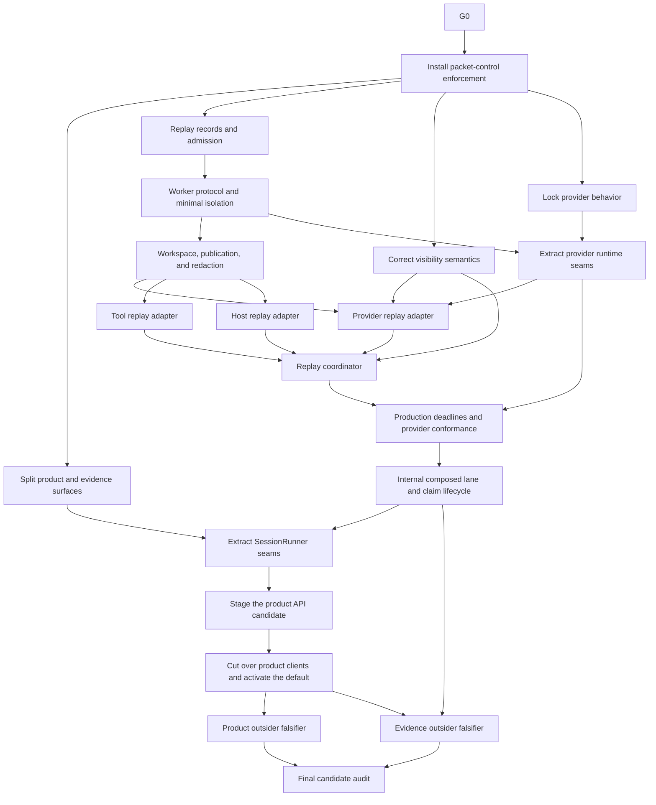

# North-Star recovery execution plan

Status: approved planning direction; no implementation packet may bypass its machine preflight or human gate, except the bounded G0 and G2 pre-checker processes defined below.

Date: 2026-07-24

## 1. Outcome

Finish the existing BreadBoard direction with one default product path and a separate internal evidence backend. The program ends when:

- the 26-operation product catalog drives the default CLI/API/SDK/TUI path;
- E4 is off by default and absent from ordinary clients;
- replay R0-R4 yields one real completed deterministic execution with a complete artifact graph;
- one named real provider route passes production replay conformance;
- one exact target behavior is captured, compared, claimed, and reverified;
- separate product and evidence clean-room falsifiers pass;
- current status reports product readiness, active exact-scope claims, and packet state without a cumulative completion score.

`ARCHITECTURE_SPEC.md` defines the target boundaries. This file owns packet scope, dependency order, budgets, acceptance, and approval sequencing.

## 2. Operating rules

1. Refresh `STATE.json` from Beads, GitHub, current source, and immutable evidence before selecting work.
2. Use one isolated worktree and one implementation owner per writing packet.
3. Run at most two writing packets concurrently, with no shared files or generated outputs.
4. The supervisor may use two remaining subagent slots for research, review, or CI diagnosis.
5. Each packet has one promotion owner who alone updates packet state, PR status, and Beads.
6. Exact-head review is mandatory. A head change invalidates local/exact-head results, review, CI, promotion, evidence dossiers, and provider/target results before `refresh_state`.
7. A base or merge-base change invalidates the diff budget, allowed paths, test derivation, local/exact-head results, review, CI, promotion, evidence dossiers, provider/target results, and integration assessment before `refresh_state`.
Generated-input changes are source-identity changes for routing: they invalidate generated fixed points, dependent claims, cached generated checks, scope-bound approvals, and all source-bound results before `refresh_state`.
Target, fixture, provider route/model, comparator, or runtime identity changes are typed invalidation events in every bound active, blocked, verified, and closed state. They route through `refresh_state` and invalidate results, reviews, dossiers, claims, caches, spend approvals, packet closure, and promotion before any successor action.
8. Stop at 100% of any file, line, attempt, or review budget. Split or abandon through a human decision.
9. Generated files count toward the file cap but not the non-generated line cap. Their authored inputs and generator command must be named.
10. Tests come from the ownership manifest, import/schema consumers, generated dependencies, and packet acceptance. A worker may not invent a smaller test plan.
11. Broad E4 fixed-point work runs only at a stable head. Target evidence is never reused across a target, fixture, provider, comparator, or environment change.
12. Merge, issue closure or supersession, public contract/default changes, and security-boundary changes remain human gates.
13. Historical evidence is immutable. Use successor records and a current selector to supersede status.
14. Generic retry defaults apply only when a packet supplies no packet-specific override: two implementation attempts, two review rounds, and one CI rerun. An approved packet-specific budget is authoritative for that packet; active G2/reset-3 uses aggregate caps of 5 attempts, 5 review rounds, and 5 CI reruns, with seed caps of 3/3/3 and candidate caps of 2/2/2. Every retry guard resolves both its phase cap and the aggregate cap before permitting a retry and stops at the applicable packet-specific cap.
15. Product defects, specification gaps, environmental failures, flakes, and gate defects are classified separately. A failed check is never hidden by skipping it.
16. Run `uv run --no-project --with PyYAML --with jsonschema python scripts/check_phase20_freeze.py` at preflight and local gates. `--no-project` prevents gate execution from creating or mutating a repository lockfile; `PyYAML` and `jsonschema` are explicit transient tool dependencies because the project environment does not declare them. A missing guard, missing digest-bound result report, missing required exception record, or nonzero result blocks the packet.
17. G2 is the first writing packet after G0. G1 may be researched concurrently, but its branch and edits wait until G2 closes.
18. Beads is local-only: `.beads/` and `.beads_local/` stay ignored and untracked, no BreadBoard source repository may be a Dolt remote, and `bd dolt push` is forbidden unless a later human-approved policy names a dedicated non-source remote. Packet transitions seal the local Dolt identity and authority snapshot instead of synchronizing it to Git.

## 3. Recovery graph



Allowed parallel work:

- after replay retirement: packet-control enforcement; G1 read-only research may run concurrently but no G1 branch or edit starts;
- after packet-control enforcement: G1, R0, visibility semantics, and provider behavior lock when their file scopes are disjoint;
- after R2: provider, tool, and host replay adapters when their file scopes are disjoint;
- product and evidence outsider falsifiers after their prerequisites are stable.

Serialize catalog regeneration, public client generation, shared evidence inventories, fixed-point regeneration, and campaign state rendering.

## 4. Packet register

Budgets apply to non-generated additions plus deletions. Mechanical moves still count unless the packet checker can prove byte-identical relocation and reports moved bytes separately. A packet crossing a cap enters `blocked_budget` before further edits.

| Key | Packet | Depends on | Max files | Max non-generated lines | Attempts | Review rounds | Required proof | Human gate |
| --- | --- | --- | ---: | ---: | ---: | ---: | --- | --- |
| G0 | Retire blocked replay implementation | none | 4 | 200 | 1 | 1 | T0, tracker/PR audit | tracker_supersession + packet_closure + campaign_graph_rewrite |
| G1 | Split product and evidence surfaces | G0, G2 | 12 | 750 | 2 | 2 | T0-T2, generated diff | public_boundary + architecture_change |
| G2 | Install packet-control enforcement | G0 | 19 | 6000 | 5 | 5 | reset-3 seed, object-mode self-host, generated projection/selected-`S` checker conformance, T0-T2, positive preseed/seed/candidate/closure fixtures, eleven negative families, fresh actions and exact reviews | governance_schema + security_boundary + scope_budget_amendment + merge + closure_anchor_selection + packet_closure |
| R0 | Replay records and admission | G2 | 8 | 650 | 2 | 2 | T0-T2 | governance_schema |
| R1 | Worker protocol and minimal isolation | R0 | 12 | 800 | 2 | 2 | T0-T2, security lens | security_boundary |
| R2 | Workspace, publication, and redaction | R1 | 12 | 900 | 2 | 2 | T0-T2, fault matrix | security_boundary + artifact_publication |
| V1 | Correct visibility semantics | G2 | 6 | 450 | 2 | 2 | T0-T2 | public_boundary |
| P0 | Lock provider behavior | G2 | 4 | 250 | 1 | 1 | T0-T1 behavior fixtures | none |
| P1 | Extract provider runtime seams | P0, R1 | 12 | 1000 | 2 | 2 | T0-T3, behavior parity | architecture_change |
| R3A | Provider replay adapter | R2, P1, V1 | 8 | 550 | 2 | 2 | T0-T2, tape fixture | none |
| R3B | Tool replay adapter | R2 | 7 | 450 | 2 | 2 | T0-T2, capability negatives | security_boundary |
| R3C | Host replay adapter | R2 | 7 | 450 | 2 | 2 | T0-T2, approval negatives | security_boundary |
| R4 | Replay coordinator | R3A, R3B, R3C, V1 | 10 | 800 | 2 | 2 | T0-T3, deterministic journey | architecture_change |
| N9B | Production deadlines and provider conformance | R4, P1 | 10 | 800 | 2 | 2 | T0-T4, named live routes | external_spend |
| N10 | Internal composed lane and claim lifecycle | N9B | 10 | 800 | 2 | 2 | T0-T4, exact-scope claim | artifact_publication |
| S1 | Extract SessionRunner seams | G1, N10 | 12 | 900 | 2 | 2 | T0-T3, behavior parity | architecture_change |
| A1 | Stage the product API candidate | S1 | 10 | 650 | 2 | 2 | T0-T3, opt-in installed journey | public_boundary + security_boundary |
| C1 | Cut over product clients and activate the default | A1 | 16 | 900 | 2 | 2 | T0-T3, generated fixed point and five-client journey | public_boundary |
| O1 | Product outsider falsifier | C1 | 0 | 0 | 1 | 1 | clean-room raw dossier | external_spend |
| O2 | Evidence outsider falsifier | N10, C1 | 0 | 0 | 1 | 1 | clean-room raw dossier | external_spend |
| F1 | Final candidate audit | O1, O2 | 4 | 200 | 1 | 2 | full CI, claim reverify, two reviews | none; postverification release |

The packet checker may tighten a budget before implementation. Increasing scope or budget routes the blocked packet through `scope_budget_approval`; only a current granted `scope_budget_amendment` record bound to the packet, old/new scope and budget, base, merge base, reason, and expiry may refresh preflight, and the amendment resets review.
N9B, O1, and O2 require an `external_spend` approval with a typed provider, target, or participant-only identity mode; exact applicable identity/route/model values; a nonnegative limit; unit/currency; request cap; token-or-runtime cap; and consumed/remaining balance. Participant-only attempts bind a participant/context digest and encode provider/target identity, route, and model as `null`. Every request or target launch, including failures and zero-cost calls, emits a typed consumption receipt. No launch may exceed the remaining balance, request cap, or token/runtime cap; exhaustion of any cap routes to `blocked_budget` without a success, claim, or promotion.
O1 and O2 are `evidence_only` packets. G0 is `external_governance`; all other packets are `code_or_contract`. `LOOP_SPEC.yaml#packet_kinds` owns their distinct state-machine paths.

Every materialized packet has one Beads issue. O1 and O2 invent no code branch or PR; after exact-hash dossier review, their typed `packet_closure` approval names and closes only the existing packet issue. The evidence worker never performs that closure. The supervisor executes it only after the human approval record matches the dossier, packet, scope, source tree/head/base/merge base, target, fixture, runtime, and environment identities.

## 5. Packet specifications

### G0: Retire blocked replay implementation
Exact controlled objects:

```text
GitHub PR: https://github.com/kmccleary3301/breadboard/pull/44
Beads packet: bb-06u.11
Salvage artifact: docs/plans/north_star_recovery/g0_replay_salvage_record.v1.json
Allowed repository path: docs/plans/north_star_recovery/g0_replay_salvage_record.v1.json
Generated terminal-handoff path: docs/plans/north_star_recovery/STATE.json
Forbidden repository paths: breadboard/**, agentic_coder_prototype/**, sdk/**, tui_skeleton/**, contracts/**, docs/conformance/**
```

The salvage record schema requires `schema_version`, old PR/base/head/tree identities, immutable retained contract refs, retained test-vector refs, and `discarded_implementation_paths` entries encoded as `{path, sha256}` records from the exact old head; successor packet keys; Beads and GitHub actions; the direct tracker/closure human approval IDs; actor; timestamps; and action-result refs. Canonical digests of the three old-head partitions must equal the preflight's `salvage_contract_sha256`, `salvage_tests_sha256`, and `discarded_code_sha256`. The action-result refs must include the digest-bound campaign-graph approval binding receipt. External PR/Beads mutations do not count as repository files; the salvage artifact counts as one file. `STATE.json` is regenerated by the state renderer after the approved actions and is not a G0 implementation file.

G0 runs only from a clean isolated worktree at the approved planning-package commit; any pre-existing tracked or untracked change blocks preflight. The generated predecessor `STATE.json` may be the sole dirty file only while the planning-review frontier is active. After two exact-hash reviews approve, the renderer writes the refreshed STATE and exact handoff manifest, commits only STATE on the reviewed authored anchor, records the resulting clean head/tree, and requires an empty status before G0 selection. G0 is the only pre-G2 external-governance bootstrap. `LOOP_SPEC.yaml#bootstrap_policy.G0` owns every closed schema and executable command. Before the first protected mutation, all preflight and initial-action commands pass. Immediately before every GitHub or Beads mutation—including every individual issue-create and dependency-edge command—the fail-closed wrapper reruns approval freshness, requires at least 900 seconds remaining, revalidates source/worktree/action sequence, and verifies that the full normalized protected tracker projection equals the previous accepted action outcome (or the approved recovery-current projection for attempt 2), with exact dependency IDs and types. The exact full PR projection is independently chained between action outcomes and retry evidence. Unrelated tracker work may advance between protected command intervals; each runner nevertheless compares its own immediate before/after unrelated semantic hashes and seals any interval drift as a typed failure. A nonzero result, expiry, identity drift, dirty path, protected-state mismatch, or command-interval unrelated drift blocks that mutation and records partial state.
The packet-specific preflight records exactly two direct approvals for `tracker_supersession` and `packet_closure`, each bound to the current planning head/tree, plus a separate `campaign_graph_rewrite` approval bound to the 21 packet titles, 31-edge dependency map, planning head/tree, and pre-action tracker snapshot context. The preflight `packet_closure` action names only closing PR #44 without merge. Bootstrap approval records use the closed pre-G2 schema and cannot satisfy post-G2 generic guards. After the G0 postcheck and independent exact-head salvage review pass, a separate closure-preflight record binds the explicit approval-record path and SHA-256, materialized G0 issue ID, issue-map digest, pre/post records, salvage and review digests, clean planning head/tree, base, merge base, and scope. Its executable validator dereferences every record, checks exact keys and live identities, and requires a nonfuture grant plus at least 900 seconds remaining immediately before closing that issue. The live closure receipt is then digest-bound to that approval and revalidated against Beads.
The G0 postcheck runs before the salvage review and state renderer. It validates the salvage artifact, direct action receipts, graph-approval binding receipt, current source identity, unexpired approvals, and a live post-action tracker snapshot while the salvage artifact is the only worktree change. It queries GitHub and Beads directly; proves the full normalized PR #44 object is closed and unmerged with unchanged immutable metadata; proves the full normalized `bb-06u.11` object is superseded with unchanged non-transition metadata; proves every new packet issue's complete semantic object, exact label set, unique ID, status, and canonical unique `(target ID, dependency_type)` list equals the final accepted action outcome and approved map; and binds both current exact-hash planning reviews. Every accepted action outcome independently proves equality of its full expected/observed protected objects and equality of unrelated before/after semantic hashes over that command interval. The chain proves each attempt-1 boundary equals the preceding accepted protected poststate; an attempt-2 boundary equals the separately validated recovery-current snapshot. It intentionally does not freeze unrelated campaigns across the entire 54-command sequence. Self-authored receipt JSON is never authoritative. After the postcheck and one independent exact-head salvage review pass, request the separate exact G0-issue `packet_closure` approval. Only that granted record may close the materialized G0 issue. The renderer may then replace only `STATE.json`; the external handoff manifest binds its digest.
G0 has one action attempt. The final preflight operation rereads the same bytes around every required validator, requires 900 seconds of approval margin, rejects every approval, grantor, reviewer, author, and prior operational identity as its run identity, creates evidence directories through root-anchored no-follow descriptors, and atomically writes a validation receipt, mutually bound anchor, success-ledger genesis, and failure-ledger genesis. The anchor records both ledgers' device/inode identities. Each genesis row binds the anchor and validation receipt by path, device, inode, and digest. Replacement of any anchored file breaks validation. Every append to either ledger rejects prior ledger and authority identities. The four-file publication is one fail-closed transaction: any receipt, anchor, ledger, or genesis failure securely unlinks every artifact created by that invocation, fsyncs the parent, emits a typed publication failure, and leaves G0 pending for an exact clean rerun. A rollback failure emits a distinct typed terminal external hold; neither path grants mutation authority before both genesis rows exist.

The executable action boundary owns close PR, supersede legacy Bead, 21 issue creates, and 31 dependency edges (54 total protected actions) in register order. Its receipt and immutable tracker snapshot use exclusive root-FD no-follow writers. One approved recovery may execute only the exact attempt-2 suffix. The failed-post snapshot remains immutable and digest-bound to the recovery record. Recovery is admissible only with a trusted post-observation and one of two exact classifications: an applied action whose full expected and observed protected PR/tracker projections are byte-canonically equal, or an explicitly unapplied action whose observed tracker projection equals its immutable pre-action boundary snapshot and whose observed PR equals the sequence-derived pre-action PR. An applied mismatch, an unapplied boundary mismatch, a null application classification, or a post-observation exception enters a terminal external hold; it cannot produce recovery evidence or admit attempt 2, and requires independently approved out-of-band remediation followed by a new clean G0 package. For an admissible failure, the fixed recovery materializer consumes the immutable failed outcome, a separately authored approval candidate bound to the acyclic recovery-intent digest, and a disjoint materializer run identity. It re-queries GitHub and Beads, repeats the applied-or-unapplied classification, requires current full protected PR/tracker equality to the classified recovery state, byte-copies the retained failed-post snapshot, emits closed-schema duplicate and unrelated-graph reports, records unrelated changes without treating them as protected drift, and exclusively writes the fixed approval and recovery record. Partial materialization writes an authenticated failure-ledger row and remains blocking. Recovery freshness and validation repeat those live checks and write a separate immutable recovery-current tracker snapshot. The actual attempt-2 boundary writes a third fresh immutable snapshot immediately before mutation; its full protected tracker projection must equal the recovery-current snapshot, and its exact PR projection and hash must equal the recovery validation result. Before each subprocess, the mutation runner itself—not its caller—revalidates that exact boundary, the anchored preflight/ledger pair, an identity disjoint from all ledger and authority identities, current remote main/head/tree, empty worktree, approval margin, recovery authority, the preceding full protected tracker/PR state, and exact packet-edge types. It derives the only argv, executes it inside a total exception-sealing boundary, rescans live state, and writes result/snapshot/outcome records through root-FD `O_NOFOLLOW|O_EXCL` operations. The outcome binds full expected and observed PR, legacy-Bead, and packet objects; exact dependency IDs and types; verbatim stdout and stderr plus independently recomputed digests; command-interval unrelated hashes; typed postcondition errors; the raw command exit; and the effective exit. A command exception with a successful trusted post-observation may produce an admissible typed outcome; a post-observation exception cannot. Evidence-publication failures attempt an authenticated failure-ledger fallback and remain blocking. Postcheck and G2 reconstruct every clean, applied-nonzero, and non-applied/retried event and reject identity overlap or artifact drift.

The independent salvage review uses a closed record schema bound to the salvage artifact, G0 postcheck, source identity, empty findings, reviewer role/run, author identity, and review round. Reviewer ID, review-run ID, and author identity are bound into both exact-hash verdicts and excluded from every operational run identity. Before any closure-side revalidation or `bd close`, the closure runner fsyncs its writer canary and appends `closure_started` to the failure ledger. The failure record names the exact stage: command exception/nonzero, unavailable or wrong live postcondition, approval expiry, snapshot write, receipt write, main-ledger append, prevalidation, or interrupted restart. Success and failure records bind the start row's sequence and canonical digest. The failure-ledger action equals the record's failure kind. A failure-record write error appends a separate authenticated writer-error row; that row blocks external progress until the fixed record can be sealed. Restart seals an unsealed start without repeating the close.

Recovery is state-specific. A failure during the initial PR/legacy-Bead/graph sequence writes an external failure record without modifying tracked STATE and enters `blocked_external`; one approved recovery returns to `implementing` only after the fixed recovery record and result validators pass. Closure command, expiry, postcondition, prevalidation, and evidence-seal failures occur from `closure_pending_receipt` and have an explicit route to `blocked_external`. A closure failure records the exact live issue when Beads is reachable. If observation fails, the record uses null issue fields plus caught error classes and retains the prevalidated closure source/worktree records. A failure-record writer error uses the anchored fallback row and never authorizes replay.
An observed-open reconciliation returns to `verified` and requires a fresh closure preflight and approval before retry. An observed-closed reconciliation reconstructs the receipt without repeating the close. An unknown observation requires a fresh `partial_governance_recovery` approval, then binds the current issue as open or closed. Receipt-validation provider or authority failures leave the loop in `closure_pending_receipt`; the validator may be retried because it does not mutate Beads. No impossible receipt-failure kind is used to move state.

Every tracker snapshot uses `bd list --all --json --limit 0`; all paths are fixed or closed-allowlisted. Critical writers use complete same-directory temporaries. Ledger appenders write every byte, then on any `BaseException` truncate and fsync back to the locked pre-append length. Round-39 verdicts carry distinct reviewer, review-run, and author identities.

Closing G0 enters `closure_pending_receipt`, never `closed`; closure and result seals gate handoff. The closure runner catches every `BaseException` after start. Closure-validation, terminal-validation, and terminal-intent publications use deterministic identities, accept one exact matching row on restart, reject conflicts, and roll back an interrupted append before retry. Empty or partial failure publication cannot satisfy a hold.

A failure-publication hold requires durable evidence: one bound immutable failure record/observation or one authenticated writer-error row with the canary and start refs. Empty publication never satisfies the hold validator; it remains an unsealed-start condition. If restart later publishes the bound record and observation, an earlier writer-error remains admissible only with its original refs and lower sequence number. G0 and G2 reject the ledger until that same start is sealed. The protected close, commit, or push is never repeated.

Both closure and terminal-push runners inventory primary/retry failure and writer artifacts before any start. Closure rejects current-run, stale-opposite, duplicate, writer-only, symlink, and malformed candidates. A noncurrent primary requires its matching primary writer, recovery approval hash, reconciliation evidence, and full failure validation.

Across closure and push, unobserved subprocesses use exit `-1` plus empty stdout/stderr; returned results are retained. Push/fetch exception classes flow separately into failure metadata. Closure failure v4 persists digest-bound pre-close validator results. If failure-record publication itself fails, the authenticated writer-failure ledger action is the last-resort exception channel.


Actions:

- immediately before the command, run the fail-closed per-mutation wrapper, then close draft PR #44 without merge under the exact approval;
- immediately before the command, rerun the wrapper, then change `bb-06u.11` from blocked to superseded and record R0-R4 plus N9B as successors under the exact `tracker_supersession` approval;
- for every issue-create and dependency-edge command, rerun the wrapper and partial-graph guard; under the separate exact `campaign_graph_rewrite` approval, create one uniquely labeled Beads issue for each of the 21 packet keys with the exact register title and dependency edges, and record the resulting key-to-ID map;
- write the fixed salvage artifact naming hashed retained contracts, retained test vectors, and discarded implementation paths from the exact old head, plus exact old base/head/tree, successor packets, approvals, and external action results;
- query GitHub and Beads live to verify PR #44 is closed and unmerged, `bb-06u.11` is superseded, and every new issue and dependency edge matches the approved map.
- capture the full pre/post all-issues Beads authority snapshots with `bd list --all --json --limit 0` and reject any change outside `bb-06u.11` plus the exact 21 newly approved packet issues;
- after the postcheck and independent salvage review pass, obtain the separate exact closure-preflight record and approval, rerun all postcheck and closure validators with at least 900 seconds remaining, close only the bound materialized G0 packet issue into `closure_pending_receipt`, and require the canonical live receipt-validation result;
- render destination-closed STATE with every canonical packet key bound to its exact Beads ID, commit exactly the salvage artifact and generated STATE, enter `g0_terminal_handoff_committed`, record and validate the manifest, then bind the authenticated local-only disposition, ignored/untracked Beads paths, absent Dolt remotes, exact local Dolt identity, preserved failed-push evidence, and canonical closure result before entering `closed`.

Do not edit any product path or any repository path outside the one allowed salvage artifact; generated STATE is the only additional terminal-handoff path. Do not merge PR #44, run its implementation, alter its branch, or rewrite accepted evidence.
A closed, unmerged PR has no promotion transition in this state machine. Reopening, merging, or attaching a new promotion path is a new protected action requiring a new current human gate; absent that action, the old branch is archival input only.

Acceptance:

- PR #44 is closed and unmerged;
- `bb-06u.11` is `superseded` with exact successors R0, R1, R2, R3A, R3B, R3C, R4, and N9B;
- the schema-valid salvage artifact separates retained immutable contracts/tests from discarded code and binds the human approval plus external action evidence;
- the materialized G0 packet issue is closed only after the postcheck and independent salvage review pass under a separate exact `packet_closure` approval bound to its materialized issue ID and evidence digests;
- the refreshed destination-closed `STATE.json` records the exact unique Beads ID and approved key dependency list for every packet key and is committed with the salvage artifact under the validated clean terminal handoff before `select_frontier` can select any G0 successor;
- G2 binds the terminal-handoff head/tree and authenticated local-only disposition and independently validates the canonical closure approval, status, salvage review, postcheck, receipt/result, exact two-file commit, destination STATE IDs, all-issues graph, live closed G0 issue, ignored/untracked Beads paths, and absence of any configured Dolt remote.
- the old branch is archival input only and has no active promotion path.

### G1: Split product and evidence surfaces

Actions:

- preserve `contracts/public/operations.v1.json` and its frozen hash as historical evidence;
- author the 26-operation product authority at `contracts/public/operations.v2.json`;
- author the 19-operation internal authority at `contracts/internal/evidence/operations.v1.json`;
- update catalog loaders, validators, `system.describe`, and the surface inventory generator to consume the correct catalog;
- move lane and claim CLI commands under an explicit maintainer namespace;
- make E4 HTTP routes opt-in and absent from default OpenAPI;
- prevent ordinary Python, TypeScript, and TUI generation from consuming the evidence catalog;
- keep compatibility callers unchanged until A1/C1.
- update package-data configuration and installed-wheel loaders so both current catalogs are present and loadable from a clean install;
- remove the product application's module-load dependency on the E4 router; import and mount E4 only after an exact true-valued internal opt-in;
- reject unknown E4 flag values rather than treating them as enablement;

Acceptance:

- the product router and catalog both contain the exact 26 operations in `ARCHITECTURE_SPEC.md`;
- the internal evidence catalog contains the exact 19 evidence operations;
- the default app has no `/v1/e4/*` routes;
- explicit E4 enablement retains the internal routes and maintainer tools;
- ordinary generated client manifests contain no lane, claim, lane-execution, or lane-lock methods;
- clean-install and installed-wheel checks load both catalogs through their intended namespaces;
- default import tracing covers the installed `bbh`/product CLI, API app creation, Python SDK, TypeScript client, and TUI; none imports `agentic_coder_prototype.api.e4`, `breadboard.product.evidence`, or any E4/evidence/campaign transitive module before exact true-valued internal opt-in;
- the same negative checks inspect Python `sys.modules`/import traces plus default route, OpenAPI, generated-export, and client manifests;
- only `1`, `true`, or `yes` enable E4; unset, false values, typos, and unknown values keep it absent or fail closed;
- the default product path is not flipped in this packet;
- a supersession record points from the historical 45-operation candidate catalog to the two current catalogs.

### G2: Install packet-control enforcement

G2 attempt 3 and review round 3 are abandoned negative evidence. Their source,
reports, approvals, and reviews cannot be promoted or reused as authority. G2
then entered execution epoch `G2/reset-1` with scope
`bb.north_star_recovery.g2.scope.v2`; that epoch is now `blocked_review` after
two rejected seed attempts and two exhausted seed review rounds. Downstream
packet keys continue to depend on logical packet `G2`.

G2 remains one packet and one Beads issue. Reset-1 defined two machine-gated
phases; its candidate phase never started because no seed was approved,
selected, or merged. No parallel seed packet, issue, task, signal, or review
noun was created.

The historical reset-1 aggregate budget was seventeen files, 4000
non-generated lines, four implementation attempts, four review rounds, and
four CI reruns. Its seed phase was capped at six files, 3000 lines, two
attempts, two review rounds, and two CI reruns. Its candidate phase was capped
at eleven files, 1000 lines, two attempts, two review rounds, and two CI
reruns. Historical counters and artifacts remain immutable and unavailable to
later epochs. The reset-2 amendment below defines the only proposed re-entry.

#### Historical reset-1 seed phase (blocked)

The seed phase may touch only:

```text
docs/plans/north_star_recovery/EXECUTION_PLAN.md
docs/plans/north_star_recovery/LOOP_SPEC.yaml
contracts/governance/schemas/bb.g2_closure_anchor.v1.schema.json
contracts/governance/g2_abandoned_round3_manifest.v1.json
scripts/packet/verify_g2_anchor.py
tests/packet/test_verify_g2_anchor.py
```

The seed contains a strict closure schema, a standard-library-only verifier,
and an immutable manifest of every abandoned round-3 candidate path, mode, blob
OID, SHA-256 digest, and byte length. The abandoned manifest also binds the
blocked record, all four frozen report digests, both round-3 review digests,
the complete path count, and the aggregate candidate digest. The seed reviews
must verify the manifest against the preserved abandoned worktree and frozen
records; a worker-supplied denylist or count is never accepted.

Before either seed attempt, the supervisor creates the operation-ledger genesis
and planning-amendment record in the OMP parent-session capability store. That
server-managed job/message store is outside every delegated agent's filesystem
and tool-write capability; `0700`, path secrecy, and same-UID permissions never
count as isolation. Before activation, the broker must launch one fresh delegated
worker route and four nonce/canary-bound attempts in strict order: `read`,
`write`, `delete`, and `fabricate`. Each attempt has broker-issued challenge,
immutable worker request, worker-authored observed response/error, broker-authored
capability denial, and broker-authored pre/post canonical store snapshots. Every
event binds its exact operation and target, worker identity, invocation, actor
handle, nonce, canary, and immutable digest; worker request/response actors are
distinct from broker denial/snapshot actors. The validator rejects missing,
replayed, reordered, cross-bound, mismatched, expired, or self-authored events,
requires the pre/post snapshot hashes and canonical visible-record hashes to be
identical, and requires an error-only zero-exposure response. Broker denial labels
alone never satisfy this gate; no filesystem fallback is permitted.
The planning-amendment record binds the exact execution plan and loop
specification, the G2 issue, source base and merge base, reset epoch, old and
new scope and budgets, and two independent plan-review objects. It supersedes
stale `STATE.json#planning_package.independent_review` only for this reset
phase; `STATE.json` is not read as authority.
The authoritative phase map places predecessor searches, capability probing, and
activation-record sealing in planning; preseed retains only the human actions,
their consumption, live recheck, and seed admission. Every operation class's
allowed source states must remain contained by its phase-map state set.
The embedded preseed validator runs two named executable negative self-tests at
startup after their helpers are defined. `self_test_runtime_write_denial_launch_binding_mismatch`
calls the same `verify_runtime_write_denial_launch_binding` helper used by
runtime-denial verification with different record and acceptance launch
handles, and passes only when the helper raises `ValueError` with exact
message `runtime write-denial launch handle equals acceptance-bound launch event handle before resolution`; no rejection is a fail-closed error.
`self_test_projected_phase_map_stale_rejection` calls the same
`verify_projected_phase_map` helper used by active-projection verification with
one stale state and passes only when the exact authenticated phase-map mismatch
`ValueError` is raised.

Each seed attempt, review round, CI rerun, merge, human action, and action
consumption is appended to that capability-store ledger. Every launched
operation requires a reservation, invocation, exactly one typed success or
failure result, a broker completion bound to that result, and one terminal
receipt. Sequence numbers are contiguous and previous-event digests form one
chain from the genesis. A missing completion or receipt consumes the
reservation and blocks the phase. Workers cannot spawn reviewers, push, start
CI, access authority records,
or create ledger events.
Every operation invocation carries the broker's authenticated
`broker_current_state`; the validator binds it to the operation ledger event's
`from_state`. A failed, canceled, timed-out, or integrity-failed completion
must carry that same state plus handles for three broker-private facts:
`operation_failure_classification`,
`operation_failure_no_mutation_no_spend`, and
`operation_failure_downstream_snapshot`. The post-exec verifier resolves those
handles from the authenticated broker event store; recomputes the operation,
phase, state, counter, cap, runtime/cancellation/identity/action facts and
failure class; binds the classification to the stored result, completion, and
receipt; and rejects caller-supplied class, route, capacity, mutation, spend, or
downstream-index assertions.
Simultaneous authenticated exceptional facts are retained; the closed priority
order selects exactly one route. Retryable and budget-exhausted classes derive
from recomputed remaining capacity only when no exceptional fact applies.

A positive-capacity `retryable_operation` takes its exact per-operation retry
target with `attempted_mutation=false`, `protected_mutation_observed=false`,
zero spend, unchanged protected-artifact digest, one consumed attempt, and no
downstream invalidation record. Terminal environment, identity-drift,
human-action-invalidity, cancellation, authenticated parsed candidate-review
`revise`/`reject`, budget, and generic operation-terminal classes map exactly
to `blocked_environment`, `refresh_state`, `blocked_external`,
`blocked_review`, `blocked_budget`, `blocked_budget`, and `blocked_review`.
Only after storing the failure and appending its completion and sole terminal receipt may the broker
revoke the authenticated downstream snapshot, persist the exact invalidation
record, and extend the capability-store tip.
The shared seed action-consumption class is admitted only from
`g2_reset_3_seed_selection` or `g2_reset_3_seed_merge`, and the shared closure
action-consumption class only from `g2_reset_3_anchor_selection` or
`g2_reset_3_closure_validation`; each consumption still binds its distinct
authenticated action instance and protected action. Seed exact-head CI runs in
`g2_reset_3_seed_implementing` before `seed_attempt_completed`; a retryable
failure returns directly to `g2_reset_3_seed_implementing`, where the next
seed operation reruns the atomic seed-admission preconditions before execution.
For a failed candidate implementation with remaining capacity, the broker
reserves the next `candidate_implementation_attempt` directly in
`g2_reset_3_candidate_implementing` (never `candidate_preflight`); that retry
atomically revalidates the immutable stored `candidate_preflight` result with
`candidate_scope_exact_eleven_paths`, `candidate_budget_remaining`,
`source_is_actual_S`, `reset_3_candidate_profile_and_descriptors_passed`,
`candidate_no_spend_policy_bound`, and `denied_union_digest_recomputed` against
the current exact-head facts before execution.


Before `S` exists, reset-3 seed admission uses the full standard-library
validator source embedded in the exact reviewed `LOOP_SPEC.yaml`; historical
reset validators and hidden capability-store code are not executable. Both
plan reviews and the three distinct fresh human scope/budget, governance, and
security actions bind its source digest, the exact planning commit/tree, and
both planning blob OIDs and SHA-256 digests. The supervisor materializes an
isolated clean worktree at that one reviewed planning commit; its exact
two-file diff is within the 4500-line proposal cap, and source base and
merge-base are the authenticated reviewed parent.
The broker is the authority at the pre-exec boundary. It authenticates one
canonical active event envelope on fixed FD 3 with exactly
`[handle, origin, immutable_object_id, raw_sha256, event_type, actor,
payload_sha256, payload]`, verifies every payload hash/handle/type, and then
launches the validator as its direct child with fixed broker-owned descriptor
snapshots. The source cannot mint, reauthorize, or choose an envelope, key,
descriptor, capability token, or metadata. On Darwin, FD 3 and data FDs 4 and
6--19 are broker-created regular files that are fully written and synced,
reopened read-only with `O_NOFOLLOW`, unlinked, and inherited only after every
write handle is closed; each must have link count zero. FD 5 is the
broker-opened `O_NOFOLLOW` read-only handle to the root-owned
`/Library/Developer/CommandLineTools/Library/Frameworks/Python3.framework/Versions/3.9/Resources/Python.app/Contents/MacOS/Python`
binary and must match the broker launch/platform attestations and
`sys.executable` by exact path plus no-follow device/inode/mode/digest identity.
The broker binds every input FD's role-specific device/inode/mode/size/digest
identity before launch and rechecks the same identities and bytes after
`waitpid`. FD 20 is the broker-created fixed Darwin unnamed-pipe child write
end; the broker retains the corresponding read end. Darwin reports distinct
device/inode endpoint identities and FD numbers with opposite access modes; the
immutable grant and launch record bind both endpoints plus one shared transport
digest.
The child write end is the only result capability and is never
replaced by fd 1, a caller descriptor, or a path reopened by the child. FDs
0--2 and every descriptor other than the declared fixed inputs and result
write end are closed; Darwin `closefrom(21)` or `posix_spawn` close-from is
required before exec and failure blocks. The broker authenticates the
pre-close soft limit as 1,048,576, reenumerates through that ceiling before
exec, then sets the child soft limit to 64. The child independently audits FD
numbers 0--1,048,575 and must observe exactly FDs 3--20. Linux sealed-memfd
semantics are neither asserted nor substituted for this Darwin transport.
Before parsing FD 3, the source checks its read-only access mode, regular-file
type, owner, zero link count, mode, and size. It uses positioned reads so it can
compare the complete bytes and physical identity again after parsing. It
applies the same role-specific pre/post checks to fixed input FDs 4--19, then
verifies their roles, broker event identities, exact bytes, and hashes.
It independently inspects `sys.argv`, `sys.flags`, `sys.executable`,
`os.uname()`, `os.getpid()`, `os.getppid()`, the actual child `os.environ`, the
full descriptor audit range, a denied loopback-connect probe, and a denied
forbidden-write probe. It opens `sys.executable` with `O_NOFOLLOW` and binds its
path/device/inode/mode/digest to FD 5, the runtime-manifest entry, and the
broker launch/platform records. The broker launch record and FD 4 digest bind
the exact `-I -S -c` reviewed source scalar. The broker-launched executable
must be exactly the root-owned Python application binary above; the observed
Darwin kernel/machine must equal the broker-pinned platform identity.

The operation profile and invocation bind the exact four-variable pre-exec
launch environment. Darwin injects `__CF_USER_TEXT_ENCODING` when the Python
child starts, so the exact observed `CLOSED_CHILD_ENV` is that launch map plus
only `0x<uppercase child UID hex>:0x0:0x0`; its value is recomputed from the
kernel-observed child UID. Empirical `sandbox-exec` preflight must prove this
five-variable normalized map exactly. Any other variable or value is a
launch-context mismatch and blocks. The broker records both the pre-sandbox
launch map and observed normalized child map; the child independently observes
the same normalized map, whose digest is bound to the probe launch record and
receipt.
Capability proof dispatch is closed and derived from the authenticated
materialized `execution_kind`: `embedded_validator` and `verified_script`
use `mach_v2_child`; `broker_builtin` uses `broker_builtin_no_child`; and
`delegated_agent` uses `delegated_agent_attestation`. Unknown or mismatched
proof kinds block before invocation. Broker-built profiles, not callers, bind
the dispatch and the corresponding argv/profile contract.
For `mach_v2_child`, the broker's immutable sandbox profile is rendered by one
canonical main-operation renderer from the authenticated materialized
operation profile, the complete broker-resolved `EXPECTED_RUNTIME_ACCESS`
manifest (including the Mach-probe runtime identity), and observed writable
path bindings. The preflight Mach probe uses those exact rendered main-operation
profile bytes and digest; it never gets a distinct weaker or incomplete
profile.
The runtime-closure identity is a broker-resolved filesystem-read exception
only: it is excluded from descriptors and input FDs. Darwin `(version 1)` is
deny-default with exact process-exec, process-info, and `sysctl-read`, explicit
`(deny mach-lookup)` and network denial, then sorted literal metadata,
read-data, and map-executable clauses derived from every authenticated
runtime-manifest entry's declared type and access set.
Path-only `process-exec` is not the execution boundary because the reviewed
Python image could re-exec itself with different `-c` bytes. Every
`mach_v2_child` therefore enters `PT_TRACE_ME` before its first exec. The parent
waits for and authenticates exactly two kernel exec stops, each before any
instruction of the new image: first the broker-pinned `sandbox-exec`
device/inode/mode/digest identity, then the broker-pinned Python identity.
The audit-token pidversion must be positive and strictly increase across those
two stops. The broker releases the result transport and continues the Python
image only after the second match; it traces that PID through terminal
`waitpid`. A third exec or any mismatched image is killed and reaped before the
new image executes, and all output is discarded without acceptance, append, or
spend. Default-deny continues to block child fork. The broker records the exact
two observations in the `mach_v2_child` proof and compares their private launch
capability digest to unexported parent state before it may accept bytes.
This private launch capability is an authority object, not an attestation
payload. At broker startup, after `PT_DENY_ATTACH`, the broker samples a
nonexported HMAC key with `getentropy`. Before fork it creates a fresh 256-bit
nonce and MAC preimage binding the operation/invocation/reservation identities,
expected child identity, both FD 3/20 endpoint identities, retained FIFO read
identity, executable/source/argv/profile digests, and the two authorized exec
identities. In the parent branch it adds the exact child PID and kernel
audit-token pidversion before releasing the close-on-exec handshake. The child
receives no nonce, key, MAC, or serialized capability. Acceptance addresses the
private map only by exact PID, pidversion, and retained FIFO identity, then
constant-time recomputes the MAC after exec-guard completion, terminal waitpid,
and FIFO EOF. A standalone same-UID parent with same-shape FDs cannot create
that lookup or append authority. The broker consumes and erases the capability
exactly once before append; evidence exposes only its digest after success.
For `broker_builtin_no_child`, the broker records an authenticated no-child
capability proof with the exact broker opcode, authority event, capability-store
principal, and `executable: null`, `argv: []`; it proves that no executable,
Python process, `sandbox-exec`, waitpid, or local Mach probe was launched.
For `delegated_agent_attestation`, the broker records the actual authenticated
route, worker/session identity, materialized delegated profile and sandbox
attestation, with denied network, empty credentials, broker-mediated-only
capability-store access, and a null ambient store channel. It never pretends
that the delegated route is a local Mach child; local executable, argv, launch,
wait, Mach, and child-attestation fields are absent/null. No caller assertion
can substitute for either nonprocess proof.
Credential absence is policy-only: the broker-authenticated `credential_input_set`
and its manifest digest are the complete evidence. The preflight child emits no
credential-denial observation and no fabricated `NO_CREDENTIAL_CAPABILITY`
result; only directly observed Mach, network, and filesystem/Git canary probes
appear in the negative result.
For `mach_v2_child` only, before the operation launch, the broker creates an
immutable private probe-launch record for the same pinned Python executable and
reviewed source scalar. Its
operation instance, invocation, reservation, and unique challenge nonce are
authenticated bindings, not child inputs, and the exact launch arguments are
`[-I, -S, -c, --, darwin_bootstrap_look_up_v2, <operation_instance_id>,
<invocation_id>, <reservation_id>, <challenge_nonce>]`. The record binds those
IDs and argv digest, the closed environment, normalized child environment,
closure/profile digests, rendered sandbox executable/profile identities,
broker-owned result-pipe identities, and broker-selected expected child UID/GID
plus a canonical supplementary-groups digest. That expected principal is
carried in the capability manifest and launch record. Before exec the broker
performs one authenticated, fail-closed `setgroups(expected_groups)`,
`setgid(expected_gid)`, `setuid(expected_uid)` handshake; every call must
succeed, and immediate `getuid`, `getgid`, and canonical sorted `getgroups`
observations must equal the expected values/digest. The broker starts that
launch as a separate sacrificial direct child, performs the same handshake, and
emits immutable identity-drop evidence covering the handshake and observed
UID/GID/groups. The exact `darwin_bootstrap_look_up_v2` opcode and all four
authenticated IDs select the source scalar's closed Mach-probe branch; no role,
service, environment, descriptor, or input is child-selectable.
Both expected identifiers are strictly positive and name the packet's
authenticated non-root child principal; UID 0 or GID 0 blocks before launch.
The combined preflight source validates `sys.argv[1:3] == ["--",
"darwin_bootstrap_look_up_v2"]`, then receives operation, invocation,
reservation, and challenge IDs from `sys.argv[3:7]` and canary paths from
`sys.argv[7:]`. These positions are fixed by the broker's exact
`python -I -S -c SOURCE -- darwin_bootstrap_look_up_v2 <operation_instance_id>
<invocation_id> <reservation_id> <challenge_nonce> ...` launch and are not
caller selectable.
The child invokes `darwin_bootstrap_look_up_v2` for `com.apple.securityd`,
`com.apple.trustd.agent`, and `com.apple.pasteboard.1`. It emits exactly one
canonical `bb.omp.untrusted_mach_lookup_probe_observation.v1` result containing
the operation instance, invocation, reservation, and challenge IDs;
independently observed child PID/parent PID, UID/GID, supplementary-groups
digest, result-pipe device/inode/mode/access identity, service names, raw
`kern_return_t` results, observation time, and its output digest. Each raw
`kern_return_t` must be
integer `1100` / `BOOTSTRAP_NOT_PRIVILEGED`, never integer `1102` /
`BOOTSTRAP_UNKNOWN_SERVICE`. Both the Mach probe and combined preflight source
write exactly one canonical result with `os.write` to `RESULT_FIFO_FD=20`, then
close descriptor 20; neither writes probe output to stdout. Immediately after
launch, the broker starts the sole bounded drain of the retained read end while
supervising the child against the operation deadline and output cap. Overflow
or timeout kills and reaps the exact child, finishes the drain to EOF, closes
both ends, and emits typed terminal failure evidence. On success, exact
`waitpid` and the single drain to EOF must both complete before the broker
hashes raw bytes, materializes one output event, or derives the receipt.
The receipt cross-binds the broker ID, invocation, launch-record digest, direct
parent and child PIDs, immutable result-pipe end identities, identity-drop
evidence, observed child UID/GID, executable/source/argv/environment/
closure/profile identities, services, raw output bytes/output event, raw
results, wait status, drain/EOF, and launch/drop/wait/EOF/output-event/receipt
partial-order evidence before the capability probe is accepted and any
successor operation may launch.
Every runtime entry has an exact literal path, an ordered root-anchored
component chain, a component-chain digest, and for each component the
descriptor-backed device, inode, mode, type, UID/GID, flags, canonical ACL
digest, descriptor identity, effective child-UID write-denial result, and
type-specific size/digest, `rdev`, or `readlink` identity. The record also
contains post-walk device, inode, mode, type, UID/GID, flags, ACL/content/
readlink digests, descriptor identity, and no-follow state for every component.
The chain is opened from one broker-authenticated root directory with
`openat`/`dir_fd` and `O_NOFOLLOW` for every traversable component; the root
descriptor and every component descriptor are retained long enough to compare
Regular-file bytes are read from that descriptor and revalidated for stable content/ACL identity;
a component that is missing, replaced, symlinked during traversal, unsupported,
or cannot provide a stable descriptor/readlink/content identity fails closed.
Every listed literal path, its broker-resolved target when present, and every
containing ancestor must be nonwritable and nonreplaceable by the expected
child principal (UID/GID and canonical supplementary groups) under the
descriptor-observed mode, flags, and ACL; the sole exception is typed
`/dev/urandom` itself. Runtime-manifest symlinks are forbidden rather than
followed: canonical literal paths are selected before execution, and any
symlink encountered by the authenticated descriptor walk rejects admission.
The ACL digest is SHA-256 over an unsigned big-endian 64-bit byte-length
prefix followed by the exact `acl_copy_ext` bytes obtained from the
authenticated descriptor. Mode evaluation is principal-aware for the expected
child UID/GID and empty canonical supplementary-group set. ACL evaluation is
deliberately stricter: the parser accepts only exact Darwin `!#acl 1` rows,
rejects unknown or ambiguous syntax, and treats any `allow` row containing
`write`, `append`, `add_file`, `add_subdirectory`, `delete`, `delete_child`,
`writeattr`, `writeextattr`, `writesecurity`, or `chown` as write
authorization regardless of named principal. Absent extended ACLs use a typed
nonempty sentinel; deny-only and read-only ACLs do not create write authority.
The broker's privileged no-sandbox helper alone performs the authenticated
`setgroups(expected_groups)`, `setgid(expected_gid)`, and `setuid(expected_uid)`
handshake and records one authenticated `bb.omp.runtime_write_denial_record.v1`
event per manifest literal. Each record binds phase (`prelaunch` or
`post_waitpid`), operation/invocation/reservation IDs, broker actor, exact
authenticated child PID, expected and observed UID/GID, sorted observed
supplementary-group list plus digest, identity-drop event handle, launch event
handle/timestamp, and (post phase only) waitpid event handle/timestamp/status.
It also carries the ordered component chain and digest for every literal,
resolved-target, and ancestor closure path. The linked identity-drop, launch,
and waitpid envelopes must all be broker authenticated and carry the same PID,
operation, invocation, reservation, and principal; every successful child
receipt must prove `WIFEXITED(wait_status)` and `WEXITSTATUS(wait_status) == 0`
for that exact raw wait status. A signaled or nonzero-exit child cannot satisfy
a successful receipt.
The path fields bind the literal/resolved/ancestor closure, ordered
descriptor-walk component chains and their digests, descriptor ACL lengths
and digests, descriptor identities, and descriptor-derived write-denial
results. No ambient `realpath`, path-only ACL lookup, or path-only access
check can authorize a record.
The broker emits prelaunch records only after identity drop and before the
authenticated launch/exec boundary, with typed-null waitpid fields; it emits
post-waitpid records only after the authenticated successful waitpid for that
same child and current operation. Both exact sorted handle sets and their
digests, runtime manifest component chains, and closure-chain digests are
bound into the capability manifest and operation evidence.
Every runtime-denial verification call uses that shared launch-binding helper
before resolving the launch event, so the acceptance-bound launch handle cannot
be substituted by a record handle that was not compared.
Every `broker_builtin` operation requires one broker-authenticated authority
envelope with the exact `broker_builtin_authority` schema (including operation/
invocation/reservation/profile/capability-store identity, broker opcode and
digest, replay nonce, and bounded
`created_at <= broker_clock < fresh_until`). Every `delegated_agent` operation
instead requires one `delegated_agent_route` envelope with the exact route
schema. Delegated routes must bind the selected worker/session/actor to the
current operation and carry an exact sandbox attestation: the route's
attestation object and digest must match the selected proof byte-for-byte and
by recomputed SHA-256, including environment, network, credentials, filesystem,
Git, descriptors, and input handles. Authority and route record handles/nonces
are globally unique. A stale, future, replayed, cross-operation,
worker/profile-mismatched, or caller-supplied record cannot be selected to
authorize an operation.
Freshness is fail-closed over the bounded window
`created_at <= observed_at <= recorded_at <= now <= fresh_until`, with explicit
maximum age and future-skew limits; missing, replayed, relabeled, future, stale,
cross-operation, wrong-PID, or out-of-order records block. The already-dropped
validator only resolves the authenticated event handles, recomputes path
closure and ACL bytes/digests, and verifies phase-bound records; it never forks
or calls setgroups/setgid/setuid and never accepts caller labels. Any credential
drift, probe, credential-drop, ACL-read, serialization, record, or freshness
failure blocks, with no exception beyond typed `/dev/urandom` itself.
Every regular file and directory in the authenticated filesystem closure is
opened component-by-component with parent-descriptor-relative `O_NOFOLLOW`,
then descriptor/inode/flags/ACL/content-bound before and after use. Symlink
aliases are not runtime-manifest entries: `/var` is represented by canonical
`/private` and `/private/var`, and the metadata-only
`/System/Cryptexes/OS` alias is excluded. `/dev/urandom`, required by isolated
Python startup, is bound by device/inode/mode/UID/GID/flags/ACL/size/`rdev`.
The probe closure is a separate exact literal path/type/access map whose
filesystem entries include the regular read-data and map-executable
`/Library/Developer/CommandLineTools/Library/Frameworks/Python3.framework/
Versions/3.9/lib/python3.9/ctypes/__init__.py`,
`lib-dynload/_ctypes.cpython-39-darwin.so`,
`lib-dynload/_struct.cpython-39-darwin.so`, and `/usr/lib/dyld`, plus every
literal ancestor (`/`, `/usr`, `/usr/lib`, and each
Python/framework/lib-dynload directory) with exact directory
metadata/read-data access. Darwin shared-cache images
`/usr/lib/libffi.dylib` and `/usr/lib/libSystem.B.dylib` remain exact
authenticated `ctypes` load identities but are not falsely claimed as
filesystem manifest entries on this host. The broker resolves and records
every manifest entry and binds the canonical closure digest into the probe
profile, sandbox rendering, launch record, and receipt. The reviewed scalar
hardcodes the exact sorted path-to-access map; a missing, extra, reordered,
wrong-type, writable, replaceable, or differently permissioned entry blocks.
That map covers the exact Python application, framework image, imported
standard-library closure, ctypes probe dependencies, and required Darwin
traversal metadata. The broker recomputes every entry and child-principal
write denial before launch and after `waitpid`; every unlisted path access
remains denied. The prelaunch and post-waitpid denial rows each resolve to
sorted exact broker event-handle sets and SHA-256 digests. Their child PID,
observed UID/GID/groups, identity-drop, launch, and (post phase) waitpid
envelopes are cross-bound to the current operation instance, invocation,
reservation, and expected principal; the prelaunch observation is before the
authenticated launch, while the post observation follows a wait status that
proves both `WIFEXITED(status)` and `WEXITSTATUS(status) == 0` for that same
PID. Both handle sets/digests are included in the capability
manifest, operation evidence, semantic bindings, acceptance, and receipt.
The child emits a canonical probe result containing only
independently observed PID, parent PID, UID/GID, result-pipe identity,
service names, and raw `kern_return_t` values. Broker-only sandbox profile,
closure, and capability-manifest claims remain in separately authenticated
launch records; they are never represented as child observations. After
`waitpid`, the broker recomputes the executable and `/usr/bin/sandbox-exec`
from broker-opened no-follow FDs, proves the launched sandbox profile,
network, expected and observed credentials, workspace, Git/object-store,
write allowlist, input handles, PID, result-pipe end identities, and
observation interval, and binds that child result into the output event,
acceptance, and receipt. Any expected/observed credential mismatch, including
post-launch drift, blocks. Host-only, parent-only, stale, or child-only
platform claims block.
Invocation descriptor digests cover only immutable
predecessor authority descriptors; action/grant/consumption records are
excluded and each action binds the already-completed invocation digest. The
source has no future result, completion, receipt, or post-attestation input.
The launch-time read-handle digest covers the broker-derived authority
descriptor ID `authority:<operation_instance_id>` plus every semantic read
descriptor except `invocation_manifest`; that manifest instead binds its own
canonical digest after the capability and launch records exist. This exclusion
prevents the capability/launch digest from recursively depending on the
manifest that carries those digests.
The validator recursively authenticates every Git tree object component by
component for head, reviewed parent, and the five exact reviewed historical
roots: reset-1 S1, reset-1 S2, the reset-1 round-3 tree snapshot, and both
reset-2 failed seed attempts. It binds the head commit, sole parent, tree,
exact two-path recursive diff, source scalar blob, and the 4500-line
additions/deletions cap. Historical negative provenance binds each denied blob
to its exact root, path, mode, bytes, digest, size, and line count; authenticates
the root plus the exact minimal intermediate-tree inclusion proof for each
denied path without transporting unrelated repository blobs; enforces
cardinalities 20/6/11 and the denied union; and excludes all 26 blobs from
candidate reuse.
The broker supplies one null-tip disposition record, four active 2x2 review
events with route-preflight/history/model/reviewer/run identities, and one
canonical grant/consumption envelope vocabulary. Every grant has a distinct
nonempty action and nonce, retains the inbound response ID and response event
handle, has a different nonempty grant event handle, and has a separate
consumption event; later actions use the same schemas and phase-available
result bindings.
The broker constructs the active projection from the exact authenticated
current `LOOP_SPEC.yaml` blob after the planning commit. Its closed canonical
object contains the full result contract, phase map, 39 operation profiles,
eight fresh action instances, budgets, complete seed and candidate scopes,
the exact negative-fixture requirement and selected-checker-conformance contract, state
machine, operation ledger, no-spend attestations, required-record table, and
the recomputed digest map of those eighteen sources. The projection object,
canonical-byte digest, source-path map, source digests, guard/event registry
digests, current LOOP_SPEC and EXECUTION_PLAN blob identities, generation
timestamp, and private broker event cross-bind. Generation is after the
planning core and before invocation intent; caller-supplied or stale
projections are rejected. The broker TCB parses the authenticated current YAML
and reconstructs the source-path values and projection object; the isolated
child does not run a second YAML parser. It authenticates the broker-private
projection event and recomputes the record, projection, source-value, and
guard/event registry digests before checking each materialized 23-field
operation profile.
Before any downstream projection acceptance, the validator calls the shared
`verify_projected_phase_map` conversion helper on the authenticated
`projection_object["phase_map"]`. The helper requires exactly six named phase
records (`planning`, `preseed`, `seed`, `candidate`, `evidence`, and `closure`),
each with only `phase_id`, `states`, and `operation_classes`, plus exactly four
control fields; it derives phase-to-class and phase-to-state maps and compares
both exactly to the embedded `PHASE_CLASSES` and `PHASE_STATES`. No caller
projection data is accepted without this authenticated binding.
The broker then materializes every named exact-scope capability: commits/trees, review and CI
records, action/ledger records, runtime artifacts, and the phase-specific
checkout or object view. Seed and candidate implementation receive distinct
isolated-worktree capabilities whose write surfaces are exactly the eight and
eleven authorized paths. Review profiles are read-only. `broker_builtin` has
no OS command (`executable: null`, `argv: []`, exact broker opcode);
`delegated_agent` uses an authenticated route and exact task/workspace context,
never a future repository script; `embedded_validator` uses the exact
root-owned Python application binary with `-I -S -c` and the reviewed scalar;
and `verified_script` uses that same binary, requires its creator commit, exact
source FD, checkout/object/runtime inputs, and network-denied local
reproducibility command manifest. Operation-time
roles are broker-issued separately from preseed fixed FDs. Builtins consume
only typed private-store operands and have no filesystem/input FDs; delegated
agents receive authenticated harness context and isolated-worktree
capabilities with no raw FDs; only embedded/verified subprocess read roles
equal `input_fds`. Seed ref advance is one broker CAS
transaction after its child receipt. Candidate and anchor creation are
broker-owned unreferenced-object transactions; no child script can mutate refs
or the object database.
Before any operation capability is admitted, the broker resolves each declared
descriptor role through the current authenticated capability-store and
operation-ledger snapshot. A reviewed per-operation selector map identifies the
authoritative event field for each role; the resolved immutable handle and
object digest, selector-map digest, current ledger tip, descriptor grants,
launch, runtime attestation, acceptance, and receipt are one cross-bound
semantic input set. Self-consistent caller-selected handles are never
authority.
For every process-capable operation, that semantic set also contains both
sorted runtime-denial handle sets and their digests: prelaunch rows resolved
before the authenticated operation launch and post-waitpid rows resolved only
after the successful waitpid event. Each row's identity-drop, launch, and
waitpid envelope is dereferenced and checked for exact current operation,
invocation, reservation, PID, and principal bindings; caller-selected or
label-only handles are non-authoritative. Non-process operations carry typed
empty sets and the canonical digest of the empty list.
For a verified script, the broker additionally proves the source
from its authenticated creator commit: it parses the exact commit and tree
objects, walks the fixed reviewed path, recomputes the blob OID and bytes, and
requires the inherited source descriptor to be that blob.

Repository write isolation uses broker-authenticated Git discovery rather than
caller path assertions. Starting from the authenticated repository/worktree
anchor, a fixed no-caller-input algorithm opens and records every path hop with
no-follow identity checks; resolves a directory or file-form `.git`, `commondir`,
the common Git directory, the primary object store, and every ordered alternate
object store; and binds the discovery digest through capability evidence and
all terminal broker records. Every writable root and canary is checked against
that complete discovered set. A harmless substitute directory cannot stand in
for the actual canonical Git metadata or object ancestry.

Every `mach_v2_child` process operation (`embedded_validator` or
`verified_script`) runs the fixed raw Mach lookup probe under the byte-identical
rendered main-operation sandbox profile, with the complete broker-resolved
runtime closure, not merely under a separate combined-preflight profile. Its
launch, identity drop, raw output, receipt, and main-profile digest all
complete before and bind the same main launch. `broker_builtin_no_child` and
`delegated_agent_attestation` operations perform their respective
broker-authority or delegated-route proof and never launch this local child.

Each protected mutation is internally staged under a broker write barrier:
authenticate the exact invocation, capability manifest, input handles,
operands, repository identity, ref/object destinations, and write sets;
persist a prepare record; lock the authenticated repository/ref targets; run
the read-only validator with writes denied; durably store its result,
completion, and receipt; then atomically recheck the same precondition,
operands, locks, and write sets. Only then may the broker perform one CAS-ref
or unreferenced-object transaction. Prepare, validation, transaction, and
durable transaction-receipt records bind the same operation instance,
reservation, operand-set digest, precondition digest, object/ref write-set
digests, validation receipt, postcondition, and fsync evidence without any
future result or completion digest. The mutation result binds that durable
transaction receipt; mutation completion follows the stored result; and only
then does the broker construct the mutation-operation receipt binding both.
Restart reconciliation reopens the
same authenticated repository, locks, and write barrier and classifies applied
versus unapplied without replay; partial or ambiguous state blocks.
The renderer alone receives a private-state temporary
write capability in addition to its result FIFO.
After seed implementation is committed, Phase 20 runs from a fresh read-only
exact proposed-`S` checkout before seed review.

After local gates and CI, the seed completes three review rounds. Each round uses
two distinct fresh sessions: one specification/correctness reviewer and one
external security/standards/generated-drift reviewer. Six review operations
and three unique round IDs are mandatory even if round one passes. The supervisor
converts returned agent artifacts into strict review objects binding
route-preflight identity, agent ID, history URI, model, lens, seed commit/tree,
planning-record digest, source identity, scope, budgets, findings, typed
whole-scope coverage, referential evidence, and output digest. Review ingestion
is immutable and parser-owned: each review object must carry a
broker-materialized raw artifact handle, active operation class, raw artifact
bytes digest, deterministic parser identity/version/source digest,
parser-input digest, exact structured
`{reviewed_head, reviewed_tree, lens, coverage, evidence, verdict, findings}`
output and digest, and a closed parsing attestation. Every coverage item binds
an exact reviewed path, blob OID, blob SHA-256, and full one-based line range;
the set must exactly cover every path in the reviewed scope. Evidence is a
closed typed control attestation rather than free-form prose. Each lens must
emit exactly one mandatory reviewer-attested control for each complete reviewed
file; every item binds its known control ID and predicate ID to that file's
exact blob identity, full one-based line range, recomputed full-blob excerpt
SHA-256, and a closed `satisfied` or `violated` outcome. Semantic predicate
truth remains the independent reviewer's signed assertion; the parser never
pretends to infer semantics from prose. The parser receives the broker-built
immutable review scope and itself recomputes exact coverage, blob identities,
full ranges, and excerpt digests before returning. The outer validator repeats
that dereference independently. Both layers reject unknown, duplicate, missing,
generic, placeholder, boilerplate, one-line, partial, cross-lens, or cross-path
controls. The parser reads the exact immutable bytes and rejects undecodable,
ambiguous, duplicate, extra, missing, unbounded, evidence-free, coverage-free,
nonreferential, partial-scope, stale-blob, stale-excerpt, or control-map-drifted
output. The transformed review must byte-canonically equal the parser output,
including every finding. The six cells require distinct reviewer, routed
agent, review-run, history, route-preflight, route-result, and raw-artifact
identities. The complete reviewer-ID set is disjoint from the complete agent-ID
set and from writer, supervisor, and human identities. Route-result events bind
the same raw artifact handle/digest and parser identity/input/output/attestation
digests before the later review digest
is computed over the completed route-result digest. Missing or malformed
`P0`-`P3` severity, duplicate lenses, a skipped round, parser disagreement, or
any unresolved `P0`-`P2` blocks selection.
Each round result embeds both full review records, their canonical digest, and
the exact operation IDs; a verdict-only or ID-only round summary is invalid.
Every review is also an active broker event envelope with the exact eight
top-level fields. Its route-preflight payload binds reviewer ID, review-run
ID, agent/history URI, resolved model, lens, planning head/tree and source
base/merge-base. The same operation instance must resolve to exactly one
immutable broker-owned `delegated_agent_route`. That route binds the reviewer
to the authenticated worker/session/actor, exact model/history/lens/run route
object, current `planning_review` profile and digest, unique live replay nonce,
and a digest-valid delegated sandbox attestation with denied network,
empty credentials, broker-only capability-store access, null ambient access,
and no local process launch. A review cannot be accepted from a caller-supplied
route, history, model, identity, artifact, parser, verdict, or findings.

The human promotion owner then selects the full seed commit `S` and tree through
the authenticated primary OMP session. The session emits a separate immutable
inbound `human_action_response` event before any broker grant. That event binds
the authenticated session instance, authenticated principal, transport
authentication result, user event/message ID, request digest, response digest,
one-time nonce, gate, exact protected-object bindings, and broker-observed
receipt chronology. The broker may envelope and consume that event but cannot
originate it. Grant records reference the inbound event and carry a distinct
broker grant handle; caller-supplied principal or channel fields are copied
only after equality with the authenticated response event and are never
authoritative. A separate supervisor consumption event references both the
inbound response and broker grant, repeats the exact protected objects and
chronology, and records the single use without mutating either source. Only
then may the exact reviewed seed be merged. The post-merge source must contain
`S` unchanged; otherwise every seed selection and review is invalidated.

#### Immutable verifier execution

The supervisor, never a worker, materializes `verify_g2_anchor.py`, the closure
schema, and the abandoned manifest from selected `S` blob OIDs into a transient
private directory after every delegated agent has terminated. The directory is
not authority. Immediately before execution the supervisor reopens every file
without symlink following and revalidates declared Git type/length, full OID,
and SHA-256 against the capability-store identities. It invokes the exact
root-owned Python application binary named above with an argv array and closed
launch environment, then deletes the transient materialization after terminal
validation. Trusted selections come
only from immutable parent-session actions, never environment variables,
filesystem JSON, or worker output.

The verifier invokes absolute `/usr/bin/git` without a shell. It pins the
canonical common Git directory and repository/remote identity; clears all
`GIT_*`, Python, locale, pager, editor, hook, credential, config, object,
alternate-object, index, worktree, and path override variables except an
explicit fixed allowlist; disables replacement objects, hooks, filters,
textconv, pagers, external diffs, and optional locks; rejects replace/graft or
shallow ancestry; and uses full OIDs plus NUL-delimited raw tree/diff output
with rename detection disabled. It rejects ambiguous abbreviations, symlinks,
submodules, non-regular modes, case or Unicode-normalization path collisions,
path escapes, duplicate JSON keys, non-finite numbers, wrong object types,
undeclared lengths, and any object whose OID or SHA-256 does not recompute.
Git refs are locators only.

Reset-3 seals one nested `remote_recovery` record inside planning-core v3
before any review reservation. Its exact fields are
`schema_version`, `repository_remote_url`, `remote_ref`,
`observation_event_handle`, `observation_receipt_sha256`,
`observation_replay_guard_event_handle`, `observation_replay_guard_sha256`,
`observation_packet_key`, `observation_execution_epoch`,
`observation_scope_version`, `observation_phase_id`,
`observation_operation_class`, `observation_operation_instance_id`,
`observation_invocation_id`, `observation_reservation_id`,
`observed_remote_head`, `source_base_commit`,
`source_merge_base_commit`, `authored_anchor_commit`,
`authenticated_merge_commit`, `state_materialization_commits`,
`allowed_materialization_paths`, `broker_observer`, `observation_method`,
`observed_ref_tip`, `observed_at_utc`, and `remote_recovery_sha256`. The
record fixes the remote
to `https://github.com/kmccleary3301/breadboard.git` at
`refs/heads/north-star/recovery-execution`, permits only
`docs/plans/north_star_recovery/STATE.json`, requires a nonempty ordered
materialization chain, and binds an immutable authenticated
`github_remote_ref_observation` broker event. That event is actor
`omp_broker`, operation class `planning_core_seal`, and has the exact
`/usr/bin/git ls-remote --refs https://github.com/kmccleary3301/breadboard.git
refs/heads/north-star/recovery-execution` argv, canonical raw stdout
`<40-lowercase-oid>\t<exact-ref>\n`, empty raw stderr, raw SHA-256s, exit
code zero, nonempty nonce, observed UTC time/head, current packet, epoch,
scope, operation class, operation instance, invocation, reservation, and its
own receipt digest. `observation_event_handle` resolves the sole registered
remote-observation event in the admitted broker snapshot, and
`observation_receipt_sha256` equals its receipt digest. The record also binds
the sole authenticated `github_remote_ref_observation_replay_guard` event and
exactly two authenticated
`github_remote_ref_observation_replay_store_snapshot` events: the broker-owned
state immediately before and after one atomic append. The snapshots bind the
current capability-store instance, planning-core operation instance,
invocation, reservation, and observation-event handle. Their complete parallel
identity/nonce sets are unique; the before snapshot excludes the current
observation identity and authority nonce; and the after snapshot equals exactly
the before sets plus those two current values. Each snapshot recomputes its body
digest and store tip, the after snapshot's prior tip equals the before
snapshot's tip, and an empty before set is accepted only with the canonical
store-instance genesis tip. The replay guard binds both snapshot handles and
payload digests, copies the authenticated before sets and tip, records the
authenticated after tip, and commits the append. Observation, before snapshot,
guard, and after snapshot times are monotonically ordered and fresh against the
broker clock. The guard's handle and payload digest equal
`observation_replay_guard_event_handle` and
`observation_replay_guard_sha256`. Those eight operation-scope fields equal the
completed current `planning_core_seal` ledger chain, and the observation nonce
equals that operation's fresh authenticated broker-authority replay nonce. An
exact prior receipt with reused labels, a fresh event from another planning-core
invocation, a duplicate event, a mismatched capability-store instance or
authority nonce, a stale/forged replay-store snapshot, a replay-guard event
whose authenticated prior sets already contain the observation identity or
nonce, or label-only broker fields cannot authenticate the observation. The
record digests all fields except its own digest.
Every identity in that record and in its planning-core bindings is a full
lowercase SHA-1 OID. `source_base_commit` and `source_merge_base_commit` must
equal the authored anchor's exact reviewed-base parent, `parent_commit`,
`reviewed_base_head`, `source_base_sha`, and `source_merge_base_sha`; the source
commit tree must equal `reviewed_base_tree`. The broker rejects an observation
from the future, an observation after planning-core creation, or an observation
older than the configured 900-second live freshness window, all measured
against the authenticated invocation `broker_clock_utc`. `authored_anchor_commit`
is exactly the authored planning head. The authenticated merge commit is parsed
from raw `core.git_objects` bytes and must have parents exactly
`[source_base_commit, authored_anchor_commit]` with a tree exactly equal to the
authored anchor head tree. Each generated STATE commit follows the merge (or
previous STATE commit) with exactly one parent, and the final identity equals
both `observed_remote_head` and `observed_ref_tip`. Each transition must change
exactly the one allowed STATE path; before and after leaves must both exist,
have regular mode `100644`, and have distinct blob OIDs.

The existing authenticated tree walker recursively closes the trusted source
tree and every transition tree, including every referenced leaf blob. A raw-tree
recursive diff stops at equal tree OIDs, descends only changed authenticated tree
pairs, yields leaf paths, and rejects a missing, deleted, mode-mutated, or
same-blob STATE leaf.

`core.git_objects` is the sole proof source: it must contain the raw
source-base/reviewed-parent and authored-head planning-core commit bodies,
the authenticated remote merge and every remote materialization commit body,
every recursively referenced head/base/source/transition tree, every head
and base leaf blob needed for complete path maps, and every remote transition
leaf blob used by the proofs. Every planning `git_objects.body_hex` must equal
the exact lowercase `raw.hex()` bytes before Git identity recomputation. The
validator recomputes every Git object OID and rejects missing, duplicate,
wrong-hash, or unused commits, trees, and blobs; exact minimality admits no
extras. Generated merge or STATE identities cannot replace authored
review-head fields, and the existing exact two-planning-path diff remains
independently enforced.

The executable source extractor reproduces YAML `source: |-` bytes: it keeps
internal blank lines, stops only at the first nonblank line with indentation
below eight spaces, removes YAML trailing line breaks only, never strips
non-newline content, and binds the declared `source_sha256` to the extracted
bytes. Startup negative fixtures cover remote record digest tamper without
recomputation, forged/tampered remote observation payload, raw stdout,
event handle, and envelope, stale observation, an actual reversed two-parent
merge, merge-tree mismatch, wrong STATE parent, STATE deletion, STATE mode
mutation, non-STATE transition, remote-head mismatch, malformed or stale
source-base OIDs, source digest mismatch, noncanonical planning object hex,
and scalar chomping mismatch; `gpgsig` continuation parsing remains unchanged.

#### Shared replacement-candidate phase

The exact candidate surfaces remain the following eleven paths (the count is
asserted by admission and must equal `files_max: 11`):

```text
contracts/governance/schemas/bb.work_packet.v2.schema.json
contracts/governance/schemas/bb.north_star_recovery.state.v1.schema.json
scripts/packet/check_packet.py
scripts/packet/derive_test_plan.py
scripts/packet/render_state.py
scripts/packet/test_ownership.v1.json
tests/packet/test_governance_schemas.py
tests/packet/test_check_packet.py
tests/packet/test_packet_negatives.py
tests/packet/test_derive_test_plan.py
tests/packet/test_render_state.py
```

The executable verifier asserts `len(candidate_allowed_paths) == 11` and
cross-checks that exact set against this list and the declarative
`candidate.budgets.files_max`; any count/list drift blocks admission.

Reuse the existing `bb.work_item.v1`, `bb.signal.v1`,
`bb.review_verdict.v1`, and coordination validators where their semantics
match. No `bb.work_item.v2` contract exists at the G2 base, so G2 must not
invent or imply one. Do not create parallel task, signal, or review nouns.

The candidate lifecycle is object-mode and one-way:

1. Admission runs the verifier materialized from `S`. It validates the exact
   source/target objects, scope, schema, ownership, test plan, and abandoned
   denylist values derived from selected `S`, not copied from preflight. The
   operation manifest binds the reservation, exact stage order, broker-issued
   operation-time descriptor roles, executable identity, result capability,
   and command. Broker recomputation is authoritative.
2. The candidate PR is based on `S` and may change only the exact eleven paths.
   A fresh exact candidate-merge action is consumed and ledgered before `C` is
   materialized. The protected `actual_candidate_merge` operation first creates
   exact candidate commit `C` as an unreferenced Git object whose sole parent is
   exact `S`; the canonical source ref remains `S`. Candidate implementation
   completion is the only prerequisite for this action and merge: candidate
   review, review seal `R`, and post-`E` CI are never prerequisites. Candidate
   CI and the four candidate review operations are intentionally post-`E`
   operations.
   The operation manifest binds the reservation, `S`, unreferenced `C`, consumed
   action, exact stage order, fixed broker-owned descriptor FDs, actual
   executable inode/path/mode and digest, result capability, and command. The
   broker recomputes the verifier blob selected from `S`; its source event
   proves the exact UTF-8 bytes, length, raw SHA-256, and blob OID. A
   preseed admission alone uses the reviewed scalar as Python's `-c` source;
   every later profile names its concrete script and execution kind
   (`broker_builtin`, `delegated_agent`, or `verified_script`) and receives
   only inputs existing at its phase boundary. `candidate_budget_validation`
   uses the projected `g2_reset_3_candidate_budget_v2` profile;
   `candidate_budget_validation`, `seed_ci_rerun`, `candidate_ci_rerun`,
   `private_validation`, and `installed_validation` execute
   `scripts/packet/verify_g2_anchor.py`; `renderer` executes
   `scripts/packet/render_state.py`.
   It is an independent reset-3 operation with its own reservation, invocation,
   stored result, completion, and terminal receipt. That terminal receipt is
   the candidate-merge validation receipt and precedes the object transaction;
   the historical reset-2 folded lifecycle is non-dispatch and forbidden.
   The selected-source verifier is untrusted and runs only through pinned
   `sandbox-exec` with a supervisor-owned default-deny profile: network,
   credentials, mutable Git surfaces, and all filesystem paths except exact
   object inputs and its result FIFO are denied. Independently of that code,
   the broker recomputes the canonical raw NUL-delimited no-rename `S..C`
   path/mode/blob/SHA-256/size/physical-line/addition/deletion manifest, totals,
   caps, and pass bit. Every verifier fact and pass bit must equal this trusted
   result. Candidate preflight binds the canonical no-spend policy digest, not
   a future execution attestation. The policy digest is
   `sha256:9779520c0416fa8cd5933401237e60247135cf98aab852204bd95f296cbe2ef6`,
   recomputed from the exact canonical policy object: denied network, three
   empty credential/launch/spend-receipt arrays, and the exact five-key
   integer-zero spend map. It is not the empty-array digest below. After `C`
   and the candidate manifest exist,
   the broker reserves `candidate_budget_validation`; after that reservation
   and before invocation, a closed no-spend pre-attestation binds empty
   credential/launch sets, network denial, sandbox profile, source, manifest,
   recomputation, command, environment, reservation, and preexecution tip. An
   empty set is exactly the two UTF-8 bytes `[]` (no BOM, whitespace, or
   newline), whose required digest is
   `sha256:4f53cda18c2baa0c0354bb5f9a3ecbe5ed12ab4d8e11ba873c2f11161202b945`;
   alternate empty encodings are rejected. The pre-attestation object contains
   only those preexecution fields; outer/stage/result/receipt and future-event
   digests are forbidden from its preimage. Its completed digest is then
   copied as a non-predictive field into the outer/stage manifests and stage
   result/receipt. Only after the source, sandbox, candidate-manifest, broker-
   recomputation, stage-result, and stage-receipt equalities pass may the
   broker seal unreferenced `C`'s object-only transaction, merge payload, common
   result, terminal completion, and common receipt. The canonical source ref
   must still equal exact `S`; the candidate transaction has an empty ref write
   set and cannot promote `C`. After that receipt and ledger event, the closed
   `g2_no_spend.v1` object binds the pre-attestation and all actual stage/common
   chain digests, denial evidence, the same
   canonical empty credential/launch/spend-receipt sets, and the exact
   lexicographically serialized integer-zero map over `credentialed_launches`,
   `paid_api_calls`, `participant_launches`, `provider_launches`, and
   `target_launches`. Unknown units and alternate encodings are rejected. The
   post-attestation must pass before the candidate-merge state may enter
   evidence seal, and its digest is the required nonrecursive input to `E`;
   neither attestation predicts a future digest. Any candidate-merge failure
   leaves `S` unchanged and records unreferenced `C` as negative evidence.
Missing or failed post-attestation leaves `S` unchanged and `C` unreferenced
but blocks every evidence, review, anchor, and closure transition.
3. Focused reports, installed-checker output, Phase 20, authority snapshots,
   no-spend attestation, and operation-ledger snapshots are sealed by the
   supervisor in pre-review evidence commit `E`, whose sole parent is `C`.
   The installed checker self-hosts against exact `C` and `E` object IDs.
   Self-host success is necessary and never authorizing.
4. Two review rounds produce four independent final reviewer records: one
   strict specification/correctness review and one external
   security/standards/generated-drift review in each round. Every record binds
   `S`, `C`, `E`, source base/merge-base, scope, budgets, candidate manifest,
   report objects, operation-ledger tip, Phase 20, authority snapshots, and
   no-spend record. The supervisor seals those exact review objects and the
   post-self-host validation into `R`.
   `R` is a review commit whose sole parent is `E`. Review objects use the same
   authenticated route/identity rules as seed reviews and require exactly one
   record for each required lens in each round with zero unresolved `P0`-`P2`.
   Each round result embeds both full immutable records, their canonical
   digest, and the matching operation IDs; aggregate verdicts cannot replace
   that route/raw-artifact/parser/findings provenance.
5. The supervisor creates unreferenced closure anchor `A` with exact parents
   `[C, R]` and a tree containing only mode `100644` path
   `G2_closure_receipt.v1.json`. The receipt binds `S`, `C`, `E`, `R`, every
   referenced blob, and the full `E -> R` ancestry. `A` is never merged.
6. The human promotion owner selects full `A` commit/tree IDs through a fresh
   primary-session action. The action binds that exact `A`, its recomputed
   tree, ordered `[C, R]` parents, sole receipt blob, every receipt binding,
   and the exact seed, candidate, evidence, review, report, approval, ledger
   and review-object OIDs plus a one-time nonce and expiry. Its separate
   consumption event and contiguous post-`A` ledger event are outside `A`; no
   receipt claims to contain them.
7. The verifier from `S` validates `A` and every pre-`A` reachable object. The
   installed checker independently repeats object-mode validation, then the
   renderer runs from an exact read-only `C` materialization.
8. A second fresh human packet-closure action binds `A`, both validator
   results, renderer result/state digest, prior action and consumption, and the
   complete post-`A` ledger tip. The supervisor consumes and ledgers that action
   once. Only then may G2 close. Generic `verified -> closed` guards cannot
   bypass this G2-specific sequence.

The closure schema defines exact keys and types for the pre-`A` receipt,
candidate manifest, pre-`A` operation-ledger snapshot, review records, pre-`A`
approvals, authority snapshots, no-spend attestation, and reports. It binds
`S/C/E/R` but cannot self-bind `A`. Human `A` selection, its immutable action
and consumption, verifier/renderer results, and the packet-closure action and
consumption form a separate post-`A` closure record in the capability store.
Every action result uses one canonical closed full authenticated action envelope: the exact shared response/grant/session/binding fields, operation identity, decision, and `action_sha256`, with a nested `binding_payload` equal to the selected fresh instance's exact declared keys and values. Its digest is over the canonical full envelope preimage without the `action_sha256` field.
It binds the authenticated channel/principal, protected action,
packet/epoch/scope, and every exact object already materialized at that gate:
planning authority for preseed; reviewed seed and selection for seed merge;
seed/candidate/Phase-20 artifacts for candidate merge; `S/C/E/R`, reports,
reviews, approvals and the pre-anchor ledger tip for anchor selection; and
`A`, both validation results, renderer state/result, prior action/consumption,
and the preclosure tip for packet closure. Every consumption is a separate
single-use record. Missing, extra, mutable-ref, self-referential, unreachable,
stale, replayed, future-result-predicting, or out-of-order bindings fail closed.

The operation ledger has one authoritative table shared by phase, result, and
profile declarations. Every class has the one phase-fixed lifecycle and exact
`operation_class + "_" + event_kind` labels generated from that table. Every
event binds phase, actor/route, source, strict broker timestamp, typed status,
contiguous sequence, previous digest, and exact counter/cap snapshots. An event
preimage excludes only its own `event_sha256`; null or prior-event fields remain
Completion binds the typed result event. For every operation, the broker stores
one authenticated `operation_capability_manifest` event whose exact payload is
the complete capability-manifest schema; the invocation references that event.
Before acceptance, the broker also stores one authenticated
`operation_capability_evidence` aggregate. Acceptance and receipt bind the same
event handle. The aggregate has full closed-schema common objects—not
digest-only placeholders—for operation/invocation/reservation/profile
bindings, observed platform, sandbox policy, runtime-access manifest,
credential input set, workspace/Git/object-store identities, writable-path
bindings, semantic inputs, and creator source. It then contains exactly one
proof object selected by the derived `proof_kind`: `mach_v2_child` carries
canonical main-profile bytes, full runtime closure, Mach launch/identity-drop/
raw-output/denial receipt, network/negative-probe output, and child-runtime
attestation; `broker_builtin_no_child` carries broker-authority and no-launch
evidence; `delegated_agent_attestation` carries actual route/profile/worker
sandbox attestation and no ambient store channel.
The verifier recomputes every envelope, nested object, actual-byte digest, path
device/inode identity, and deterministic render from the authenticated
materialized operation profile. It binds class, instance, execution kind,
derived proof kind, invocation, reservation, chronology, platform, sandbox,
credentials, network, workspace, Git, object store, input handles, and
writable paths across manifest, launch, runtime attestation, acceptance, and
receipt. Missing, stale, swapped, caller-expanded, symbolic, or digest-only
support blocks.
Every `mach_v2_child` process operation records one authenticated
`child_runtime_attestation_state` across the broker runtime attestation,
acceptance, and receipt. `complete` requires the exact child attestation and
strict equality of expected and independently child-observed UID/GID/canonical
supplementary groups. A failed process may use
`omitted_before_child_attestation` only when the authenticated failed result has
`failure_stage: pre_child_runtime_attestation`; every observed-principal and
child-attestation digest field is then null. A passed process cannot use that
state.
For `broker_builtin_no_child` and `delegated_agent_attestation`, the state is
`not_applicable`, the child attestation and all process/Mach launch fields are
absent/null, and the selected broker-authority or delegated-route proof is
required instead. Their profile, worker/authority, route, no-launch, sandbox,
credential, network, workspace, and store-channel bindings are recomputed from
broker-authenticated records; no caller-asserted or ambient capability passes.
The broker issues the v2 receipt over the private acceptance record, stored
result, completion, completion ledger tip, aggregate capability evidence
handle, and principal chain, then appends a receipt event that binds that
receipt; the receipt never predicts the receipt event's digest.

Each reservation is exactly `reservation ->
invocation -> result_stored -> completion -> receipt`
or `reservation -> invocation -> failure -> completion -> receipt`, with one
`action_consumption` event only for the phase's dedicated consumption operation
class. The receipt is the sole terminal ledger event. Operation maxima and
aggregate caps are checked before admission; the open admission reservation is
the final input event. For `failed`, `canceled`, `timed_out`, or
`integrity_failed`, the broker derives the typed failure from authenticated
launch/wait/timeout/cancellation/integrity and no-mutation facts. A child result
may be absent. The nested child-runtime attestation may be absent only under the
cross-bound `omitted_before_child_attestation` state and
`pre_child_runtime_attestation` failure stage above; otherwise it is mandatory.
The launch record, broker runtime attestation, stored failed result, completion,
and terminal receipt remain mandatory.
Only the supervisor can launch or append; reservations count immediately and
cannot be deleted or reused.

G2 permits no provider, target, participant, paid API, or credential-bearing
launch. Workers receive no provider credentials and candidate execution runs
with network disabled except supervisor-owned GitHub/Beads control-plane
adapters. A strict no-spend record binds the ledger range, empty spend-receipt
set, zero aggregate in fixed units, environment, and supervisor broker
configuration. Any requested spend requires a new reviewed human amendment
outside `G2/reset-3`.

The broker pins absolute `/opt/homebrew/bin/uv` and its SHA-256, a verified
read-only offline cache, and exact `PyYAML`/`jsonschema` package artifact
digests. Seed Phase 20 uses the mandatory
`uv run --no-project --with PyYAML --with jsonschema python
scripts/check_phase20_freeze.py` shape from an exact proposed `S` checkout;
candidate Phase 20 uses it from exact `C`. Installed-checker and renderer
profiles use the same pinned runtime. Missing or changed tool/cache identity
blocks rather than falling back to `/usr/bin/python3` or network.

`render_state.py` receives three supervisor-created snapshots: exact Git
objects, authenticated local-only Beads, and authenticated GitHub API
observation for repository `kmccleary3301/breadboard` and exact requested
head. Each snapshot binds executable/config identity, request, actor/workflow
identity when available, response bytes, timestamp, and SHA-256. Unavailable
or unverifiable GitHub/Beads data is non-authoritative and materialized as a
conflict; it cannot be fabricated or used to satisfy closure. Evidence comes
only from objects reachable from selected `A`. Prior `STATE.json` is forbidden
as input. The rendered state preserves every current schema field, emits
conflicts without choosing a winner, records authenticated generator
provenance, and schema-validates before atomic write.

Any change to G0, `S/C/E/R/A`, base/merge-base, scope/budget or amendment,
planning/governance/security/merge/selection/closure action, verifier/schema/
abandoned manifest, ownership/test-plan, Phase 20, reports/reviews, any ledger
event, authority snapshot, no-spend record, runtime/cache/package identity,
environment, or source head triggers an explicit interrupt transition from
every applicable `g2_*` state. Seed-root changes enter `refresh_state` and can
resume only after reset-3-owned revalidation and the next atomic seed-admission
preflight; candidate/downstream changes return to candidate preflight; cap, scope,
environment, review, or external-action failures enter their exact blocked
state. All downstream objects, self-host, reviews, selections, results, and
render output are invalidated.

Acceptance tests must fail on:

- any extra, missing, forbidden, wrong-mode, case-colliding, Unicode-colliding,
  symlink, submodule, or unhashed candidate path;
- physical-line, additions/deletions, phase or aggregate file/line,
  implementation, review, or CI cap overflow; candidate `S..C` budget validation
  omitted, run before `C` exists, command-substituted, failed, swapped, or lacking
  its stage receipt and actual-merge common-receipt binding;
- stale or changed G0, seed, base, merge-base, candidate, evidence, review,
  anchor, report, approval, authority, environment, or ledger identity;
- a ref lookup, abbreviated OID, replace/graft/shallow history, alternate object
  store, config override, hook/filter/textconv/external diff, corrupt object,
  wrong type/length, path escape, duplicate JSON key, non-finite number,
  non-object report, malformed finding, or digest/parse byte mismatch;
- candidate `C` not containing exact `S`, incorrect `C <- E <- R` ancestry,
  anchor parents other than `[C, R]`, or anchor tree not exactly one receipt;
- missing dependency closure, canonical test ownership, or exact G0 root;
- worker/reviewer self-finalization; duplicated/spoofed reviewer identity or
  lens; malformed severity; or promotion without selected `S` and `A`;
- missing, stale, expired, replayed, wrong-scope, wrong-object, or unconsumed
  planning, governance, scope/budget, merge, seed-selection, or closure action;
- a ledger gap, duplicate/replayed sequence, wrong previous digest, launch
  without reservation, omitted failure/completion, worker launch, or cap drift;
- route preflight/history that conflates configured alias with authoritative
  runtime model, omits exact planning provenance, substitutes either identity,
  or is not bound to the activation run and broker invocation;
- any provider credential, paid/target/participant launch, nonempty spend
  receipt set, or nonzero/unknown spend;
- missing or failing Phase 20 enforcement;
- unauthenticated, wrong-repository, wrong-head, stale, or fabricated GitHub or
  Beads observations being treated as authority;
- state that omits DAG state, exact source identities, per-claim references,
  approval scope, completion evidence, or authenticated generator provenance;
- any renderer use of prior `STATE.json`; and
- any omitted abandoned manifest entry or any abandoned-round-3 blob appearing
  in the replacement candidate.

The G2-specific state machine, seed verifier, and closure schema are
authoritative for this packet. The generic packet transitions apply only where
the G2 override explicitly delegates to them. No record from an abandoned
scope version can satisfy an active `G2/reset-3` gate.

#### Historical reset-2 planning amendment record (non-dispatch)

The reset-2 proposal, its predecessor disposition, operation ledger,
profiles, actions, results, phases, budgets, Git evidence, and transition
names are immutable failed history and negative evidence only. This record is
queryable for audit and denial derivation; it is not an executable plan.
Reset-3 seals planning core, null-tip genesis, two fresh planning review
rounds, two fresh predecessor searches, and one capability-store isolation
probe. The probe is one fresh delegated-agent route whose broker-authenticated
launch event binds a unique worker session and the exact materialized
`capability_probe` profile. Its closed environment, denied network,
credential-free and deny-all ambient filesystem/Git policy, empty inherited
descriptor set, two harness-authenticated challenge contexts, and
broker-mediated-only capability-store channel are embedded in a hashed sandbox
attestation before launch. The worker then performs exactly four strictly
ordered nonce/canary-bound attempts (`read`, `write`, `delete`, `fabricate`);
every attempt has broker challenge, immutable worker request, worker
response/error, broker denial, and broker pre/post canonical store snapshot
events. Every challenge/request/response/denial binds the same unique
broker-attested worker session, immutable handles/digests, exact operation and
target, worker identity, actor, invocation, challenge, nonce, and canary. The
validator rejects a different or stale worker session, non-delegated profile,
profile/attestation drift, any ambient channel, or missing, replayed,
reordered, mismatched, expired, or self-authored evidence,
and requires identical pre/post store and visible-record snapshot hashes plus an
error-only zero-exposure response before activation.
After the probe, reset-3 also seals fresh human inbound response events and
separate grants/consumptions, plus a live recheck immediately before bounded
preseed admission. Each review's immutable
raw artifact handle/bytes digest, deterministic broker/validator parser
identity/source digest, parser input digest, exact parsed verdict/findings
output, parsing attestation, and route-result correlation are validated before
activation. Undecodable, ambiguous, duplicate, extra, missing, or transformed
verdict/findings are rejected fail closed. The preseed authority validator is
descriptor-bound and checks those facts; the complete runtime verifier is
seed work in the eight-file seed scope.

Preseed launch uses an acyclic broker contract. After activation, the broker
seals an `invocation_intent` over the immutable source, executable, closed
environment, predecessor descriptor set, planning core, and activation record.
Each human response is captured first by the authenticated primary session as
an immutable `human_action_response` event binding session instance, principal,
transport authentication result, user event/message ID, request/response
digests, nonce, gate, exact protected objects, and timestamps. The broker may
envelope/consume but cannot originate it. Grants bind the response event and
carry a separate broker grant handle; action and channel identity fields from
callers are non-authoritative. The three human grants bind that completed
intent—not the future invocation manifest—and are consumed once before the
live recheck. Every completed prerequisite must have the exact successful
`reservation → invocation → result_stored [→ action_consumption] → completion
→ receipt` lifecycle and a `passed` stored result byte-canonically equal to the
authoritative planning, review, search, probe, activation, human-action,
consumption, or live-recheck record being consumed; any failure terminal blocks
admission and routes through recovery. Only then does the broker open the
admission reservation and issue invocation-manifest v4, which must reproduce
every immutable intent field and additionally bind the exact three response
events, grants, consumptions, live recheck, open-reservation ledger bytes,
result FIFO, and broker runtime attestation. The validator rejects a
future-result digest, an action bound to invocation-manifest v4, any reordered
timestamp, response-event/grant mismatch, intent/manifest field drift, or any
unauthenticated profile, descriptor, action, consumption, or state transition.
Any consumer that encounters a reset-2 operation table must treat it as
`historical_evidence_only_non_dispatch` and reject execution.

#### Reset-3 supersession amendment

`G2/reset-3` is the sole active G2 epoch. It keeps logical packet `G2`,
Beads issue `bb-zjd`, the dependency graph, and the candidate's exact eleven
paths, while superseding reset-2 with scope
`bb.north_star_recovery.g2.scope.v4`. The historical reset-2 record above
cannot satisfy any active guard.

The reviewed authored amendment anchor is the activation planning-core and
review head: one exact authored commit whose sole parent is the exact
reviewed-base commit. The planning-core proof and all four fresh planning
review subject fields use this authored anchor and its sole parent only. A
later GitHub merge commit is separately authenticated and must be whole-tree
equal to the authored anchor at merge; generated `STATE`-only materialization
commits are separately authenticated identities that need only preserve the
exact two planning blob OIDs and bytes (their full trees may differ). Neither
is ever substituted for either core commit in the two-commit planning-core
proof or for any of the four review subjects. The
current remote recovery observation must prove that the authored anchor is
reachable from the authenticated remote and that its planning tree equals the
authenticated merged planning tree, using the bound immutable
`github_remote_ref_observation` receipt rather than label-only fields.
The planning proposal is evaluated from the broker-supplied authenticated
current planning `HEAD` (the reviewed authored amendment anchor), tree, and
the two exact planning-file blob OIDs. The four fresh planning review records
bind those same runtime identities; the embedded source contains no
current-head literal and cannot become stale when this amendment changes the
planning files. The reviewed-base parent/tree are separate authenticated
fields in the planning-core record. The repair is exactly one new
single-parent commit with the reviewed base as its parent, changing exactly
the two planning paths below and no other path; the cumulative two-file
tree/diff is the authority, and an earlier multi-commit planning history is
not a violation.
The planning-core Git proof contains the two core commits plus the
authenticated remote source-base, merge, and materialization commit set;
recursively closes the current-head, reviewed-base, source, and every
remote-transition tree; and includes every head/base leaf blob required for
complete path maps plus every remote-transition leaf blob used by those
proofs. Tree entry OIDs and modes prove unchanged leaves without omitting
the recursive authenticated closure. Exact minimality rejects every missing,
duplicate, wrong-hash, or unused commit, tree, or blob, so no extra object is
accepted.
Fresh predecessor searches and the live recheck query every G2 epoch, including
reset-3, but exclude exactly the current chain by its authenticated genesis
SHA-256. Any tip from another reset-3 activation remains visible and blocks;
the current chain cannot contradict its own required empty predecessor result.
Reset-3 seals planning core, null-tip genesis, two fresh planning review
rounds, two fresh predecessor searches, a capability probe, activation, fresh
human actions with separate consumptions, and a live recheck immediately
before bounded preseed admission. The preseed authority validator is
descriptor-bound and checks those facts; the complete runtime verifier is
seed work in the eight-file seed scope.

Preseed launch uses an acyclic broker contract. After activation, the broker
seals an `invocation_intent` over the immutable source, executable, closed
environment, predecessor descriptor set, planning core, and activation record.
The three human grants bind that completed intent—not the future invocation
manifest—and are consumed once before the live recheck. Only then does the
broker open the admission reservation and issue invocation-manifest v4, which
must reproduce every immutable intent field and additionally bind the exact
three consumptions, live recheck, open-reservation ledger bytes, result FIFO,
and broker runtime attestation. The validator rejects a future-result digest,
an action bound to invocation-manifest v4, any reordered timestamp, or any
intent/manifest field drift.

The child is a semantic checker, not the authority root. A passed JSON value or
a look-alike FD 3/20 launch has no transition power. The OMP broker accepts one
result only when its non-caller-writable capability store matches the retained
launch record and child PID, exact immutable input handles, invocation, open
reservation, retained FIFO read-end identity, and the child/runtime capability
attestations. The broker consumes that FIFO once and `waitpid` proves exit code
zero with no terminating signal. Its post-exec verifier parses the stored
result, recomputes every digest and physical binding, emits a private v2
acceptance record, appends completion, issues the v2 receipt binding
acceptance/result/completion and the completion ledger tip, then appends the
receipt event. Preseed transition guards for acceptance, child status,
completion, receipt, and ledger extension are owned only by that broker
post-exec verifier; the embedded child cannot self-validate them. Direct scalar
execution, forged FD values, a forged parent, or child-authored post-exec
records produce only inert bytes.

| Phase | Files | Non-generated lines | Attempts | Review rounds | CI reruns |
| --- | ---: | ---: | ---: | ---: | ---: |
| reset-3 seed | 8 | 2500 | 3 | 3 | 3 |
| candidate (unchanged scope, reset-3-owned profiles) | 11 | 3500 | 2 | 2 | 2 |
| active reset-3 aggregate | 19 | 6000 | 5 | 5 | 5 |
Reset-3 packet-specific budgets override the generic defaults and are authoritative at every retry transition: seed is capped at 3 implementation attempts, 3 review rounds, and 3 CI reruns; candidate is capped at 2/2/2; and the aggregate is capped at 5/5/5. Counters are recomputed against both the active phase cap and aggregate cap; capacity cannot transfer between phases or epochs.

Candidate final review remains exactly two rounds/four operations; it is
sealed from the candidate review records and does not create a sixth
implementation-review round. The seed source of truth is the reviewed
declarative contract and its generated projection; canonical Git object
inspection and the thin anchor CLI are required. Selected-`S` checker
conformance is deferred until selected `S` exists and the fresh selection
action has one stored consumption; preseed performs no checker execution.
The seed denies the exact 26-OID union (20 reset-1 identities plus six
reset-2 failures), with the 11 round-3 entries a strict subset, and rejects
every candidate blob in that union. Eleven negative families, fail-closed
command profiles, typed result receipts, guarded phase transitions, and
supervisor-only promotion remain mandatory.
The generated fixture matrix binds one positive canonical recipe and one
contract-check recipe for each named negative verifier family. These public
recipes prove declarative fixture closure only. Neither the selected checker
nor the runtime challenge generator may use them as a runtime mutation oracle.

Before any challenge generation or selected-checker launch, the verifier
resolves the selection consumption, its inbound human response, and its broker
grant as three distinct events in the complete tip-bound broker store. The
response must be the exact `Kyle_McCleary` authenticated-session event; the
grant must be the exact broker event for `human_seed_selection_action`; and
response, grant, and consumption must agree on action, nonce, protected action,
object bindings, request/response identities and digests, principal, channel,
and chronology. The consumption's action digest and protected action result
recompute from that grant. A self-consistent consumption without this
authenticated response/grant chain is not selection authority.

After the selected commit/tree/path/blob is fixed and the fresh selection
action consumption is stored, the broker invokes a separately reviewed private
challenge generator. Its inputs are the authenticated current projection,
selected-`S` identity, a fresh 256-bit CSPRNG nonce, and a private grammar
commitment. Selected-`S` code, caller templates, caller cases, prior checker
outputs, and public fixture recipes are forbidden generator inputs. The
generator produces at least two independently salted valid case encodings of
the exact authenticated current projection and at least two distinct,
non-enumerable, single-invariant negative candidate projections for every one
of the eleven semantic families: at least 24 cases total. Valid and negative
inputs have the same canonical-object transport shape.

Before the first checker launch, the broker fixes the entire private bundle:
case order, canonical input bytes and digests, private family and expected
outcome, unique mutation commitment, and HMAC-SHA-256 case token derived from
the private nonce, ordinal, and input digest. It stores one broker-private
challenge-bundle event and exposes publicly only the nonce digest, generator
and grammar commitments, case commitments, count, and bundle digest through
the source-resolution and aggregate records. Nonce plaintext, private mutation
descriptions, family mapping, expected outcomes, and the private case map are
available only to the distinct verifier child through its authenticated FD 3
request. The selected checker receives none of them.

The broker reserves one aggregate `selected_seed_checker_execution` operation
but executes every committed case in its own distinct operation, invocation,
reservation, sandbox, process, descriptor-grant set, source descriptor, and
result FIFO. It resolves exactly `scripts/packet/g2_contract.py` from the
selected commit/tree to a blob OID and SHA-256 for every case. Each fresh child
receives on FD 0 exactly one canonical JSONL row containing only the opaque
case token and an input record whose exact runtime object fields are
`schema_version`, broker-generated opaque `challenge_salt`, and
`projection_object`. The salt makes valid-case input digests distinct without
changing projection semantics; valid and negative rows retain identical
transport shape. It receives no peer input or output,
family, expected outcome, case order, retry feedback, shared writable channel,
or authority FD 3. It runs the pinned Python executable as
`-I -S -c <exact selected-S checker bytes> --fixture-jsonl-stdin` with the
closed environment and writes only one canonical JSONL row to FD 20 containing
token, input digest, observed status, and observed semantic rejection code.

For each child, the broker immediately drains the retained FIFO read end under
a 65,536-byte cap while supervising the exact 30-second deadline. Success
requires exact `waitpid`, FIFO EOF, one output row, zero exit, null signal, and
digest-bound launch, wait, acceptance, and case-execution events. The verifier
dereferences the wait record's broker-owned identity-drop event and requires
its operation/invocation/reservation, child PID, expected principal, and
observed UID/GID/groups to equal the launch, wait, runtime attestation, and
terminal acceptance. It also resolves each case's invocation, v4 capability
manifest, runtime attestation, and capability-evidence envelope; all must bind
the exact `selected_seed_checker_execution` profile digest, canonical rendered
sandbox bytes, empty credential inputs, result-FIFO-only writable binding, and
complete child runtime attestation.
For every case, the authenticated staged-store list order is authoritative:
the invocation envelope must precede launch, which must precede waitpid, which
must precede acceptance. The case verifier also validates the complete
`mach_v2_child` proof and its two-stop Darwin exec guard; proof-kind or outer
digest assertions alone are insufficient.

The case verifier independently requires the exact canonical
`EXPECTED_RUNTIME_ACCESS` manifest, resolves every broker-private prelaunch and
post-waitpid write-denial record, and binds the preflight launch to the same
rendered main sandbox bytes. It verifies the canonical Mach, network,
filesystem, Git refs, primary object-store, and alternate object-store denial
observations and receipts before the main child launch.

Overflow, timeout, extra output, malformed output, nonzero exit, identity reuse, or any case failure kills and reaps the
exact child, closes the drain, discards every staged checker case and aggregate
event, and records only typed terminal failure and no-spend evidence. There is
no case retry, adaptive challenge generation, partial pass, or partial
promotion.

After all cases terminate, the broker constructs the aggregate execution from
the exact committed token/input set and the exact set of isolated case-event
digests. It does not trust checker-authored family or expected values. It then
reserves the distinct `selected_seed_checker_verification` operation. The
verifier source is the reviewed `preseed_admission_validator.source`; exact
argv `-I -S -c <exact reviewed source bytes> --
selected_seed_checker_verifier_v3` selects
`run_selected_seed_checker_verifier_mode`. The verifier receives one canonical
broker-private staged-view request on read-only unlinked FD 3 and writes only
to FD 20. Its launch uses the same bounded FIFO and exact wait/EOF algorithm.
FD 3 and FD 20 must be kernel-observed broker-owned inherited transports:
their owner UID is identical and differs from the child UID, FD 3 is an
unlinked read-only regular file, and FD 20 is a write-only FIFO. These
child-local checks are untrusted observations, not provenance or transition
authority. Before fork, the broker creates an unexported private launch
capability binding the verification operation, invocation, reservation, FD 3
device/inode, and the single retained FIFO read-end device/inode. In the parent
branch it finalizes that capability with the exact child PID before releasing
the child through the close-on-exec handshake. The broker accepts bytes only
from that retained read end after
the exact child waitpid and FIFO EOF, then matches its private staged-store
tip, snapshot nonce, and reservation before assigning `actor_class=omp_broker`
or appending any event. A standalone verifier or caller-owned same-shape FDs
can produce only unauthoritative bytes and cannot satisfy broker acceptance.
The argv branch is not transition authority: before parity evaluation or any
FD 20 output, the child resolves exactly one prelaunch `operation_invocation`
for its verification operation from the complete tip-bound broker event store
and binds its execution kind, source identity, invocation, reservation, active
projection profile digest, exact verifier argv, and referenced capability
manifest. Missing, duplicate, caller-selected, or mismatched mode authority
blocks before output.
The authenticated store's list order is authoritative: the verifier computes
both envelope positions and requires the unique invocation handle to precede
the unique bound launch-record handle.
The child validates the internal consistency of an eight-field staged snapshot,
not its external broker provenance. Its creation/freshness window and nonzero
256-bit nonce are bound into `current`; the child rejects mismatch, reuse, or
more than 60 seconds of lag against its live UTC clock. The broker separately
compares the output's store tip and nonce to its unexported private staged
transaction view and consumes the nonce with the unique verification
reservation. Historical or attacker-created self-consistent stores therefore
cannot authorize an append.
The verifier child closes FDs 0–2, 4–19, and 21+ before reading its request;
its complete runtime attestation therefore contains exactly the observed
authority descriptor on FD 3 and write-only result FIFO on FD 20. The
capability manifest and launch record retain the pre-exec source provenance
while the observed child descriptor set proves post-exec closure; broker
acceptance supplies the private transport provenance.
Before output, the child also binds the pinned executable, exact normalized
environment, UID/GID/groups, and one-million-FD audit, then performs live
loopback-connect and forbidden-write denial probes. Its canonical
`child_runtime_attestation.v3` and raw evidence are fields of the untrusted
verifier observation. The broker must bind that evidence digest into both the
`selected_seed_checker_verification` result and operation-capability evidence
before it can record complete child attestation or accept the operation.
A direct broker function call is not transition evidence.

The verifier independently resolves the selected source object closure,
recomputes the projection and all schema-source digests, checks that challenge
generation followed authenticated selection consumption, verifies nonce
nonreplay and the private bundle commitment, and recomputes every HMAC token.
It derives the one accepted semantic rejection code for each private negative
family from the authenticated current projection's reviewed named-fixture map;
nonempty caller-selected codes are insufficient. It verifies every distinct
child, sandbox, capability proof, identity drop, descriptor, launch, wait,
drain, acceptance, input digest, and output digest. Only inside the verifier
does the broker-private token/input record join to family and expected outcome.
The verifier requires every committed case exactly once, checks each valid case
contains the exact current projection, each negative has exactly one semantic
leaf difference under its declared family root, and every family has at least
two distinct negative candidate projections. It recomputes each salted
mutation commitment, derives every semantic outcome and pass bit, and
recomputes the aggregate execution, conformance result, and
receipt.

The private staged view contains the challenge bundle, all isolated
case-execution events, aggregate execution, conformance result/receipt, and
the distinct verifier lifecycle. A verifier pass atomically commits the entire
checker set and verifier success chain. Any case or verifier failure discards
that set and success chain and atomically commits only the verifier failed
result, completion, terminal receipt, and no-spend evidence. The
`fresh_seed_selection_consumed` transition resolves and revalidates the
challenge commitment, every isolated case, aggregate, conformance
result/receipt, and verifier result/completion/receipt before transition or
seed-merge completion. The gate cannot authorize its own result creation.
Missing, extra, mismatched, stale, replayed, caller-supplied, identity-reused,
or nonzero-result evidence blocks `fresh_seed_selection_consumed` and seed
merge. Preseed self-simulated checker execution remains forbidden.
Every active event is present in the closed event registry with exact source
state(s), destination, ordered guard IDs, and result binding. The registry key
set equals the happy-transition and failure-route event union; every guard is
present in the closed guard registry with one validator source and exact
required fields. A required human-action field resolves first at the action
result top level, otherwise exactly once in the instance's declared
`binding_payload`; unresolved, ambiguous, or undeclared fields block.
The lookup is an explicit exactly-one choice between a declared full-envelope top-level key and the selected action instance's declared `binding_payload` key; recursive or arbitrary nested search is never permitted.
Every failed-result object is acyclic: it binds only the authenticated
pre-invalidation downstream-handle index and the current monotonic
capability-store tip. The broker stores that failure, appends the operation
ledger completion and sole terminal receipt, and only then constructs a
separate broker-private downstream-invalidation record. Its semantic body is
the exact record fields excluding `body_sha256`, `extended_capability_store_tip_sha256`,
and optional final `invalidation_sha256`; `body_sha256` is the canonical digest
of that body. The broker derives the next monotonic tip only as the canonical
digest of `[prior_capability_store_tip_sha256, body_sha256]`, then persists the
record with that extended tip and, when enabled, `invalidation_sha256` over the
completed record excluding only itself. Invalidation is not another
operation-ledger event.
The broker-private authority envelope also carries one exact source-fact
record per failed operation. It binds the runtime, transaction, identity,
deadline/wait, integrity, cancellation, canonical parsed-review, and protected
artifact facts to the dedicated observation records; its key set must equal the
failed-operation set. Caller-supplied or orphan observation values cannot
select a route.
Retryable implementation, seed-review, and CI routes
require no invalidation record, no attempted or protected mutation, a
monotonic counter increment, zero spend, and broker-recomputed remaining
capacity. A post-`E` CI failure with remaining CI capacity is different: its
authenticated failed-result envelope must name `candidate_ci_rerun`,
`G2/reset-3/evidence`, and the broker-owned final-review state and bind the
unchanged active `C`/`E` handle set. It stays in final review and may rerun only
CI; candidate implementation, merge-action reuse, and `C`/`E` mutation are
forbidden. A failed envelope naming `candidate_review_round` with a
broker-authenticated canonical parsed verdict of `revise` or `reject` is
mutually exclusive and terminal regardless of remaining review capacity:
the broker resolves the current passed `candidate_merge` and `evidence_seal`
stored results from the canonical live handle set, requires the parsed reviewed
head/tree to equal current `C`, and recomputes the raw artifact subject binding
over current `C`, current `E`, and that exact handle set.
The broker-private source-fact map binds that current candidate tree to the
exact review scope bytes and both mandatory lens-control maps. The failure path
reuses the normal review parser: full-path coverage, per-control referential
blob and excerpt hashes, satisfied/violated outcome semantics, and closed
finding schemas all validate before a verdict can classify the failure.
A stale review cannot be rebound to a fresh failure.
After its receipt, the cross-bound invalidation record revokes exact `C`, `E`,
and downstream review handles, extends the capability-store tip in the
body-then-tip order above, and routes to `blocked_budget`. A positive-capacity
candidate-review operation failure without such a verdict is a generic
operation-terminal failure and routes to `blocked_review`; it cannot consume a
review retry or impersonate a review verdict. Budget, environment,
external-action, identity-drift, and cancellation terminal routes use the same
authenticated receipt-before-body, body-before-tip chronology and fail closed.
`all_nonterminal_states_exact` is the closed concrete active reset-3
vocabulary, not ambient executor behavior. It includes the external dispatch
source `select_frontier`, the nested entry target `blocked_review`, the
fail-closed revalidation state `refresh_state`, and every state named by the
reset-3 phase map. `g2_reset_selected` is the exact external entry event from
`select_frontier` to `blocked_review`, not a state. `blocked_budget`,
`blocked_environment`, and `blocked_external` are separately declared terminal
failure states.
Closure reaches only `g2_reset_3_packet_closed`; it cannot reach the
program's global `complete` state. A later bound-identity or digest drift is an
exact broker-builtin `packet_closure` revalidation reservation from
`g2_reset_3_packet_closed`. It cannot pass, consume another human action, or
select a successor directly: it must emit the typed identity-drift failure,
completion, receipt, closure-handle invalidation, and extended private-store
tip before routing to `refresh_state`.
In reset-3, `refresh_state` has no generic `authorities_loaded` exit: its sole
reset-3-owned recovery event, `reset_3_refresh_authority_revalidated`, may
re-enter `select_frontier` only after the broker authenticates fresh authority,
recomputes scope/source/bound digests, verifies the current invalidation receipt,
and proves active-projection parity. The recovery bundle is instance-specific,
fresh, and non-replayed; stale, expired, mismatched, or replayed refresh input
fails closed.
The refresh verifier accepts only the complete eight-field
`bb.omp.refresh_revalidation_event_store_snapshot.v1` private-store
snapshot. It recomputes the store tip, snapshot digest, and nonzero nonce,
requires the snapshot freshness interval to contain its live UTC observation,
and requires the result's authenticated broker clock to lag that observation
by at most 60 seconds. Historical self-consistent clocks or four-field event
stores cannot refresh authority.
The sole refresh result class is
`reset_3_refresh_authority_revalidation_result`, and its sole transition event
type is `reset_3_refresh_authority_revalidated` under schema
`bb.north_star_recovery.g2_refresh_revalidation.v1`.
Its operation class is the distinct non-ledger
`reset_3_refresh_revalidation`. The closed
`command_profiles.non_ledger_transition_registry` contains exactly that class,
one 23-field broker-built-in profile, the exact
`reset_3_refresh_authority_revalidate_v1` opcode, the transition-event map, and
their recomputed profile and registry digests. The verifier's authenticated
source context carries the registry digest and must equal the embedded
operation-class, profile-ID, profile-digest, source-identity, and opcode
constants before any refresh result or transition can pass. This transition
class is intentionally absent from both the 39 operation-ledger classes and
their ordinary result/profile registry.
The closed result/event schema carries `schema_version`, the result/event class
and operation/actor classes,
`packet_key`, `execution_epoch`, `scope_version`, `refresh_instance_id`,
`operation_instance_id`, `invocation_id`, `reservation_id`, `from_state`,
`to_state`, `state_transition_id`, the broker authority event handle and
digest, recomputed scope/source/bound digests, the current invalidation-receipt
handle and digest, active-projection digest, `issued_at_utc`,
`fresh_until_utc`, authenticated `broker_clock_utc`, `replay_nonce`, and
result/event digests. The event additionally carries its `event_type` and
`event_id`; its `result_sha256` must equal the authenticated result digest, and
`event_sha256` is recomputed over the complete event excluding only itself.
The broker stores the result under the closed event type
`reset_3_refresh_authority_revalidation_result` and stores the transition event
under `reset_3_refresh_authority_revalidated`. The verifier receives only the
broker's current context and a complete broker-private event-store snapshot
whose store instance and canonical tip equal that context. It resolves the
result, transition, authority, invalidation, projection, and both replay-store
handles in that snapshot before using any payload; bare, unregistered,
self-digested, caller-supplied, or cross-store objects are rejected.
The broker, never the caller, derives and authenticates every binding from the
current packet, execution, scope, operation, invocation, reservation, and
state-transition identities, and enforces
`issued_at_utc <= broker_clock_utc < fresh_until_utc`. The authority handle
must resolve to one current exact-schema `broker_builtin_authority` event; the
invalidation handle must resolve to one exact-schema
`downstream_invalidation_record` event whose failure, result, completion,
receipt, prior tip, revoked handles, downstream phases, body, extended tip,
and final digest are recomputed; and the projection handle must resolve to one
exact-schema broker projection event whose payload digest is current.
The guard registry resolves those checks to the separate executable
`refresh_revalidation_result_event_verifier`, not the preseed operation
dispatcher. Its exact source bytes and digest are authenticated by the active
projection before the broker may invoke it.
The nonce and event ID must be absent from an authenticated exact-schema
`refresh_replay_store_snapshot` before event and present exactly once in the
corresponding after snapshot. The verifier recomputes both snapshot bodies and
tips, binds both snapshots to the current operation/invocation/reservation and
refresh instance, and returns the authenticated after tip before transition.
Every refresh guard consumes that exact result class and field set, and the
transition consumes exactly one matching result/event pair; malformed, extra,
stale, future, replayed, unbound, digest-mismatched, or otherwise
unauthenticated input remains in `refresh_state`.
Both nonterminal `scope_source_identity_or_bound_digest_changed` and
closed-packet `closed_packet_bound_identity_or_digest_changed` routes enter this
same guarded refresh recovery; no generic transition table can bypass it.

The active artifact chronology is strict: candidate implementation attempts and
the exact candidate merge produce `C`; the supervisor then seals pre-review
evidence `E`; after `E` exists, candidate CI runs against the exact `C` head
and tree and must include at least one successful exact-head run. A retryable
CI failure remains in final review and reissues only that CI operation with the
same authenticated `C`, `E`, no-spend, and candidate-merge-action identities.
The same successful post-`E` CI identity, reports, no-spend attestations, and
`E` digest bind both candidate review rounds (four review operations total);
only those reviews may form review seal `R`, and only `R` may authorize anchor
`A`. A candidate review failure is terminal for the candidate review budget,
durably invalidates `C`/`E` and downstream review handles, and blocks a new
candidate path pending a new reviewed planning epoch. Seed selection has the
analogous prerequisite of at least one successful exact-head CI before
selection. A CI result from before `E`, a review omitting
`E`/reports/no-spend, or any anchor selected before `R` is stale and blocks the
transition.

Every reserved reset-3 operation now has one fail-closed broker failure path.
The broker authenticates source observations, decodes child exit/signal status
where a child exists, stores one typed failed result, appends one completion
and post-exec receipt, and recomputes the phase/aggregate counters, cap, route
class, and recovery target. Cancellation, identity drift, invalid human action,
unrecoverable runtime or transaction mismatch, and terminal candidate-review
failure outrank retry or exhaustion; only named attempt, CI, and seed-review
operations with remaining capacity may retry, and then only with zero protected
mutation, zero spend, and no downstream invalidation. Every terminal failure
invalidates the exact broker-private live handle and phase sets only after the
receipt, extends the capability-store tip once, and blocks or refreshes through
the declared route. From the `candidate_preflight` reservation through the
`packet_closure` receipt, after planning, preseed, and seed are already
complete, the normal path uses exactly 23 reserved operation-ledger
operations: six candidate, eight evidence, and nine closure operations,
including every required human action consumption and review operation. Its
exact ledger maximum is 25, allowing one candidate implementation retry and
one candidate CI retry. One separately broker-authenticated packet-closed
refresh revalidation may follow, bounding the combined operation/transition
work at 26. Malformed, missing, duplicate, replayed, or unbound
evidence blocks rather than falling through.

Each scope/security authorization, seed-selection, seed-merge,
candidate-merge, anchor-selection, and packet-closure action is admitted only
from an immutable inbound `human_action_response` event captured by the
authenticated primary session. The response event binds the human-authored
closed decision `granted`, session instance, authenticated principal,
transport authentication result, user event/message ID, request digest,
response digest, nonce, gate, exact protected objects, and received-at
chronology. A denial, ambiguous response, missing decision, or any decision
other than exact `granted` blocks before grant construction. Its
`received_at_utc` must equal the action and consumption
`response_received_at_utc` before the grant chronology is evaluated. It has a
closed schema and cannot be originated by the broker; the broker may only
envelope or consume it. The corresponding grant carries a distinct
grant-event handle and repeats the exact authenticated response decision and
bindings only after equality checks; caller-supplied identity/channel or
decision values are non-authoritative. Each action result contains every key
of its instance's exact `binding_payload`, its digest, plus `instance_id`,
response/grant handles, the response digests and chronology, `decision`, and
`action_sha256`.
The separate consumption record repeats the inbound/grant/session/auth/request/
response/nonce/gate/object bindings and full chronology, and the closed action-instance
map binds each preseed and later action to exactly one consumption operation class,
operation instance, reservation, gate, ledger event digest, ledger sequence and
sequence label. It names the selected action instance and full action-result digest,
requires one matching reservation/invocation/result/consumption/completion/receipt
lifecycle in that order, binds `operation_ledger_event_sha256` to that exact event,
and is consumed exactly once before mutation or closure. Transition validators locate
both source events and recompute all current commit/tree, preflight, attempt,
CI/review, ownership, test-plan, validation, state-artifact, and ledger-tip bindings.
The reset-3 map has exactly eight closed rows: scope-budget, governance, security-boundary, seed-selection, seed-merge, candidate-merge, anchor-selection, and packet-closure. Each row's selected action instance, operation instance, reservation, operation class, gate, phase, sequence label/index, ledger-event digest, and action-result digest is checked against the corresponding authenticated ledger row; a missing, duplicate, or permuted row is rejected.
A shortened action result,
denied or ambiguous response, broker-invented grant decision, caller identity,
replayed response, or stale prerequisite cannot authorize mutation or closure.

Reset-3 inherits only immutable semantics explicitly copied by the YAML
overlay. Epoch, scope, budgets, paths, identities, actions, reviews, negative
inventory, validator, command profiles, phase/state maps, generated
projection, and dispatch are reset-3 overrides; no reset-2 result or
capacity transfers into this epoch.

### R0: Replay records and admission

Scope:

```text
breadboard/product/evidence/replay/{__init__,plan,execution,manifest,admission,errors}.py
one focused test module
```

Acceptance:

- canonical plan IDs are stable and exclude `plan_id` from the preimage;
- any bound-input mutation changes plan ID;
- imported capture or normalized records enter `not_evaluated`, never executed;
- noncompleted execution cannot compare or claim;
- serialization round-trips without object or callable reconstruction;
- manifest paths reject absolute paths, traversal, and duplicate destinations;
- content-addressed refs are checked for existence and digest before admission;
- execution and provider-exchange parent identities must link;
- no provider runtime, FastAPI, SDK, TUI, tracker, or campaign imports.

The permissive `bb.replay_session.v1` scenario contract remains historical input and is not execution authority.

### R1: Worker protocol and minimal isolation

Implement one deterministic dummy worker through a protocol and an adapter to an approved existing sandbox driver. Resolve the current `HostPort.execute` versus sandbox `run`/`run_shell` mismatch explicitly.

Acceptance:

- canonical JSON-only IPC;
- no pickle, callable, or arbitrary object deserialization;
- explicit environment with no inherited secret variables;
- closed inherited file descriptors;
- startup, shutdown, and cancellation bounded;
- cancellation leaves no child or container;
- import outside a frozen allowlist fails;
- network and host filesystem denied by default;
- provider worker has no writable workspace;
- Docker timeout explicitly stops the container;
- legacy gVisor import has no role in the active path.

### R2: Workspace, publication, and redaction

Reuse the current content-addressed artifact and crash-safe session publication behavior.

Acceptance:

- a baseline snapshot exists before execution;
- symlink and root escape fail closed;
- content digests detect modification;
- publication uses staging, `fsync`, no-replace, and rollback;
- replay records reference the product artifact store;
- redaction produces a report;
- raw secrets never appear in published files, logs, errors, or refs;
- fault injection at each publication step leaves no partially authoritative result.

### V1: Correct visibility semantics

Acceptance fixtures cover:

- system prompt: model/provider visible;
- provider route configuration: host-only;
- secret reference: redacted and host-only;
- tool result: model and host visible;
- approval event: host-only;
- public projection: host-only projection, not kernel truth.

No unconditional all-true visibility remains in product compilation or event projection.

### P0 and P1: Provider behavior lock and seam extraction

P0 records current request conversion, streaming events, auth handling, error mapping, cancellation, and descriptor behavior in focused fixtures.

P1 separates product-owned ports and conversions from transport/orchestration without changing public behavior. It must eliminate replay imports from production provider code and break the observed import cycle before N9B.

No production provider rewrite is allowed. A broad design change stops for a new packet.

### R3A, R3B, and R3C: Replay adapters

R3A uses one deterministic tape-backed provider adapter before real transport work. It proves request/response normalization, exact binding identity, and no workspace access.

R3B proves typed input/output, capability enforcement, workspace scope, and an outcome record separate from model rendering.

R3C proves brokered side effects, an approval reference, and no ambient host capability.

Each adapter depends inward on product-owned ports. Production runtime does not depend on replay.

### R4: Replay coordinator

The coordinator owns deterministic turn sequencing, provider/tool/host transitions, cancellation observation, execution-state transitions, referenced outcomes, and handoff to publication.

Acceptance:

- deterministic multi-turn provider-to-tool-to-provider fixture;
- deterministic host fixture with approval;
- cancellation and terminal status;
- complete content-addressed artifact graph;
- failed/canceled/timed-out/integrity-failed results remain nonclaimable;
- no production provider deadlines, fallback, retry, or transport policy;
- no OS sandbox implementation details.

### N9B: Production deadlines and provider conformance

Run only after target preflight proves credentials, models, provider endpoints, runtime, and spend approval.

Acceptance:

- explicit operation, idle, and total deadlines;
- cancellation races and cleanup fault matrix;
- no fallback/model drift hidden inside a result;
- streaming and non-streaming/tool routes run twice on named real providers;
- one live cancellation stops within grace and cannot claim;
- raw request IDs, route/model identities, environment hash, logs, and redaction evidence retained;
- no mock result occupies a production evidence role.

Environmental holds remain blocked and do not become code defects.

### N10: Internal composed lane and claim lifecycle

This packet replaces the existing public lane/claim intent. It stays internal unless a second real HTTP-service consumer is proven.

Acceptance:

- Lane Lock composes with Replay Plan;
- one deterministic lane executes, compares, and produces one exact-scope candidate claim;
- stored reuse cannot be labeled executed;
- claim scope-overreach fails closed;
- reverification is non-mutating and bound to current inputs;
- the recovery claim record binds claim ID and scope to current execution, comparison, support-claim, input, environment, and reverification digests;
- `STATE.json#completion.recovery_claim` points to that record and cannot be satisfied by pre-existing inventory counts;
- current claim counts come from `docs/conformance/e4_lane_inventory.json`, not historical score expectations;
- ordinary product clients gain no lane or claim methods.

### S1: Extract SessionRunner seams

Extract only the seams required for the product Session to own lifecycle and records. Preserve behavior with current CLI/API/session fixtures. Keep provider, tool, and host ports behind explicit boundaries. Do not replace the runtime wholesale.

Acceptance:

- product Session owns lifecycle and product records;
- compatibility adapter calls the same product service;
- no new dual-write state;
- cancellation, input, events, approvals, resume, and artifact behavior remain stable;
- product service does not read campaign or E4 state.

### A1: Stage the product API candidate

Acceptance:

- the lock-first local CLI journey uses `session.start` rather than `config_path` compatibility creation;
- the product API candidate works only under explicit opt-in; the default does not flip in A1;
- compatibility routes remain isolated behind explicit compatibility mode;
- E4 remains off by default;
- installed-wheel CLI and direct API candidate journeys pass;
- `system.describe`, candidate OpenAPI, and the v2 product catalog agree;
- `integration.probe` has an explicit capability, secret, filesystem, network, and side-effect policy review bound to the candidate head;
- rollback of the candidate path is one documented flag change;
- the human approver receives the exact public-candidate diff and head.

### C1: Cut over product clients and activate the default

Generate or update ordinary OpenAPI, Python SDK, TypeScript SDK, TUI, and docs from the v2 product catalog while the candidate remains opt-in. Keep compatibility in explicit non-ordinary modules with removal metadata. Remove lane/claim methods from ordinary clients. Flip the product default only in the final reviewed C1 diff.

Acceptance:

- ordinary OpenAPI, Python SDK, TypeScript SDK, TUI, CLI, and docs expose exactly the 26 product operation IDs and no internal evidence operation;
- compatibility exports exist only in separate non-ordinary modules with owner and removal packet;
- Python and TypeScript clients pass against the same server;
- one lock-first session journey passes through CLI, API, Python SDK, TypeScript SDK, and TUI at the exact C1 head;
- TUI uses the same event and result semantics;
- client regeneration reaches a fixed point;
- no hand-maintained duplicate operation list remains;
- the human approval is bound to the exact generated-client and default-flip diff and head;
- only after all preceding C1 checks pass, the product API is enabled by default and compatibility remains explicit;
- rollback is the documented product-default flag without changing E4's off-by-default state.

### O1 and O2: Outsider falsifiers

These are evidence-only packets with zero repository files and lines. Use separate approved participants or clean contexts. O1 receives no E4 requirement. O2 begins only after a product journey exists. Write content-addressed dossiers to the external evidence root with raw commands, inputs, typed target/fixture/environment/runtime identities, exact source tree/head/base/merge base, elapsed time, line counts, failures, outputs, participant approval ID, redaction result, evidence-attempt counter/max, and review-round counter/max. A failed run remains valid negative evidence but cannot close the packet. Each dossier receives exact-hash independent review. A failed, over-budget, contaminated, unredacted, or missing-hash dossier routes to a blocked state and cannot emit `evidence_complete`. Remediation requires both counters to remain available; exhausted evidence attempts enter `blocked_budget` and exhausted evidence review rounds enter `blocked_review`.

### F1: Final candidate audit

The final audit answers:

- Can an outsider build and run a harness?
- Is one engine path used across all ordinary clients?
- Can one exact target behavior be captured and claimed?
- Are product and evidence surfaces separate?
- Are there unresolved P0/P1 correctness or security defects?
- Do compatibility paths have removal owners?

Run full product CI once at the stable candidate head, touched-lane claim reverification, and two independent review lenses. Do not produce a cumulative readiness score.

## 6. Proof tiers

G2 authors the ownership manifest and packet checker. G0 and G2 alone use their distinct bounded bootstrap processes above. Every later writing packet, including G1, must pass the installed checker before editing; no worker may reconstruct a smaller test plan from memory.

- T0: changed-file lint/type/import checks, directly owned units, schema validation, touched generator check, and `scripts/check_phase20_freeze.py`. Target under 60 seconds.
- T1: owning package tests, contract boundaries, import-boundary negatives. Target under three minutes.
- T2: product integration, clean-install or installed-wheel journey, generated-surface checks. Target under ten minutes.
- T3: required GitHub CI matrix and exact-head integration gates.
- T4: named provider/target preflight, capture, replay, comparison, claim, or fixed-point evidence.

A cache hit is valid only when packet key, scope version, head/tree identity, base, merge base, test-manifest hash, exact command, dependency lock, environment fingerprint, and generated input hashes match. T4 also requires the same target version, fixture, provider route/model, comparator, and runtime.

## 7. Review and CI

Every packet receives one exact-head read-only reviewer. G1, G2, R0-R4, V1, P1, N9B, N10, S1, A1, and C1 receive two lenses:

- specification, correctness, behavior, and completeness;
- security, public boundary, standards, and generated/dispatch drift.

Findings use P0-P3 and Q severity. P0-P2 block promotion. The implementer returns a finding-resolution table; the reviewer reruns on the new head. At the supervisor/global-packet level, exhausted review rounds enter `blocked_review`. Within reset-3, phase or aggregate review-cap exhaustion follows the exact `budget_or_review_cap_exhausted` guard to `blocked_budget`; exhausted implementation attempts or CI reruns also enter `blocked_budget`.

One CI watcher classifies failures as product defect, specification gap, flaky check, environmental hold, or gate defect. Only product defects return directly to implementation. The CI watcher never changes code.
An environment change from any environment-bound work, review, CI, promotion, merge, evidence, verified, blocked, or closed state invalidates environment-bound results, reviews, CI, and promotion eligibility and routes through `refresh_state`.

## 8. Human approval gates

The supervisor must stop with one evidence-backed question before:

- closing or superseding the blocked replay PR or tracker packet;
- merging any packet;
- expanding scope or budget; the human decision must be captured in a typed `scope_budget_amendment` record binding the packet, old/new scope and budget, base, merge base, reason, protected action, decision, and expiry;
- changing public operation catalogs, route defaults, schemas, or generated clients;
- changing isolation, secret, filesystem, network, capability, or approval boundaries;
- activating or changing authoritative artifact publication semantics;
- spending external provider/target resources;
- accepting a known P0-P2 defect or test waiver;
- activating the product API by default;
- rewriting the existing North-Star tracker graph;
- publishing claims or releasing a candidate.

The user's approval to create this package authorizes planning and managed PR preparation. It does not remove the previously selected merge, issue-closure, public-boundary, or security gates.

## 9. Tracker amendment

After this package passes independent review:

1. preserve the current campaign and packet history;
2. link the recovery program as an amendment;
3. supersede the blocked replay packet with R0-R4 and N9B;
4. reframe the existing lane/claim API packet as internal evidence service work, or cancel it if no second consumer exists;
5. retain the merged core API packet as accepted exact-head work, not product certification;
6. replace the current downstream dependency edges with the graph in section 3;
7. update Beads only after the human graph-rewrite gate;
8. regenerate `STATE.json` after each approved transition.

## 10. Stop conditions

Stop the loop and escalate when:

- a packet reaches any hard budget;
- an exact behavior cannot be reproduced on the base;
- the required target, credential, provider, platform, or participant is unavailable;
- source authority, tracker state, or evidence identity conflicts cannot be reconciled;
- implementation requires a forbidden path or an unapproved public/security change;
- two implementation attempts or two review rounds fail;
- CI reports an unclassified failure;
- a generated surface has no authored owner;
- the product and evidence paths start to share public operations again.
