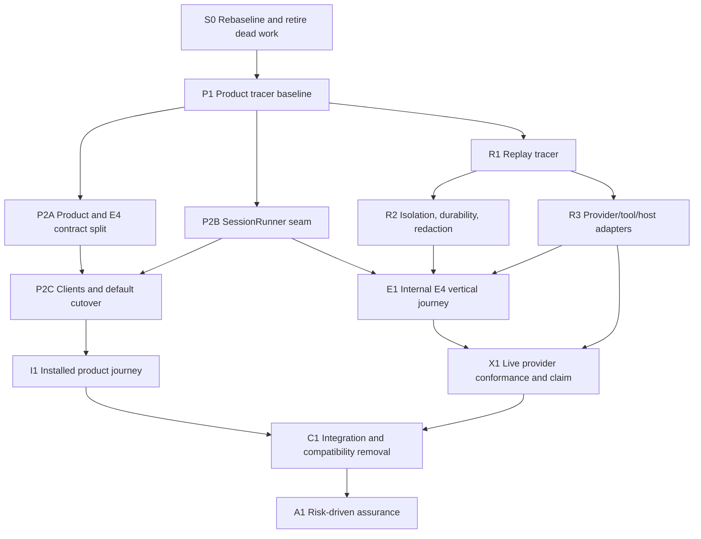

# North-Star recovery execution plan

Status: revised for outcome-first execution.

Date: 2026-08-18

## 1. Outcome

Ship one installed BreadBoard journey in which an author validates and locks a harness, runs and resumes a durable session through the default product surface, inspects events and artifacts through every ordinary client, and uses the separate internal E4 path to replay one representative execution and publish one exact-scope real-provider claim.

The campaign has two tracks:

- **Outcome:** product, replay, isolation, E4, provider, and migration behavior required for the north star.
- **Assurance:** additional matrices, targets, reviewers, benchmarks, and provenance work justified by a named risk or broader claim.

Outcome work never waits for unrelated assurance. Assurance never upgrades a claim beyond what its run observed.

## 2. Operating rules

1. Start from current merged source or an explicitly approved integration base.
2. Reproduce the relevant user-visible behavior before changing it.
3. Build vertical packets that end at a public or durable boundary; do not build horizontal proof infrastructure first.
4. Use one isolated writer per packet. Two writers may run only when dependencies and paths are disjoint.
5. Run focused tests during implementation. Run shared integration and broad CI once at a stable integration candidate.
6. Add tests only for observable behavior, material boundaries, or a diagnosed regression.
7. Use existing Git, CI, package, target, and provider records directly. Do not duplicate them into custom ledgers.
8. Hash only immutable locks, captures, claims, release artifacts, or external inputs whose identity affects the result.
9. `STATE.json` is refreshed after packet closure, merge, or handoff. Staleness blocks only a decision that depends on the stale field.
10. Stop after two implementation attempts without new information, two review rounds on the same risk, or one unexplained CI rerun. Diagnose or escalate instead of increasing the limit.
11. No fake provider, target, sandbox, claim, approval, or CI evidence.
12. No runtime dependency on `docs_tmp` or campaign tooling.

## 3. Delivery graph



S0 is governance and inventory only. P2A, P2B, and R1 may proceed in parallel after P1 when their path sets are disjoint. R2 and R3 may proceed in parallel after R1.

## 4. Packet contract

Every packet states only:

- **Outcome:** the user-visible or durable behavior added;
- **Scope:** allowed files/symbols and explicit non-goals;
- **Risk:** the plausible failure that would falsify the packet;
- **Checks:** the smallest independent observations that expose that risk;
- **Dependencies:** exact predecessor packets;
- **Approval:** only if the packet crosses a listed human gate.

A packet report is concise:

```yaml
packet: P2B
base: <commit>
head: <commit>
behavior: <what changed for the user or system>
checks:
  - command: <exact command>
    result: pass|fail|blocked
external_identity: <only when environment/provider/target affects the claim>
open_risks: []
decision: ready|repair|blocked
```

Raw logs stay in the test runner, CI, or external-run artifact store. Do not copy them into the report unless the original location is unstable.

## 5. Packets

### S0: Rebaseline and retire dead work

**Outcome:** one current base and one honest frontier.

**Actions:**

- inspect current merged source, open PRs, Beads, and relevant immutable evidence;
- close or supersede the blocked replay implementation only with the required human approval;
- retain reusable contracts, identity rules, security invariants, and behavior tests as an inventory;
- discard its monolithic runner, replay-specific provider expansion, and proof-control scaffolding;
- identify existing product and E4 entry points before editing.

**Checks:** current base and open work agree; no blocked branch is treated as merged authority; the ready frontier names P1 only.

### P1: Product tracer baseline

**Outcome:** one minimal harness fixture reaches the current default front door far enough to expose the first real product failure.

**Actions:**

- use the smallest existing harness or flagship fixture;
- run validate, lock, and session start through `bbh` and the current `/v1` API;
- record only the first owning-seam failure and the existing commands that observe it;
- avoid creating new schemas, catalogs, scorecards, or campaign machinery.

**Checks:** a reproducible pass/fail at the CLI/API boundary and a focused regression command.

### P2A: Product and E4 contract split

**Outcome:** ordinary clients have one 26-operation product authority; E4 has one separate 19-operation internal authority and is off by default.

**Actions:**

- preserve `contracts/public/operations.v1.json` as historical;
- author and package `contracts/public/operations.v2.json` and `contracts/internal/evidence/operations.v1.json`;
- make product routing, OpenAPI, and generators consume only the product catalog;
- lazily mount E4 only for exact documented true values; fail closed otherwise;
- keep compatibility outside the ordinary catalog.

**Checks:** installed package resource loading, default import boundary, OpenAPI/catalog agreement, E4 true/false/unknown behavior, and generated-client drift.

**Approval:** required before changing the public catalog or route defaults.

### P2B: SessionRunner seam

**Outcome:** CLI, API, and replay adapters invoke one Session lifecycle instead of competing execution paths.

**Actions:**

- extract only the provider/tool/host/resource seams required by the current SessionRunner;
- preserve current lifecycle behavior and event semantics;
- route `bbh harness run --local` through the product `session.start` contract;
- remove obsolete callers after migration; do not rewrite the runtime wholesale.

**Checks:** session start/input/events/approval/cancel/resume/artifacts across CLI and API, including one real error and child cleanup.

### P2C: Clients and default cutover

**Outcome:** Python SDK, TypeScript SDK, TUI, CLI, and default OpenAPI expose the same product operations and Session semantics.

**Actions:**

- regenerate or update ordinary clients from the v2 product catalog;
- remove lane/claim methods from ordinary clients;
- migrate known callers from compatibility routes;
- flip the product default only after all client journeys pass on the candidate.

**Checks:** focused client contract tests plus one API/SDK/TUI boundary smoke using the same fixture and server.

**Approval:** required for generated ordinary surfaces and the final default flip.

### R1: Replay tracer

**Outcome:** one deterministic record travels from plan to admitted execution to a completed artifact without E4 orchestration.

**Actions:**

- implement immutable plan identity, execution states, admission, and manifest path safety;
- use one deterministic tape-backed worker;
- distinguish stored, reused, and executed results;
- port only behavior tests owned by this packet.

**Checks:** one completed replay, one mutation-invalidates-reuse case, and rejection of failed/stored-only claimability.

### R2: Isolation, durability, and redaction

**Outcome:** replay survives restart, publishes artifacts transactionally, cancels cleanly, and does not leak secrets or escape its workspace.

**Actions:**

- define canonical JSON IPC and bounded child lifecycle;
- adapt an existing sandbox driver; do not create another sandbox platform;
- reuse product artifact/session publication and workspace snapshot behavior;
- enforce environment allowlisting, descriptor closure, path containment, rollback, and redaction.

**Checks:** restart/read-back, cancellation with no orphan, denied path/symlink escape, denied inherited secret, and publication rollback.

**Approval:** required before changing isolation, filesystem, network, secret, capability, approval, or authoritative publication behavior.

### R3: Provider, tool, and host replay adapters

**Outcome:** replay invokes the same product ports without granting adapters unintended workspace or campaign access.

**Actions:**

- lock current provider conversion, streaming, error, and cancellation behavior in focused fixtures;
- add narrow replay adapters for provider, tool, and host boundaries;
- keep production provider runtime independent of replay;
- keep sandbox selection outside the coordinator.

**Checks:** deterministic tape adapter plus one product provider/tool/host integration smoke and representative error propagation.

### E1: Internal E4 vertical journey

**Outcome:** an explicitly enabled maintainer can lock one lane, capture a product execution, replay it, compare it, create an exact-scope claim, and reverify it.

**Actions:**

- correct visibility and not-applicable semantics needed by the representative lane;
- compose existing E4 functions around the new replay path;
- keep HTTP routes optional and internal;
- ensure a product pass does not imply an E4 pass and vice versa.

**Checks:** one representative capture-to-reverify journey, claim refusal for nonclaimable execution, and default-off import/OpenAPI checks.

### I1: Installed product journey

**Outcome:** a user outside the source checkout can complete the lock-first journey through every ordinary client.

**Actions:**

- build/install the actual package and generated clients in clean environments;
- run the same fixture through CLI, API, Python SDK, TypeScript SDK, and TUI;
- restart the service and read back the session and artifacts;
- measure authored manifest and adapter size for the Direction Charter thesis, without turning those counts into a readiness score.

**Checks:** one raw journey transcript and durable read-back. Failure is assigned to the owning product seam, not hidden by more assurance work.

### X1: Live provider conformance and exact-scope claim

**Outcome:** one named provider/model/runtime route completes the representative journey and supports one narrow reverifiable claim.

**Preflight:** credentials, endpoint, model, runtime, rate/spend envelope, target identity, and cleanup authority.

**Checks:** request conversion, streaming, cancellation, error mapping, completed execution integrity, comparison, claim, and reverification on the named route.

A missing credential or unavailable provider blocks X1 only. It does not invalidate local product or replay behavior and does not trigger fake-provider substitution.

**Approval:** required before external spend and before claim publication.

### C1: Integration and compatibility removal

**Outcome:** the integrated candidate has one default product path, no ordinary E4 exposure, and no live caller on an unowned compatibility path.

**Actions:**

- merge dependency-ready packets in order;
- remove obsolete aliases, routes, exports, and generators after caller migration;
- run focused cross-boundary checks, one broad suite, and current generated-drift checks;
- review public API/default changes and security boundaries independently;
- refresh concise campaign state and prepare the merge/release decision.

**Checks:** I1 and X1 still pass on the integrated candidate; relevant CI is green; no unresolved P0/P1 product, contract, or security defect remains.

**Approval:** required before merge, release, or closing superseded compatibility work.

### A1: Risk-driven assurance

**Outcome:** confidence or claim scope expands only where a named risk or product promise warrants it.

Candidate work includes additional providers/targets, broader E4 lanes, soak/performance checks, a clean-room outsider exercise, and extra security review. Select an item only when its gate card names the claim, risk, seam, independent oracle, and stop result. Close inapplicable items instead of manufacturing ceremonies.

A1 cannot compensate for a failed I1 or X1 journey.

## 6. Proof ladder

For each packet, climb only as far as its claim requires:

1. **Static:** typecheck, schema parse, import, or compile.
2. **Focused:** one behavior test at the owning seam.
3. **Boundary:** one real process, adapter, persistence, or client journey.
4. **Installed:** packaged artifact, restart/read-back, or multi-component path.
5. **External:** named provider/target or destructive environment.

Do not run a broader rung when the lower rung already failed for a local reason. Do not use a broad green suite to replace a missing boundary observation.

## 7. Review and CI

Independent review is required for:

- public catalog, schema, or route-default changes;
- isolation, secret, filesystem, network, capability, approval, or publication changes;
- compatibility deletion and final integration;
- a published support claim.

One reviewer is sufficient for ordinary contract/correctness changes. Add a security lens only for changed security boundaries and the final candidate. Reviewers report actionable P0-P2 findings; P3 comments do not block.

Run focused tests during edits. Run the broad compatibility suite once after the final behavioral edit for an integration candidate. Rerun CI only after classifying a failure and changing the relevant bytes, environment, or diagnosis.

## 8. Human gates

Stop for one precise decision before:

- merge or release;
- closing or superseding a PR/issue;
- changing the public catalog, public schema, or default route/client surface;
- changing isolation, secret, filesystem, network, capability, approval, or publication policy;
- spending external provider/target resources;
- publishing a support claim;
- accepting a known P0-P2 defect or expanding a packet after its attempt budget.

Routine local edits, focused tests, read-only diagnosis, and preparation of a gated change do not need additional approval.

## 9. Stop conditions

Pause the affected packet—not the entire campaign—when:

- a required external credential, endpoint, target, or spend approval is absent;
- two implementation attempts produce no new information;
- a review repeats the same unresolved P0-P2 finding after two rounds;
- source/base changes invalidate the packet's actual diff or behavioral result;
- the packet would cross a frozen surface without a qualifying Direction Charter case.

Escalate with the blocker, what was tried, the cheapest discriminating next action, and one recommended option.

## 10. Campaign completion

Complete when the architecture's outcome-track conditions pass on one integrated candidate, relevant CI and the broad compatibility run are green, required independent reviews have no unresolved P0/P1 findings, live claims are exact-scope and reverifiable, and the human approves merge/release.

Return product readiness, active claims, compatibility removal status, external limitations, and nonblocking assurance follow-ups. Never substitute a score, packet count, hash count, or review count for the working journey.
